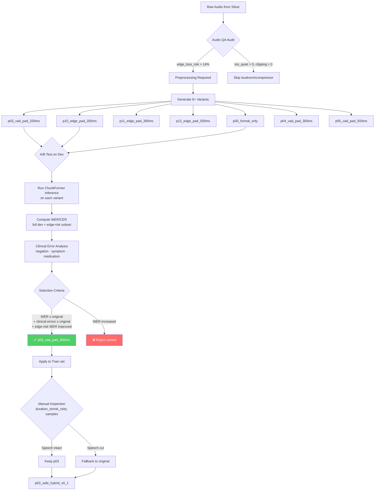
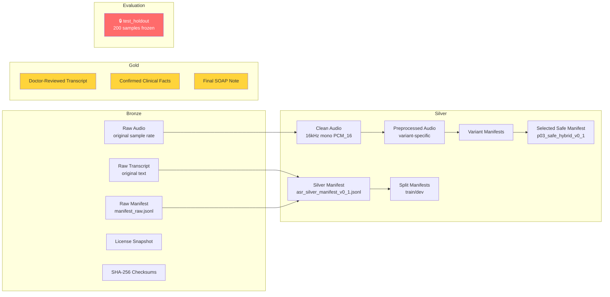

# Trợ lý Tài liệu Lâm sàng (Clinical Ambient Documentation Assistant) — Kiến trúc Pipeline

> Tài liệu pipeline chi tiết chuẩn quốc tế, phản ánh toàn bộ flow thực tế từ codebase.

---

## 1. Tổng quan Pipeline (End-to-End Pipeline Overview)

```mermaid
flowchart TD
    subgraph "STAGE 1: Data Ingestion"
        A1[HuggingFace Streaming API] --> A2[Bronze Raw Audio + Transcript]
        A3[Common Voice Manual Download] --> A2
        A2 --> A4[Bronze Manifest<br/>manifest_raw.jsonl]
        A4 --> A5[License Snapshot<br/>+ SHA-256 Checksums]
    end

    subgraph "STAGE 2: Audio Normalization — Bronze → Silver"
        A4 --> B1[FFmpeg Pipeline<br/>mono · 16kHz · loudnorm]
        B1 --> B2[Silver Clean Audio<br/>audio_clean/]
        B2 --> B3[Silver Manifest<br/>asr_silver_manifest_v0_1.jsonl]
        B3 --> B4[Checksum + Duration<br/>Metadata]
    end

    subgraph "STAGE 3: Data Split & Governance Gate"
        B3 --> C1{Split Strategy<br/>seed=42}
        C1 --> C2[train_candidate<br/>600 samples]
        C1 --> C3[dev<br/>200 samples]
        C1 --> C4[test_holdout 🔒<br/>200 samples]
        C2 --> C5[Governance Check<br/>license · allowed_use]
        C5 --> C6[train_allowed = true/false]
    end

    subgraph "STAGE 4: Audio Quality Audit"
        C2 --> D1[Audio QA<br/>RMS · Peak · Clipping · Edge Energy]
        C3 --> D1
        D1 --> D2[Warning Classification<br/>edge_loss_risk · too_quiet · clipping]
        D2 --> D3[Audio QA Report<br/>JSON + Markdown]
    end

    subgraph "STAGE 5: Preprocessing Variant Engineering"
        D3 --> E1{Build Variants}
        E1 --> E2[p00_format_only]
        E1 --> E3[p10_edge_pad_200ms]
        E1 --> E4[p03_vad_pad_200ms<br/>Silero VAD + trim + pad]
        E1 --> E5[p04_vad_pad_300ms]
        E1 --> E6[p05_vad_pad_500ms]
        E4 --> E7[Variant Manifest + Preprocessed Audio]
        E7 --> E8[Variant Audio QA<br/>+ Padding-Aware Audit]
    end

    subgraph "STAGE 6: Preprocessing A/B Testing"
        E8 --> F1[ASR Inference<br/>ChunkFormer on each variant]
        F1 --> F2[WER/CER Computation<br/>strict + normalized]
        F2 --> F3[Clinical Error Analysis<br/>negation · symptom · medication]
        F3 --> F4[Edge-Risk Subset Analysis]
        F4 --> F5{Decision Matrix}
        F5 --> F6["✅ Selected: p03_vad_pad_200ms"]
    end

    subgraph "STAGE 7: Safe Manifest Preparation"
        F6 --> G1[Apply p03 to Train 600]
        G1 --> G2[Manual VAD-Risk Inspection]
        G2 --> G3{Duration Shrink Risky?}
        G3 -- No --> G4[Keep p03]
        G3 -- Yes --> G5[Fallback to Original]
        G4 --> G6[p03_safe_hybrid_v0_1]
        G5 --> G6
        G6 --> G7[Selected Train Manifest<br/>vietmed_train_preprocessed_selected_safe_v0_1.jsonl]
        G6 --> G8[Selected Dev Manifest<br/>vietmed_dev_preprocessed_selected_safe_v0_1.jsonl]
    end

    subgraph "STAGE 8: Fine-tune Data Preparation"
        G7 --> H1[PhoWhisper Manifest Converter<br/>audio · sentence · language · task · split]
        G8 --> H1
        H1 --> H2[Audio Existence Validation]
        H2 --> H3[Transcript Minimal Cleanup<br/>whitespace only, no semantic edit]
        H3 --> H4[Split Policy Enforcement<br/>train_allowed gate]
        H4 --> H5[train_manifest_for_phowhisper.jsonl<br/>dev_manifest_for_phowhisper.jsonl]
    end

    subgraph "STAGE 9: Model Fine-tuning"
        H5 --> I1[Seq2Seq Training<br/>PhoWhisper-medium]
        I1 --> I2[Run 01: Conservative<br/>lr=1e-5, epochs=3]
        I1 --> I3[Run 02: Low LR<br/>lr=5e-6, epochs=5]
        I2 --> I4[Best Checkpoint Selection<br/>by dev WER]
        I3 --> I4
        I4 --> I5[Backup Decision<br/>formal model selection report]
    end

    subgraph "STAGE 10: ASR Evaluation"
        I4 --> J1[Dev WER/CER<br/>strict + normalized]
        J1 --> J2[Medical Error Analysis<br/>7 clinical error groups]
        J2 --> J3[Manual Audit<br/>30 samples × 3 models]
        J3 --> J4[Leaderboard + Decision Report]
        J4 --> J5["🔒 test_holdout Evaluation<br/>(only after freeze)"]
    end

    subgraph "STAGE 11: Multi-Dataset Expansion"
        J4 --> K1[ViMedCSS Dataset<br/>HuggingFace Ingestion]
        K1 --> K2[Manifest Audit<br/>quality · duration · suspect filtering]
        K2 --> K3[Run Manifest + Archive Creation]
        K3 --> K4[Cross-Dataset Generalization Testing]
    end

    style C4 fill:#ff6b6b,color:#fff
    style F6 fill:#51cf66,color:#fff
    style J5 fill:#ff6b6b,color:#fff
```

---

## 2. Bảng tham chiếu các giai đoạn Pipeline (Pipeline Stage Reference Table)

| Giai đoạn | Script(s) | Đầu vào (Input) | Đầu ra (Output) | Vùng dữ liệu (Zone) |
|:---:|---|---|---|---|
| **1** | `scripts/data_ingestion/ingest_asr_public_day1.py` | HuggingFace API (VietMed, FOSD) | `data/data_lake/bronze/public/*/metadata/manifest_raw.jsonl` | Bronze |
| **1** | `scripts/data_ingestion/ingest_common_voice_vi_official.py` | Common Voice TSV + clips | Bronze manifest + raw audio | Bronze |
| **2** | `scripts/data_ingestion/normalize_public_audio.py` | Bronze raw audio + manifest | `data/data_lake/silver/audio_clean/*.wav` + `asr_silver_manifest_v0_1.jsonl` | Silver |
| **3** | `scripts/asr_eval/create_asr_splits.py` | Silver manifest | `splits/vietmed_{train,dev}_v0_1.jsonl` + `evaluation/vietmed_test_holdout_v0_1.jsonl` | Silver + Eval |
| **3** | `scripts/asr_eval/check_split_leakage.py` | train/dev/test manifests | Báo cáo rò rỉ (Leakage report JSON) | Audit |
| **4** | `scripts/asr_preprocess/audit_audio_quality.py` | Manifest JSONL | Báo cáo Audio QA (JSON + MD) + mẫu có nguy cơ | Audit |
| **5** | `scripts/asr_preprocess/build_preprocess_variants.py` | Dev/Train manifest | Variant audio + variant manifest JSONL | Silver |
| **5** | `scripts/asr_preprocess/audit_audio_quality_padding_aware.py` | Variant manifest | Padding-aware QA report | Audit |
| **5** | `scripts/asr_preprocess/summarize_variant_audio_qa.py` | All variant QA | Tóm tắt JSON + MD | Audit |
| **6** | `scripts/asr_eval/run_chunkformer_ctc.py` | Manifest + model | Dự đoán (Prediction) JSONL | Experiment |
| **6** | `scripts/asr_eval/run_whisper_transformers.py` | Manifest + model | Dự đoán (Prediction) JSONL | Experiment |
| **6** | `scripts/asr_eval/compute_wer.py` | Prediction JSONL | WER/CER metrics JSON | Experiment |
| **6** | `scripts/asr_eval/asr_medical_error_analysis.py` | Prediction JSONL + terms | Báo cáo lỗi y tế (JSON + MD) | Experiment |
| **7** | `scripts/asr_preprocess/create_selected_preprocessing_manifests.py` | p03 train/dev manifests | Selected manifests | Silver |
| **7** | `scripts/asr_preprocess/export_vad_risky_samples.py` | p03 manifest | Danh sách mẫu rủi ro | Audit |
| **7** | `scripts/asr_preprocess/apply_manual_fallback_manifest.py` | Selected manifest + fallback list | Safe hybrid manifest | Silver |
| **8** | `scripts/asr_eval/prepare_phowhisper_finetune_manifest.py` | Safe selected manifest | PhoWhisper-ready JSONL | Experiment |
| **9** | `scripts/asr_eval/finetune_phowhisper_seq2seq.py` | Config JSON + manifests | Checkpoints + predictions + metrics | Experiment |
| **10** | `scripts/asr_eval/compute_wer.py` + `asr_medical_error_analysis.py` | Fine-tuned predictions | Báo cáo đánh giá (Evaluation) | Experiment |
| **10** | `scripts/asr_eval/make_phowhisper_backup_decision.py` | Multi-run metrics | Báo cáo chọn model (Model selection) | Decision |
| **11** | `scripts/asr_vimedcss/00_rebuild_vimedcss_raw_manifests_from_hf.py` | HuggingFace ViMedCSS | Raw manifests | Bronze |
| **11** | `scripts/asr_vimedcss/01_audit_vimedcss_manifests.py` | Raw manifests | Audit report (clean/suspect/excluded) | Audit |
| **11** | `scripts/asr_vimedcss/02_create_vimedcss_run_manifests_and_archives.py` | Audited manifests | Run manifests + tar archives | Silver |

---

## 3. Tiền xử lý (Preprocessing Pipeline) — Tham chiếu kỹ thuật

### 3.1. Luồng quyết định tiền xử lý (Decision Flow)

### 3.2. Đặc tả chuẩn hóa âm thanh (Audio Normalization - Stage 2)

| Tham số | Giá trị | Công cụ (Tool) |
|---|---|---|
| Sample Rate | 16,000 Hz | FFmpeg `-ar 16000` |
| Channels | Mono | FFmpeg `-ac 1` |
| Volume Normalization | EBU R128 loudnorm | FFmpeg `-af loudnorm` |
| Output Format | WAV PCM_16 | FFmpeg |
| Checksum | SHA-256 per file | Python hashlib |

### 3.3. Đặc tả các biến thể tiền xử lý (Preprocessing Variants - Stage 5)

| Variant ID | Chiến lược | Edge Pad (ms) | VAD | Mô tả |
|---|---|---:|:---:|---|
| `p00_format_only` | Chỉ định dạng lại | 0 | ❌ | Chuyển Mono/16kHz, không đệm |
| `p10_edge_pad_200ms` | Đệm cạnh | 200 | ❌ | Đệm 200ms im lặng ở đầu và cuối |
| `p11_edge_pad_300ms` | Đệm cạnh | 300 | ❌ | Đệm 300ms im lặng ở đầu và cuối |
| `p12_edge_pad_500ms` | Đệm cạnh | 500 | ❌ | Đệm 500ms im lặng ở đầu và cuối |
| `p03_vad_pad_200ms` | VAD Trim + Pad | 200 | ✅ | Silero VAD cắt gọn → đệm 200ms quanh phần có tiếng |
| `p04_vad_pad_300ms` | VAD Trim + Pad | 300 | ✅ | Silero VAD cắt gọn → đệm 300ms quanh phần có tiếng |
| `p05_vad_pad_500ms` | VAD Trim + Pad | 500 | ✅ | Silero VAD cắt gọn → đệm 500ms quanh phần có tiếng |

### 3.4. Cấu hình VAD (Silero VAD)

| Tham số | Giá trị |
|---|---|
| Framework | `snakers4/silero-vad` via `torch.hub` |
| `min_speech_duration_ms` | 250 |
| `min_silence_duration_ms` | 100 |
| `speech_pad_ms` | 0 (padding ngoài được áp dụng) |
| Chiến lược gộp (Merge strategy) | Bắt đầu câu nói đầu tiên → Kết thúc câu nói cuối cùng |
| Ngưỡng an toàn | `kept_ratio < 0.50` → chuyển về đệm cạnh (edge pad) |
| Phương án dự phòng (Fallback) | Nếu VAD lỗi/không có sẵn → chỉ đệm cạnh |

### 3.5. Tiêu chuẩn kiểm định chất lượng âm thanh (Audio Quality Audit Metrics)

| Chỉ số (Metric) | Ngưỡng | Cờ (Flag) |
|---|---|---|
| Sample Rate | ≠ 16kHz | `non_16khz` |
| Channels | ≠ 1 | `non_mono` |
| Duration | < 1.0s | `too_short` |
| Duration | > 30.0s | `long_audio_may_need_chunking` |
| RMS (dB) | < -35 dB | `too_quiet` |
| RMS (dB) | > -10 dB | `too_loud` |
| Peak (dB) | > -0.1 dB | `peak_near_0db_clipping_risk` |
| Clipping Ratio | > 0.001 | `clipping_detected` |
| Leading Silence | > 1000 ms | `long_leading_silence` |
| Trailing Silence | > 1000 ms | `long_trailing_silence` |
| Edge/Middle Energy Ratio | < 0.35 | `edge_loss_risk` |

### 3.6. Kết quả A/B Test — Lựa chọn tiền xử lý

| Chỉ số | Original | p10_edge_pad_200ms | **p03_vad_pad_200ms** |
|---|---:|---:|---:|
| **Full Dev WER** | 12.90% | 14.49% | **12.90%** |
| **Edge-Risk Subset WER** | 11.87% | 13.02% | **11.59%** |
| Missing Negation | baseline | — | ≤ baseline |
| Missing Symptom | baseline | — | ≤ baseline |
| Dose/Unit Error | baseline | — | ≤ baseline |

**Căn cứ lựa chọn:**
- `p03_vad_pad_200ms` giữ nguyên WER trên toàn bộ tập dev đồng thời cải thiện WER của tập con có rủi ro biên (edge-risk) thêm 0.28 điểm phần trăm.
- Không làm tăng bất kỳ loại lỗi lâm sàng nào (negation, symptom, medication, dose/unit).
- Các biến thể đệm cạnh (`p10`) làm giảm WER đáng kể (+1.59 pp) do các hiệu ứng tại biên âm thanh.

### 3.7. Cấu trúc dữ liệu Medallion (Data Lineage)

### 3.8. Chiến lược Xử lý Văn bản (Transcript Preprocessing Strategy)

Để đảm bảo mô hình ASR có thể tự động sinh ra văn bản y tế có định dạng chuẩn, dự án áp dụng chiến lược tách biệt hoàn toàn giữa việc huấn luyện và đánh giá:

| Loại xử lý | Áp dụng cho | Hành động | Mục đích |
|---|---|---|---|
| **Minimal Cleanup** | Data Preparation (Huấn luyện) | Chỉ xóa khoảng trắng thừa (Whitespace strip). KHÔNG lowercasing, KHÔNG xóa dấu câu. | Ép model học cách sinh văn bản lâm sàng có cấu trúc, đúng chính tả, viết hoa và tự động điền dấu câu. |
| **Text Normalization** | ASR Evaluation (Tính toán WER/CER) | Chuyển đổi số thành chữ, chuẩn hóa dấu câu, quy chuẩn hóa các đơn vị y tế (vd: mg, ml). | Đảm bảo tính toán khoảng cách Levenshtein (WER) công bằng và chính xác khi chấm điểm model. |

---

## 4. Model Registry & Phân loại lỗi y khoa

### 4.1. Danh sách mô hình ASR (ASR Model Registry)

| Model | Dòng (Family) | Vai trò | Dev WER (Strict) |
|---|---|---|---:|
| `khanhld/chunkformer-ctc-large-vie` | ChunkFormer CTC | Primary Inference Baseline | ~12.90% |
| `vinai/PhoWhisper-medium` | Whisper Seq2Seq | Fine-tune Candidate (Primary) | ~24.64% (baseline) |
| `vinai/PhoWhisper-base` | Whisper Seq2Seq | Fine-tune Candidate (Lightweight) | ~26.75% (baseline) |
| `openai/whisper-small` | Whisper Seq2Seq | Reference Only | Very high WER |

### 4.2. Nhóm lỗi lâm sàng (Clinical Error Groups)

| Nhóm | Mức độ | Ví dụ |
|---|---|---|
| `negation` | 🔴 Nghiêm trọng (Critical) | không, chưa, phủ nhận, không ghi nhận |
| `allergy` | 🔴 Nghiêm trọng (Critical) | dị ứng thuốc, dị ứng penicillin |
| `medication` | 🟠 Cao (High) | paracetamol, amoxicillin, metformin |
| `dose_unit` | 🟠 Cao (High) | mg, viên, gói, mỗi ngày |
| `red_flag` | 🟠 Cao (High) | đau ngực, khó thở, spo2, nôn ra máu |
| `number` | 🟡 Vừa (Moderate) | 37.8, 500, 3 ngày, một viên |
| `symptom` | 🟡 Vừa (Moderate) | ho, sốt, đau bụng, mệt mỏi |

---

## 5. Quản trị dữ liệu & Các rào cản an toàn (Governance & Guardrails)

### 5.1. Quy tắc tính toàn vẹn (Split Integrity Rules)

| Quy tắc | Cơ chế thực thi |
|---|---|
| test_holdout KHÔNG BAO GIỜ được dùng để huấn luyện | `train_allowed = false`, `is_holdout = true` |
| test_holdout KHÔNG BAO GIỜ được dùng để chọn model | Chỉ đánh giá sau khi model + preprocessing đã được chốt (freeze) |
| Dev KHÔNG BAO GIỜ được dùng để huấn luyện | `train_allowed = false` |
| Không thay đổi quy tắc chuẩn hóa văn bản sau khi xem test | Giao thức được ghi chép trong `WER_PROTOCOL.md` |
| Bắt buộc kiểm tra rò rỉ dữ liệu (Leakage check) | `check_split_leakage.py` phải báo PASS |

### 5.2. Giao thức báo cáo WER (WER Reporting Protocol)

| Chỉ số | Yêu cầu |
|---|---|
| Strict WER | ✅ Luôn luôn |
| Normalized WER | ✅ Luôn luôn |
| Strict CER | ✅ Luôn luôn |
| Normalized CER | ✅ Luôn luôn |
| Clinical Error Groups (7 nhóm lỗi) | ✅ Luôn luôn |
| Phân định Split (Split identification) | ✅ Luôn nêu rõ dev/test |
| Phiên bản Preprocessing | ✅ Luôn nêu rõ variant |

---

## 6. Quy ước đặt tên tệp (File Naming Conventions)

| Mẫu (Pattern) | Ví dụ (Example) |
|---|---|
| Bronze manifest | `manifest_raw.jsonl` |
| Silver manifest | `asr_silver_manifest_v0_1.jsonl` |
| Split manifest | `vietmed_{split}_{version}.jsonl` |
| Variant manifest | `vietmed_{split}_{variant_id}.jsonl` |
| Selected safe manifest | `vietmed_{split}_preprocessed_selected_safe_v0_1.jsonl` |
| Prediction output | `{model}_{variant}_{split}_predictions.jsonl` |
| Metrics output | `{model}_{variant}_{split}_metrics.json` |
| Error analysis output | `{model}_{variant}_medical_errors.json` |
| Preprocessed audio | `{sample_id}_{variant_id}.wav` |
