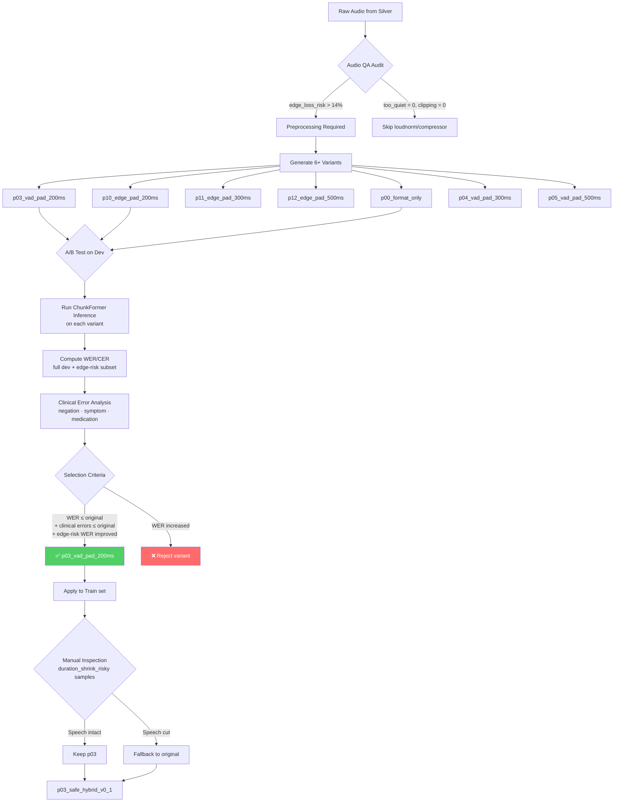
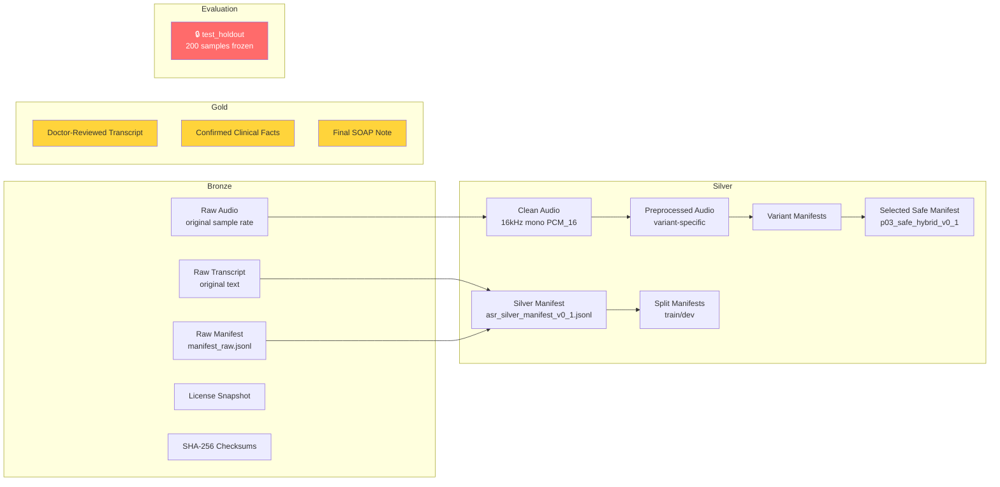

# Clinical Ambient Documentation Assistant — README kỹ thuật & vận hành

> Phiên bản README này được viết để bàn giao cho mentor/sếp hoặc người mới vào dự án có thể hiểu bối cảnh, kiểm tra dữ liệu, chạy pipeline ASR, đánh giá WER/CER, phân tích lỗi lâm sàng và tiếp tục fine-tune một cách có kiểm soát.

---

## 0. Tóm tắt dự án

**Clinical Ambient Documentation Assistant** là hệ thống hỗ trợ bác sĩ ghi chép y bạ tự động từ hội thoại khám bệnh tiếng Việt.

Pipeline mục tiêu:

```text
Thu âm cuộc khám
→ ASR tiếng Việt / ASR y tế
→ transcript có timestamp
→ phân đoạn người nói
→ gán vai trò Doctor / Patient / Caregiver / Nurse / Unknown
→ trích xuất clinical facts có source evidence
→ sinh SOAP-lite note draft
→ bác sĩ review / chỉnh sửa / xác nhận
→ dữ liệu đã xác nhận mới được xem là Gold
```

Dự án ưu tiên triết lý:

```text
Local-first
Privacy-by-design
Doctor-in-the-loop
Evidence-first
Synthetic-first
Evaluation-before-training
```

Hệ thống **không phải AI doctor**, **không tự chẩn đoán**, **không tự kê đơn**, và **không được tự động ghi thẳng vào hồ sơ bệnh án nếu chưa có bác sĩ xác nhận**.

---

## 0.5. Sơ đồ Kiến trúc Pipeline (Pipeline Architecture)

```mermaid
flowchart TD
    subgraph "STAGE 1: Data Ingestion"
        A1[HuggingFace Streaming API] --> A2[Bronze Raw Audio + Transcript]
        A3[Common Voice Manual Download] --> A2
        A2 --> A4[Bronze Manifest<br/>manifest_raw.jsonl]
        A4 --> A5[License Snapshot<br/>+ SHA-256 Checksums]
    end

    subgraph "STAGE 2: Audio Normalization — Bronze → Silver"
        A4 --> B1[FFmpeg Pipeline<br/>mono · 16kHz · loudnorm]
        B1 --> B2[Silver Clean Audio<br/>audio_clean/]
        B2 --> B3[Silver Manifest<br/>asr_silver_manifest_v0_1.jsonl]
        B3 --> B4[Checksum + Duration<br/>Metadata]
    end

    subgraph "STAGE 3: Data Split & Governance Gate"
        B3 --> C1{Split Strategy<br/>seed=42}
        C1 --> C2[train_candidate<br/>600 samples]
        C1 --> C3[dev<br/>200 samples]
        C1 --> C4[test_holdout 🔒<br/>200 samples]
        C2 --> C5[Governance Check<br/>license · allowed_use]
        C5 --> C6[train_allowed = true/false]
    end

    subgraph "STAGE 4: Audio Quality Audit"
        C2 --> D1[Audio QA<br/>RMS · Peak · Clipping · Edge Energy]
        C3 --> D1
        D1 --> D2[Warning Classification<br/>edge_loss_risk · too_quiet · clipping]
        D2 --> D3[Audio QA Report<br/>JSON + Markdown]
    end

    subgraph "STAGE 5: Preprocessing Variant Engineering"
        D3 --> E1{Build Variants}
        E1 --> E2[p00_format_only]
        E1 --> E3[p10_edge_pad_200ms]
        E1 --> E4[p03_vad_pad_200ms<br/>Silero VAD + trim + pad]
        E1 --> E5[p04_vad_pad_300ms]
        E1 --> E6[p05_vad_pad_500ms]
        E4 --> E7[Variant Manifest + Preprocessed Audio]
        E7 --> E8[Variant Audio QA<br/>+ Padding-Aware Audit]
    end

    subgraph "STAGE 6: Preprocessing A/B Testing"
        E8 --> F1[ASR Inference<br/>ChunkFormer on each variant]
        F1 --> F2[WER/CER Computation<br/>strict + normalized]
        F2 --> F3[Clinical Error Analysis<br/>negation · symptom · medication]
        F3 --> F4[Edge-Risk Subset Analysis]
        F4 --> F5{Decision Matrix}
        F5 --> F6["✅ Selected: p03_vad_pad_200ms"]
    end

    subgraph "STAGE 7: Safe Manifest Preparation"
        F6 --> G1[Apply p03 to Train 600]
        G1 --> G2[Manual VAD-Risk Inspection]
        G2 --> G3{Duration Shrink Risky?}
        G3 -- No --> G4[Keep p03]
        G3 -- Yes --> G5[Fallback to Original]
        G4 --> G6[p03_safe_hybrid_v0_1]
        G5 --> G6
        G6 --> G7[Selected Train Manifest<br/>vietmed_train_preprocessed_selected_safe_v0_1.jsonl]
        G6 --> G8[Selected Dev Manifest<br/>vietmed_dev_preprocessed_selected_safe_v0_1.jsonl]
    end

    subgraph "STAGE 8: Fine-tune Data Preparation"
        G7 --> H1[PhoWhisper Manifest Converter<br/>audio · sentence · language · task · split]
        G8 --> H1
        H1 --> H2[Audio Existence Validation]
        H2 --> H3[Transcript Minimal Cleanup<br/>whitespace only, no semantic edit]
        H3 --> H4[Split Policy Enforcement<br/>train_allowed gate]
        H4 --> H5[train_manifest_for_phowhisper.jsonl<br/>dev_manifest_for_phowhisper.jsonl]
    end

    subgraph "STAGE 9: Model Fine-tuning"
        H5 --> I1[Seq2Seq Training<br/>PhoWhisper-medium]
        I1 --> I2[Run 01: Conservative<br/>lr=1e-5, epochs=3]
        I1 --> I3[Run 02: Low LR<br/>lr=5e-6, epochs=5]
        I2 --> I4[Best Checkpoint Selection<br/>by dev WER]
        I3 --> I4
        I4 --> I5[Backup Decision<br/>formal model selection report]
    end

    subgraph "STAGE 10: ASR Evaluation"
        I4 --> J1[Dev WER/CER<br/>strict + normalized]
        J1 --> J2[Medical Error Analysis<br/>7 clinical error groups]
        J2 --> J3[Manual Audit<br/>30 samples × 3 models]
        J3 --> J4[Leaderboard + Decision Report]
        J4 --> J5["🔒 test_holdout Evaluation<br/>(only after freeze)"]
    end

    subgraph "STAGE 11: Multi-Dataset Expansion"
        J4 --> K1[ViMedCSS Dataset<br/>HuggingFace Ingestion]
        K1 --> K2[Manifest Audit<br/>quality · duration · suspect filtering]
        K2 --> K3[Run Manifest + Archive Creation]
        K3 --> K4[Cross-Dataset Generalization Testing]
    end

    style C4 fill:#ff6b6b,color:#fff
    style F6 fill:#51cf66,color:#fff
    style J5 fill:#ff6b6b,color:#fff
```



### Bảng tham chiếu các giai đoạn Pipeline

| Giai đoạn | Script(s) | Đầu vào (Input) | Đầu ra (Output) | Vùng dữ liệu (Zone) |
|:---:|---|---|---|---|
| **1** | `scripts/data_ingestion/ingest_asr_public_day1.py` | HuggingFace API (VietMed, FOSD) | `data/data_lake/bronze/public/*/metadata/manifest_raw.jsonl` | Bronze |
| **1** | `scripts/data_ingestion/ingest_common_voice_vi_official.py` | Common Voice TSV + clips | Bronze manifest + raw audio | Bronze |
| **2** | `scripts/data_ingestion/normalize_public_audio.py` | Bronze raw audio + manifest | `data/data_lake/silver/audio_clean/*.wav` + `asr_silver_manifest_v0_1.jsonl` | Silver |
| **3** | `scripts/asr_eval/create_asr_splits.py` | Silver manifest | `splits/vietmed_{train,dev}_v0_1.jsonl` + `evaluation/vietmed_test_holdout_v0_1.jsonl` | Silver + Eval |
| **3** | `scripts/asr_eval/check_split_leakage.py` | train/dev/test manifests | Báo cáo rò rỉ (Leakage report JSON) | Audit |
| **4** | `scripts/asr_preprocess/audit_audio_quality.py` | Manifest JSONL | Báo cáo Audio QA (JSON + MD) + mẫu có nguy cơ | Audit |
| **5** | `scripts/asr_preprocess/build_preprocess_variants.py` | Dev/Train manifest | Variant audio + variant manifest JSONL | Silver |
| **5** | `scripts/asr_preprocess/audit_audio_quality_padding_aware.py` | Variant manifest | Padding-aware QA report | Audit |
| **5** | `scripts/asr_preprocess/summarize_variant_audio_qa.py` | All variant QA | Tóm tắt JSON + MD | Audit |
| **6** | `scripts/asr_eval/run_chunkformer_ctc.py` | Manifest + model | Dự đoán (Prediction) JSONL | Experiment |
| **6** | `scripts/asr_eval/run_whisper_transformers.py` | Manifest + model | Dự đoán (Prediction) JSONL | Experiment |
| **6** | `scripts/asr_eval/compute_wer.py` | Prediction JSONL | WER/CER metrics JSON | Experiment |
| **6** | `scripts/asr_eval/asr_medical_error_analysis.py` | Prediction JSONL + terms | Báo cáo lỗi y tế (JSON + MD) | Experiment |
| **7** | `scripts/asr_preprocess/create_selected_preprocessing_manifests.py` | p03 train/dev manifests | Selected manifests | Silver |
| **7** | `scripts/asr_preprocess/export_vad_risky_samples.py` | p03 manifest | Danh sách mẫu rủi ro | Audit |
| **7** | `scripts/asr_preprocess/apply_manual_fallback_manifest.py` | Selected manifest + fallback list | Safe hybrid manifest | Silver |
| **8** | `scripts/asr_eval/prepare_phowhisper_finetune_manifest.py` | Safe selected manifest | PhoWhisper-ready JSONL | Experiment |
| **9** | `scripts/asr_eval/finetune_phowhisper_seq2seq.py` | Config JSON + manifests | Checkpoints + predictions + metrics | Experiment |
| **10** | `scripts/asr_eval/compute_wer.py` + `asr_medical_error_analysis.py` | Fine-tuned predictions | Báo cáo đánh giá (Evaluation) | Experiment |
| **10** | `scripts/asr_eval/make_phowhisper_backup_decision.py` | Multi-run metrics | Báo cáo chọn model (Model selection) | Decision |
| **11** | `scripts/asr_vimedcss/00_rebuild_vimedcss_raw_manifests_from_hf.py` | HuggingFace ViMedCSS | Raw manifests | Bronze |
| **11** | `scripts/asr_vimedcss/01_audit_vimedcss_manifests.py` | Raw manifests | Audit report (clean/suspect/excluded) | Audit |
| **11** | `scripts/asr_vimedcss/02_create_vimedcss_run_manifests_and_archives.py` | Audited manifests | Run manifests + tar archives | Silver |

---

## 1. Trạng thái nghiên cứu hiện tại

### 1.1. Giai đoạn 1: Synthetic outpatient data v0.1

Đã xây dựng bộ synthetic outpatient encounters để kiểm thử end-to-end downstream clinical NLP/SOAP.

Mỗi case trong:

```text
data/synthetic_data/outpatient_v0_1/
```

có cấu trúc logic:

```text
script.md
→ transcript_segments_gold.json
→ clinical_facts_candidate.json
→ clinical_facts_gold.json
→ soap_note_gold.md
→ soap_source_evidence.json
→ annotation_notes.md
→ encounter_metadata.json
→ encounter_outcome.json
```

Mục tiêu của synthetic data:

```text
- kiểm thử schema
- kiểm thử source attribution
- kiểm thử negation
- kiểm thử medication/dose/allergy
- kiểm thử caregiver attribution
- kiểm thử SOAP-lite note draft
- không dùng để đo WER nếu chưa có audio thật/TTS/volunteer audio
```

Ví dụ nhóm lỗi safety đã được đưa vào synthetic cases:

```text
- mất phủ định: "không đau ngực" → "đau ngực"
- mất dị ứng: "chưa từng dị ứng thuốc"
- sai thuốc/liều: paracetamol 500mg
- sai duration: 3 ngày, 2 ngày, 1 tuần
- gán nhầm clinical_subject khi caregiver nói thay patient
```

---

### 1.2. Giai đoạn 2: ASR ingestion + benchmark foundation

Dự án đã chuyển từ “ingest public data” sang **ASR benchmark track** vì mục tiêu thực tế là:

```text
Baseline sếp báo: Whisper-small trên VietMed WER khoảng 31%
Mục tiêu mới: dùng model bất kỳ đạt WER < 20%
```

Đã ingest VietMed vào data lake và tạo split:

```text
VietMed total: 1050 samples
train_candidate: 600
dev: 200
test_holdout: 200
train_allowed: 600
split_mode: full_dataset_split
```

Quy tắc split:

```text
train_candidate: dùng cho fine-tune nếu được phép
dev: dùng chọn model / chọn preprocessing / chọn checkpoint
test_holdout: chỉ dùng đánh giá cuối cùng, không dùng để tune
```

Kết quả dev đánh giá đáng chú ý:

```text
openai/whisper-small: WER rất cao, bị loại khỏi nhóm candidate chính
vinai/PhoWhisper-base: nhanh, WER khoảng 26.75% trên dev
vinai/PhoWhisper-medium: WER khoảng 24.64% trên dev
khanhld/chunkformer-ctc-large-vie: WER khoảng 12.90% trên dev
```

Kết luận từ đánh giá baseline:

```text
ChunkFormer là primary inference baseline vì WER tốt nhất.
PhoWhisper-medium/base vẫn là fine-tuning candidate vì kiến trúc Whisper-family dễ thích nghi với pipeline Seq2Seq.
WER thấp chưa đủ vì vẫn còn lỗi lâm sàng như missing negation, symptom, dose/unit.
```

---

### 1.3. Giai đoạn 3: Data preprocessing trước fine-tune

Sau phân tích lỗi, quyết định **không fine-tune ngay** mà dành thời gian để tiền xử lý dữ liệu trước.

Lý do:

```text
Vấn đề không chỉ nằm ở model.
Một phần lỗi ASR đến từ dữ liệu audio:
- năng lượng đầu/cuối câu yếu
- edge-loss risk
- boundary context chưa đủ
- VAD/chunking/padding cần được kiểm chứng
```

Kết quả kiểm tra Audio QA:

```text
Train 600:
- edge_loss_risk: 110/600 ≈ 18.3%
- long_leading_silence: 2
- long_trailing_silence: 3
- too_quiet: 0
- clipping_detected: 0

Dev 200:
- edge_loss_risk: 29/200 ≈ 14.5%
- long_leading_silence: 1
- long_trailing_silence: 1
- too_quiet: 0
- clipping_detected: 0
```

Kết luận:

```text
Không ưu tiên loudnorm/compressor/noise reduction ở vòng đầu.
Ưu tiên kiểm thử padding và VAD-padding.
```

Các variant đã test:

```text
p03_vad_pad_200ms
p04_vad_pad_300ms
p05_vad_pad_500ms
p10_edge_pad_200ms
p11_edge_pad_300ms
p12_edge_pad_500ms
```

Sau padding-aware audit và ASR/clinical error analysis, quyết định:

```text
Selected preprocessing: p03_vad_pad_200ms
```

Lý do chọn p03:

```text
Full dev WER:
- original: 12.90%
- p10_edge_pad_200ms: 14.49%
- p03_vad_pad_200ms: 12.90%

Edge-risk subset WER:
- original: 11.87%
- p10: 13.02%
- p03: 11.59%

Clinical errors:
- p03 không làm tăng missing negation
- p03 không làm tăng missing symptom
- p03 không làm tăng medication/dose/numeric error
```

Lưu ý về bước rà soát:

```text
p03 có một số mẫu duration_shrink_risky:
- train: 4 samples
- dev: 1 sample
Cần manual inspection trước khi freeze hoàn toàn.
Nếu có dấu hiệu VAD cắt speech, tạo p03_safe_hybrid_v0_1 bằng cách fallback riêng sample lỗi về original.
```

---

## 2. Nguyên tắc an toàn và governance

### 2.1. Không dùng real patient data khi chưa phê duyệt

Mọi dữ liệu bệnh nhân thật phải có:

```text
- phê duyệt governance/legal/clinical
- consent hoặc cơ sở pháp lý rõ
- retention policy
- access control
- audit log
- de-identification nếu phù hợp
```

Trong giai đoạn hiện tại:

```text
Synthetic data: dùng cho downstream NLP/SOAP/evidence pipeline
VietMed: dùng nội bộ cho ASR training/evaluation theo phê duyệt hiện tại
Common Voice/FOSD: dùng bootstrap/general ASR nếu license phù hợp
Real patient data: chưa dùng
```

### 2.2. Không trộn nhầm data lake zones

```text
Bronze:
  raw audio, raw transcript, raw metadata, checksum, license snapshot

Silver:
  clean audio, preprocessed audio, normalized transcript, ASR manifest, split manifest

Gold:
  transcript/facts/note đã review/xác nhận

Evaluation:
  frozen holdout sets, không train, không tune

Dictionary:
  terminology, aliases, medical terms, negation cues

Audit:
  review logs, model run logs, correction logs
```

### 2.3. Test holdout là bất khả xâm phạm

```text
Không train trên test_holdout.
Không chọn model bằng test_holdout.
Không chọn preprocessing bằng test_holdout.
Không chỉnh text normalization sau khi xem test.
Không manual fix prediction trên test.
```

---

## 3. Cấu trúc thư mục chính

```text
Clinical Ambient Documentation Assistant/
├── .gitignore                          # Cấu hình bỏ qua các file không cần thiết cho git
├── Clinical ASR_NLP Evaluation...md    # Tiêu chuẩn đánh giá và benchmark quốc tế cho ASR lâm sàng
├── Future-Proof Canonical Clinical Schema Design.md # Thiết kế schema dữ liệu JSON chuẩn cho dự án
├── Khung an toàn AI cho tài liệu Y tế.md # Quy định và khung an toàn AI áp dụng trong y tế
├── Nghiên cứu pháp lý AI Y tế tại Việt Nam.md # Báo cáo nghiên cứu tính pháp lý tại Việt Nam
├── README.md                           # Tài liệu giới thiệu và hướng dẫn chính của dự án
├── README_vi.md                        # Phiên bản tiếng Việt của README
├── assume.md                           # Giả định và ràng buộc kỹ thuật của hệ thống
├── Vietnamese ASR Clinical...md        # Báo cáo nghiên cứu tổng quan về ASR y tế tiếng Việt
├── audio_clean_dev.tar.gz              # Dữ liệu âm thanh phát triển (archive)
├── data_lake.zip                       # Bản nén của data_lake ban đầu (nếu có)
├── requirements.txt                    # Danh sách thư viện Python cần thiết (chính)
├── requirements-dev.txt                # Danh sách thư viện Python cho môi trường phát triển (test, lint)
├── data/                               # Chứa toàn bộ dữ liệu dự án
│   ├── data_governance/                # Tài liệu về quản trị dữ liệu, quy định cấp phép
│   │   ├── dataset_registry.csv        # Sổ đăng ký các tập dữ liệu
│   │   ├── dataset_registry_dictionary.md # Từ điển giải thích các cột trong registry
│   │   ├── internal_approval_notes.md  # Ghi chú phê duyệt nội bộ
│   │   ├── license_matrix.md           # Ma trận giấy phép các tập dữ liệu
│   │   └── source_risk_register.md     # Đánh giá rủi ro nguồn dữ liệu
│   ├── data_lake/                      # Cấu trúc medallion data lake (Bronze, Silver, Gold)
│   │   ├── audit/                      # Dữ liệu kiểm toán và log
│   │   ├── bronze/                     # Dữ liệu thô ban đầu (Audio & Manifest)
│   │   ├── silver/                     # Dữ liệu đã làm sạch và chuẩn hóa
│   │   ├── gold/                       # Dữ liệu chất lượng cao nhất dùng để đánh giá/huấn luyện
│   │   ├── dictionary/                 # Từ điển lâm sàng (nguồn thô và đã xử lý)
│   │   └── evaluation/                 # Dữ liệu dành riêng cho đánh giá (VD: test holdout)
│   ├── docs/                           # (Thư mục docs rỗng/đang chờ)
│   ├── schemas/                        # Các file JSON schema định nghĩa cấu trúc dữ liệu
│   │   ├── clinical_fact.schema.json   # Schema cho các fact y tế
│   │   ├── dataset_metadata.schema.json# Schema cho siêu dữ liệu dataset
│   │   ├── encounter.schema.json       # Schema lưu thông tin phiên khám
│   │   ├── encounter_outcome.json      # Schema cho kết quả sau khám
│   │   ├── soap_source_evidence.json   # Schema lưu bằng chứng SOAP
│   │   └── transcript_segment.schema.json # Schema cho từng đoạn phiên âm
│   ├── scripts/                        # (Chứa scripts liên quan đến data)
│   └── synthetic_data/                 # Dữ liệu tổng hợp (mock) để kiểm thử hệ thống
│       ├── evaluation_seed_coverage_matrix.md # Ma trận độ phủ của dữ liệu sinh tự động
│       ├── safety_error_taxonomy.md    # Phân loại lỗi an toàn
│       ├── synthetic_encounter_specs.md# Đặc tả kịch bản khám bệnh sinh tự động
│       └── outpatient_v0_1/            # Các hồ sơ bệnh án sinh tự động (SYN_OUT_001 -> 010)
│           ├── README.md               # Mô tả tập outpatient
│           ├── audit_synthetic_data.py # Script kiểm tra độ hợp lệ của dữ liệu mock
│           ├── fix_segment_ids.py      # Script sửa lỗi ID trong segments
│           ├── standardize_folders.py  # Chuẩn hóa tên thư mục SYN_OUT_*
│           └── SYN_OUT_001...010/      # (Mỗi folder chứa: audio script, clinical facts, metadata, SOAP note...)
├── docs/                               # Tài liệu nghiên cứu chuyên sâu, kiến trúc và quy trình
│   ├── assets/                         # Ảnh và tài nguyên cho báo cáo (Layer1_IDAE_System.drawio.png)
│   ├── research/                       # Các nghiên cứu cốt lõi của dự án
│   │   ├── 01_governance/              # Bộ tài liệu MVP về quy định, bảo mật và lưu trữ
│   │   ├── 02_ai_safety/               # Đánh giá rủi ro, HITL và báo cáo an toàn AI
│   │   ├── 03_clinical_ASR_NLP_evaluation_metrics/ # Các metric đánh giá ASR/NLP trong y tế
│   │   ├── 04_vietnamese_clinical_asr_benchmark/   # Benchmark cho các model ASR tiếng Việt
│   │   ├── 05_future-proof_schema_design/          # Thiết kế schema hệ thống dài hạn
│   │   ├── architecture/               # Kế hoạch kiến trúc dự án (PROJECT_PIPELINE_PLAN.md)
│   │   ├── technical/                  # Báo cáo kỹ thuật chi tiết
│   │   └── whisper_phowhisper/         # Nghiên cứu chuyên sâu về Whisper & PhoWhisper
│   └── research_data_source/           # Nguồn tài liệu tổng hợp (master_research_report...)
├── experiments/                        # Nơi lưu trữ mã nguồn và kết quả thử nghiệm
│   └── asr/                            # Thử nghiệm các mô hình ASR
│       ├── ASR_SPLIT_STRATEGY.md       # Chiến lược chia tập train/dev/test
│       ├── WER_PROTOCOL.md             # Giao thức đo lường Word Error Rate (WER)
│       ├── asr_target.md               # Mục tiêu và chỉ số kỳ vọng của hệ thống ASR
│       ├── baseline/                   # Kết quả chạy Baseline (logs, metrics, predictions)
│       ├── error_analysis/             # Phân tích lỗi (Medical taxonomy, terms check)
│       ├── finetune/                   # Thư mục cho Phase Fine-tuning (Tuần 4)
│       ├── model_expansion_v2/         # Mở rộng thử nghiệm mô hình ASR mới (ViStreamASR, Zipformer...)
│       │   ├── ADAPTER_INTERFACE.md
│       │   ├── MODEL_REGISTRY_EXPANSION_V2.md
│       │   ├── configs/
│       │   │   ├── vietmed_dev_mini_30.jsonl
│       │   │   └── vietmed_dev_smoke_10.jsonl
│       │   ├── error_analysis/
│       │   │   └── dev/
│       │   │       ├── vistream_dev_medical_errors.json
│       │   │       ├── vistream_dev_medical_errors.md
│       │   │       ├── zipformer30m_dev_medical_errors.json
│       │   │       └── zipformer30m_dev_medical_errors.md
│       │   ├── logs/
│       │   ├── metrics/
│       │   │   └── dev/
│       │   │       ├── vistream_dev_full_metrics.json
│       │   │       ├── vistream_dev_smoke_10_metrics.json
│       │   │       ├── zipformer30m_dev_full_metrics.json
│       │   │       └── zipformer30m_dev_smoke_10_metrics.json
│       │   ├── predictions/
│       │   │   └── dev/
│       │   │       ├── vistream_dev_full_predictions.jsonl
│       │   │       ├── vistream_dev_smoke_10_predictions.jsonl
│       │   │       ├── zipformer30m_dev_full_predictions.jsonl
│       │   │       └── zipformer30m_dev_smoke_10_predictions.jsonl
│       │   └── runtime/
│       │       └── dev/
│       ├── preprocessing/              # Thử nghiệm tiền xử lý âm thanh (A/B test, kiểm toán, ablation)
│       │   ├── DAY1_AUDIO_QA_REPORT.md
│       │   ├── DAY3_VARIANT_AUDIO_QA_FINDING.md
│       │   ├── ablation/
│       │   │   ├── DAY4_ASR_PREPROCESSING_ABLATION.md
│       │   │   ├── PREPROCESSING_ABLATION_LEADERBOARD_DEV.md
│       │   │   ├── logs/
│       │   │   ├── metrics/
│       │   │   └── predictions/
│       │   ├── audio_quality_audit/
│       │   │   ├── VARIANT_AUDIO_QA_SUMMARY.md
│       │   │   ├── dev/
│       │   │   ├── padding_aware/
│       │   │   ├── train/
│       │   │   ├── variant_audio_qa_summary.json
│       │   │   └── variants/
│       │   └── day2_build_variants/
│       │       ├── DAY2_BUILD_PREPROCESSING_VARIANTS_REPORT.md
│       │       ├── p00_format_only_failures.jsonl
│       │       ├── p00_format_only_summary.json
│       │       ├── p03_vad_pad_200ms_failures.jsonl
│       │       ├── p03_vad_pad_200ms_summary.json
│       │       ├── p04_vad_pad_300ms_failures.jsonl
│       │       ├── p04_vad_pad_300ms_summary.json
│       │       ├── p05_vad_pad_500ms_failures.jsonl
│       │       ├── p05_vad_pad_500ms_summary.json
│       │       ├── p10_edge_pad_200ms_failures.jsonl
│       │       ├── p10_edge_pad_200ms_summary.json
│       │       ├── p11_edge_pad_300ms_failures.jsonl
│       │       ├── p11_edge_pad_300ms_summary.json
│       │       ├── p12_edge_pad_500ms_failures.jsonl
│       │       └── p12_edge_pad_500ms_summary.json
│       └── validation/                 # Kiểm chứng mô hình (Leakage check, audit thủ công, day6 summary)
├── external_models/                    # Lưu trữ các mô hình ASR mở rộng bên ngoài (VD: ChunkFormer)
│   └── (Thư mục trống/chờ tải model)
├── report/                             # Báo cáo tiến độ hàng tuần
│   ├── Tuần_1/                         # Các báo cáo LaTeX và file PDF tuần 1
│   ├── Tuần_2/                         # Các báo cáo LaTeX và file PDF tuần 2
│   └── Tuần_3/                         # Báo cáo Markdown tuần 3 (Day6_Week3_Report.md)
├── scripts/                            # Chứa toàn bộ scripts thực thi của hệ thống
│   ├── asr_eval/                       # Scripts cho pipeline đánh giá ASR (WER, leak, normalize...)
│   │   ├── asr_medical_error_analysis.py # Phân tích lỗi thuật ngữ y khoa ASR
│   │   ├── check_asr_manifest.py       # Kiểm tra file jsonl manifest
│   │   ├── check_split_leakage.py      # Kiểm tra rò rỉ dữ liệu giữa tập train/test
│   │   ├── clinical_error_analysis.py  # Đánh giá lỗi y tế tổng quan
│   │   ├── compute_wer.py              # Script tính WER/CER
│   │   ├── create_asr_splits.py        # Chia tập dataset
│   │   ├── run_chunkformer_ctc.py      # Script chạy mô hình Chunkformer CTC
│   │   ├── run_hf_ctc_asr.py           # Script chạy mô hình CTC của HuggingFace
│   │   ├── run_whisper_transformers.py # Script chạy mô hình họ Whisper
│   │   └── text_normalization_vi.py    # Chuẩn hóa văn bản tiếng Việt
│   ├── asr_preprocess/                 # Scripts tiền xử lý và kiểm toán chất lượng âm thanh
│   │   ├── audit_audio_quality.py      # Kiểm toán chất lượng âm thanh ban đầu
│   │   ├── audit_audio_quality_padding_aware.py # Kiểm toán tách biệt padding và vùng có tiếng (speech)
│   │   ├── build_preprocess_variants.py # Xây dựng các biến thể dữ liệu âm thanh để A/B testing
│   │   └── summarize_variant_audio_qa.py # Tổng hợp báo cáo kiểm toán cho từng biến thể
│   ├── data_ingestion/                 # Scripts tải và import dữ liệu (Common Voice, public data)
│   │   ├── ingest_asr_public_day1.py   # Ingest script dữ liệu public day1
│   │   ├── ingest_common_voice_vi_official.py # Ingest script dữ liệu Common Voice VN
│   │   └── normalize_public_audio.py   # Chuẩn hóa file audio public
│   ├── data_utils/                     # Các công cụ tiện ích dữ liệu (validate json, fix dữ liệu gold)
│   │   ├── check_json.py               # Kiểm tra format JSON
│   │   ├── fix_candidate.py            # Sửa cấu trúc file candidate
│   │   ├── fix_gold.py                 # Chuẩn hóa dữ liệu gold
│   │   └── validate.py                 # Xác thực cấu trúc chung
│   ├── generate_candidates.py          # Script sinh kết quả từ mô hình ASR
│   └── validate_array.py               # Xác thực array
└── tests/                              # Thư mục chứa Unit Test
    └── scripts/                        # Test cho các scripts hệ thống
        └── data_ingestion/             # Test cho quy trình data ingestion
            └── test_normalize_public_audio.py # Test script chuẩn hóa âm thanh
```

---

## 4. Thiết lập môi trường

### 4.1. Yêu cầu hệ thống

Khuyến nghị:

```text
OS: Ubuntu 22.04/24.04 hoặc WSL2 Ubuntu
Python: 3.10+
RAM: ≥ 16GB
GPU: khuyến nghị nếu chạy Whisper/PhoWhisper/fine-tune
Disk: cần đủ dung lượng cho audio, predictions, checkpoints
```

Công cụ hệ thống:

```bash
sudo apt update
sudo apt install -y ffmpeg libsndfile1 git git-lfs
```

Kiểm tra:

```bash
ffmpeg -version
python --version
```

### 4.2. Tạo virtual environment

```bash
cd "/home/duykhongngu28/massive/Clinical Ambient Documentation Assistant"

python -m venv .venv
source .venv/bin/activate

pip install -U pip setuptools wheel
```

### 4.3. Cài dependencies

Nếu repo đã có `requirements.txt`:

```bash
pip install -r requirements.txt
```

Nếu thiếu package khi chạy ASR/preprocessing:

```bash
pip install numpy pandas scipy soundfile librosa tqdm jiwer
pip install torch torchaudio transformers accelerate datasets
```

Nếu dùng Silero VAD qua `torch.hub`, cần internet lần đầu hoặc cache model sẵn.

### 4.4. Biến môi trường nên dùng

```bash
export PROJECT_ROOT="/home/duykhongngu28/massive/Clinical Ambient Documentation Assistant"
export DATA_ROOT="$PROJECT_ROOT/data"
```

---

## 5. Kiểm tra data hiện có

### 5.1. Kiểm tra manifest split

```bash
cd "$PROJECT_ROOT"
source .venv/bin/activate

wc -l \
data/data_lake/silver/asr_manifests/splits/vietmed_train_candidate_v0_1.jsonl \
data/data_lake/silver/asr_manifests/splits/vietmed_dev_v0_1.jsonl \
data/data_lake/evaluation/asr_eval_v0_1/vietmed_test_holdout_v0_1.jsonl
```

Kỳ vọng:

```text
600 vietmed_train_candidate_v0_1.jsonl
200 vietmed_dev_v0_1.jsonl
200 vietmed_test_holdout_v0_1.jsonl
```

### 5.2. Kiểm tra manifest hợp lệ

```bash
python scripts/asr_eval/check_asr_manifest.py \
  --manifest data/data_lake/silver/asr_manifests/splits/vietmed_train_candidate_v0_1.jsonl

python scripts/asr_eval/check_asr_manifest.py \
  --manifest data/data_lake/silver/asr_manifests/splits/vietmed_dev_v0_1.jsonl
```

Kỳ vọng:

```text
Missing audio: 0
Missing transcript: 0
```

Với train:

```text
train_allowed_count: 600
```

Với dev:

```text
train_allowed_count: 0
```

### 5.3. Kiểm tra leakage

Nếu script `check_split_leakage.py` hỗ trợ các tham số train/dev/test:

```bash
python scripts/asr_eval/check_split_leakage.py \
  --train data/data_lake/silver/asr_manifests/splits/vietmed_train_candidate_v0_1.jsonl \
  --dev data/data_lake/silver/asr_manifests/splits/vietmed_dev_v0_1.jsonl \
  --test data/data_lake/evaluation/asr_eval_v0_1/vietmed_test_holdout_v0_1.jsonl
```

Kỳ vọng:

```text
PASS
No overlap between train/dev/test
```

---

## 6. Chạy ASR baseline trên dev

### 6.1. Chạy ChunkFormer trên dev

```bash
python scripts/asr_eval/run_chunkformer_ctc.py \
  --manifest data/data_lake/silver/asr_manifests/splits/vietmed_dev_v0_1.jsonl \
  --model khanhld/chunkformer-ctc-large-vie \
  --output experiments/asr/baseline/predictions/dev/chunkformer_dev_predictions.jsonl
```

### 6.2. Tính WER/CER

```bash
python scripts/asr_eval/compute_wer.py \
  --predictions experiments/asr/baseline/predictions/dev/chunkformer_dev_predictions.jsonl \
  --output experiments/asr/baseline/metrics/dev/chunkformer_dev_metrics.json
```

Kỳ vọng tham chiếu hiện tại:

```text
ChunkFormer dev WER khoảng 12.90%
```

### 6.3. Chạy medical error analysis

```bash
python scripts/asr_eval/asr_medical_error_analysis.py \
  --predictions experiments/asr/baseline/predictions/dev/chunkformer_dev_predictions.jsonl \
  --terms experiments/asr/error_analysis/medical_terms_for_asr_check.json \
  --output experiments/asr/error_analysis/dev/chunkformer_dev_medical_errors.json
```

---

## 7. Chạy Preprocessing Pipeline

### 7.1. Bước 1: Audio QA

Chạy audit cho train:

```bash
python scripts/asr_preprocess/audit_audio_quality.py \
  --manifest data/data_lake/silver/asr_manifests/splits/vietmed_train_candidate_v0_1.jsonl \
  --output_dir experiments/asr/preprocessing/audio_quality_audit/train \
  --project_root "$PROJECT_ROOT"
```

Chạy audit cho dev:

```bash
python scripts/asr_preprocess/audit_audio_quality.py \
  --manifest data/data_lake/silver/asr_manifests/splits/vietmed_dev_v0_1.jsonl \
  --output_dir experiments/asr/preprocessing/audio_quality_audit/dev \
  --project_root "$PROJECT_ROOT"
```

Các chỉ số cần đọc:

```text
edge_loss_risk
long_leading_silence
long_trailing_silence
too_quiet
clipping_detected
min_edge_to_middle_ratio
```

Kết quả hiện tại:

```text
train edge_loss_risk: 110/600
dev edge_loss_risk: 29/200
too_quiet: 0
clipping_detected: 0
```

---

### 7.2. Bước 2: Build preprocessing variants

Tạo VAD-padding variants:

```bash
python scripts/asr_preprocess/build_preprocess_variants.py \
  --manifest data/data_lake/silver/asr_manifests/splits/vietmed_dev_v0_1.jsonl \
  --project_root "$PROJECT_ROOT" \
  --variants p03_vad_pad_200ms p04_vad_pad_300ms p05_vad_pad_500ms \
  --enable_vad
```

Tạo padding-only variants nếu cần:

```bash
python scripts/asr_preprocess/build_preprocess_variants.py \
  --manifest data/data_lake/silver/asr_manifests/splits/vietmed_dev_v0_1.jsonl \
  --project_root "$PROJECT_ROOT" \
  --variants p10_edge_pad_200ms p11_edge_pad_300ms p12_edge_pad_500ms
```

Kiểm tra:

```bash
wc -l data/data_lake/silver/asr_manifests/preprocessing_variants/*.jsonl
```

Kỳ vọng mỗi dev variant có 200 dòng.

---

### 7.3. Bước 3: Audit variants

Audit từng variant:

```bash
python scripts/asr_preprocess/audit_audio_quality.py \
  --manifest data/data_lake/silver/asr_manifests/preprocessing_variants/vietmed_dev_p03_vad_pad_200ms.jsonl \
  --output_dir experiments/asr/preprocessing/audio_quality_audit/variants/p03_vad_pad_200ms \
  --project_root "$PROJECT_ROOT"

python scripts/asr_preprocess/audit_audio_quality.py \
  --manifest data/data_lake/silver/asr_manifests/preprocessing_variants/vietmed_dev_p04_vad_pad_300ms.jsonl \
  --output_dir experiments/asr/preprocessing/audio_quality_audit/variants/p04_vad_pad_300ms \
  --project_root "$PROJECT_ROOT"

python scripts/asr_preprocess/audit_audio_quality.py \
  --manifest data/data_lake/silver/asr_manifests/preprocessing_variants/vietmed_dev_p05_vad_pad_500ms.jsonl \
  --output_dir experiments/asr/preprocessing/audio_quality_audit/variants/p05_vad_pad_500ms \
  --project_root "$PROJECT_ROOT"
```

Tổng hợp:

```bash
python scripts/asr_preprocess/summarize_variant_audio_qa.py \
  --project_root "$PROJECT_ROOT"
```

Chạy padding-aware audit:

```bash
python scripts/asr_preprocess/audit_audio_quality_padding_aware.py \
  --manifest data/data_lake/silver/asr_manifests/preprocessing_variants/vietmed_dev_p03_vad_pad_200ms.jsonl \
  --output_dir experiments/asr/preprocessing/audio_quality_audit/padding_aware/p03_vad_pad_200ms \
  --project_root "$PROJECT_ROOT"
```

Kết luận hiện tại:

```text
p03_vad_pad_200ms là variant tốt nhất để kiểm thử ASR.
p10_edge_pad_200ms không đủ tốt sau ASR/clinical error analysis.
p04/p05 300–500ms không được chọn.
```

---

### 7.4. Bước 4: ASR preprocessing A/B test

Chạy ChunkFormer cho original:

```bash
python scripts/asr_eval/run_chunkformer_ctc.py \
  --manifest data/data_lake/silver/asr_manifests/splits/vietmed_dev_v0_1.jsonl \
  --model khanhld/chunkformer-ctc-large-vie \
  --output experiments/asr/preprocessing/ablation/predictions/dev/chunkformer_original_dev_predictions.jsonl
```

Chạy cho p10:

```bash
python scripts/asr_eval/run_chunkformer_ctc.py \
  --manifest data/data_lake/silver/asr_manifests/preprocessing_variants/vietmed_dev_p10_edge_pad_200ms.jsonl \
  --model khanhld/chunkformer-ctc-large-vie \
  --output experiments/asr/preprocessing/ablation/predictions/dev/chunkformer_p10_edge_pad_200ms_dev_predictions.jsonl
```

Chạy cho p03:

```bash
python scripts/asr_eval/run_chunkformer_ctc.py \
  --manifest data/data_lake/silver/asr_manifests/preprocessing_variants/vietmed_dev_p03_vad_pad_200ms.jsonl \
  --model khanhld/chunkformer-ctc-large-vie \
  --output experiments/asr/preprocessing/ablation/predictions/dev/chunkformer_p03_vad_pad_200ms_dev_predictions.jsonl
```

Tính WER/CER:

```bash
python scripts/asr_eval/compute_wer.py \
  --predictions experiments/asr/preprocessing/ablation/predictions/dev/chunkformer_original_dev_predictions.jsonl \
  --output experiments/asr/preprocessing/ablation/metrics/dev/chunkformer_original_dev_metrics.json

python scripts/asr_eval/compute_wer.py \
  --predictions experiments/asr/preprocessing/ablation/predictions/dev/chunkformer_p10_edge_pad_200ms_dev_predictions.jsonl \
  --output experiments/asr/preprocessing/ablation/metrics/dev/chunkformer_p10_edge_pad_200ms_dev_metrics.json

python scripts/asr_eval/compute_wer.py \
  --predictions experiments/asr/preprocessing/ablation/predictions/dev/chunkformer_p03_vad_pad_200ms_dev_predictions.jsonl \
  --output experiments/asr/preprocessing/ablation/metrics/dev/chunkformer_p03_vad_pad_200ms_dev_metrics.json
```

---

### 7.5. Bước 5: Clinical error + edge-risk subset analysis

Chạy medical error analysis:

```bash
python scripts/asr_eval/asr_medical_error_analysis.py \
  --predictions experiments/asr/preprocessing/ablation/predictions/dev/chunkformer_original_dev_predictions.jsonl \
  --terms experiments/asr/error_analysis/medical_terms_for_asr_check.json \
  --output experiments/asr/preprocessing/clinical_error_ablation/original_medical_errors.json

python scripts/asr_eval/asr_medical_error_analysis.py \
  --predictions experiments/asr/preprocessing/ablation/predictions/dev/chunkformer_p10_edge_pad_200ms_dev_predictions.jsonl \
  --terms experiments/asr/error_analysis/medical_terms_for_asr_check.json \
  --output experiments/asr/preprocessing/clinical_error_ablation/p10_edge_pad_200ms_medical_errors.json

python scripts/asr_eval/asr_medical_error_analysis.py \
  --predictions experiments/asr/preprocessing/ablation/predictions/dev/chunkformer_p03_vad_pad_200ms_dev_predictions.jsonl \
  --terms experiments/asr/error_analysis/medical_terms_for_asr_check.json \
  --output experiments/asr/preprocessing/clinical_error_ablation/p03_vad_pad_200ms_medical_errors.json
```

Kết luận hiện tại:

```text
Selected preprocessing = p03_vad_pad_200ms
```

---

### 7.6. Bước 6: Apply selected preprocessing

Apply p03 cho train:

```bash
python scripts/asr_preprocess/build_preprocess_variants.py \
  --manifest data/data_lake/silver/asr_manifests/splits/vietmed_train_candidate_v0_1.jsonl \
  --project_root "$PROJECT_ROOT" \
  --variants p03_vad_pad_200ms \
  --enable_vad
```

Tạo selected manifest:

```bash
python scripts/asr_preprocess/create_selected_preprocessing_manifests.py \
  --train_p03_manifest data/data_lake/silver/asr_manifests/preprocessing_variants/vietmed_train_candidate_p03_vad_pad_200ms.jsonl \
  --dev_p03_manifest data/data_lake/silver/asr_manifests/preprocessing_variants/vietmed_dev_p03_vad_pad_200ms.jsonl \
  --output_train_selected data/data_lake/silver/asr_manifests/vietmed_train_preprocessed_selected_v0_1.jsonl \
  --output_dev_selected data/data_lake/silver/asr_manifests/vietmed_dev_preprocessed_selected_v0_1.jsonl \
  --project_root "$PROJECT_ROOT" \
  --selected_variant p03_vad_pad_200ms
```

Kiểm tra:

```bash
python scripts/asr_eval/check_asr_manifest.py \
  --manifest data/data_lake/silver/asr_manifests/vietmed_train_preprocessed_selected_v0_1.jsonl

python scripts/asr_eval/check_asr_manifest.py \
  --manifest data/data_lake/silver/asr_manifests/vietmed_dev_preprocessed_selected_v0_1.jsonl
```

Kỳ vọng:

```text
train: 600 rows, train_allowed_count 600
dev: 200 rows, train_allowed_count 0
missing audio: 0
missing transcript: 0
```

---

## 7.7. Tiền xử lý (Preprocessing Pipeline) — Tham chiếu kỹ thuật

### Luồng quyết định tiền xử lý (Decision Flow)



### Đặc tả chuẩn hóa âm thanh (Audio Normalization - Stage 2)

| Tham số | Giá trị | Công cụ (Tool) |
|---|---|---|
| Sample Rate | 16,000 Hz | FFmpeg `-ar 16000` |
| Channels | Mono | FFmpeg `-ac 1` |
| Volume Normalization | EBU R128 loudnorm | FFmpeg `-af loudnorm` |
| Output Format | WAV PCM_16 | FFmpeg |
| Checksum | SHA-256 per file | Python hashlib |

### Đặc tả các biến thể tiền xử lý (Preprocessing Variants - Stage 5)

| Variant ID | Chiến lược | Edge Pad (ms) | VAD | Mô tả |
|---|---|---:|:---:|---|
| `p00_format_only` | Chỉ định dạng lại | 0 | ❌ | Chuyển Mono/16kHz, không đệm |
| `p10_edge_pad_200ms` | Đệm cạnh | 200 | ❌ | Đệm 200ms im lặng ở đầu và cuối |
| `p11_edge_pad_300ms` | Đệm cạnh | 300 | ❌ | Đệm 300ms im lặng ở đầu và cuối |
| `p12_edge_pad_500ms` | Đệm cạnh | 500 | ❌ | Đệm 500ms im lặng ở đầu và cuối |
| `p03_vad_pad_200ms` | VAD Trim + Pad | 200 | ✅ | Silero VAD cắt gọn → đệm 200ms quanh phần có tiếng |
| `p04_vad_pad_300ms` | VAD Trim + Pad | 300 | ✅ | Silero VAD cắt gọn → đệm 300ms quanh phần có tiếng |
| `p05_vad_pad_500ms` | VAD Trim + Pad | 500 | ✅ | Silero VAD cắt gọn → đệm 500ms quanh phần có tiếng |

### Cấu hình VAD (Silero VAD)

| Tham số | Giá trị |
|---|---|
| Framework | `snakers4/silero-vad` via `torch.hub` |
| `min_speech_duration_ms` | 250 |
| `min_silence_duration_ms` | 100 |
| `speech_pad_ms` | 0 (padding ngoài được áp dụng) |
| Chiến lược gộp (Merge strategy) | Bắt đầu câu nói đầu tiên → Kết thúc câu nói cuối cùng |
| Ngưỡng an toàn | `kept_ratio < 0.50` → chuyển về đệm cạnh (edge pad) |
| Phương án dự phòng (Fallback) | Nếu VAD lỗi/không có sẵn → chỉ đệm cạnh |

### Tiêu chuẩn kiểm định chất lượng âm thanh (Audio Quality Audit Metrics)

| Chỉ số (Metric) | Ngưỡng | Cờ (Flag) |
|---|---|---|
| Sample Rate | ≠ 16kHz | `non_16khz` |
| Channels | ≠ 1 | `non_mono` |
| Duration | < 1.0s | `too_short` |
| Duration | > 30.0s | `long_audio_may_need_chunking` |
| RMS (dB) | < -35 dB | `too_quiet` |
| RMS (dB) | > -10 dB | `too_loud` |
| Peak (dB) | > -0.1 dB | `peak_near_0db_clipping_risk` |
| Clipping Ratio | > 0.001 | `clipping_detected` |
| Leading Silence | > 1000 ms | `long_leading_silence` |
| Trailing Silence | > 1000 ms | `long_trailing_silence` |
| Edge/Middle Energy Ratio | < 0.35 | `edge_loss_risk` |

### Kết quả A/B Test — Lựa chọn tiền xử lý

| Chỉ số | Original | p10_edge_pad_200ms | **p03_vad_pad_200ms** |
|---|---:|---:|---:|
| **Full Dev WER** | 12.90% | 14.49% | **12.90%** |
| **Edge-Risk Subset WER** | 11.87% | 13.02% | **11.59%** |
| Missing Negation | baseline | — | ≤ baseline |
| Missing Symptom | baseline | — | ≤ baseline |
| Dose/Unit Error | baseline | — | ≤ baseline |

**Căn cứ lựa chọn:**
- `p03_vad_pad_200ms` giữ nguyên WER trên toàn bộ tập dev đồng thời cải thiện WER của tập con có rủi ro biên (edge-risk) thêm 0.28 điểm phần trăm.
- Không làm tăng bất kỳ loại lỗi lâm sàng nào (negation, symptom, medication, dose/unit).
- Các biến thể đệm cạnh (`p10`) làm giảm WER đáng kể (+1.59 pp) do các hiệu ứng tại biên âm thanh.

### Cấu trúc dữ liệu Medallion (Data Lineage)



### Chiến lược Xử lý Văn bản (Transcript Preprocessing Strategy)

Để đảm bảo mô hình ASR có thể tự động sinh ra văn bản y tế có định dạng chuẩn, dự án áp dụng chiến lược tách biệt hoàn toàn giữa việc huấn luyện và đánh giá:

| Loại xử lý | Áp dụng cho | Hành động | Mục đích |
|---|---|---|---|
| **Minimal Cleanup** | Data Preparation (Huấn luyện) | Chỉ xóa khoảng trắng thừa (Whitespace strip). KHÔNG lowercasing, KHÔNG xóa dấu câu. | Ép model học cách sinh văn bản lâm sàng có cấu trúc, đúng chính tả, viết hoa và tự động điền dấu câu. |
| **Text Normalization** | ASR Evaluation (Tính toán WER/CER) | Chuyển đổi số thành chữ, chuẩn hóa dấu câu, quy chuẩn hóa các đơn vị y tế (vd: mg, ml). | Đảm bảo tính toán khoảng cách Levenshtein (WER) công bằng và chính xác khi chấm điểm model. |

---

## 7.8. Model Registry & Phân loại lỗi y khoa

### Danh sách mô hình ASR (ASR Model Registry)

| Model | Dòng (Family) | Vai trò | Dev WER (Strict) |
|---|---|---|---:|
| `khanhld/chunkformer-ctc-large-vie` | ChunkFormer CTC | Primary Inference Baseline | ~12.90% |
| `vinai/PhoWhisper-medium` | Whisper Seq2Seq | Fine-tune Candidate (Primary) | ~24.64% (baseline) |
| `vinai/PhoWhisper-base` | Whisper Seq2Seq | Fine-tune Candidate (Lightweight) | ~26.75% (baseline) |
| `openai/whisper-small` | Whisper Seq2Seq | Reference Only | Very high WER |

### Nhóm lỗi lâm sàng (Clinical Error Groups)

| Nhóm | Mức độ | Ví dụ |
|---|---|---|
| `negation` | 🔴 Nghiêm trọng (Critical) | không, chưa, phủ nhận, không ghi nhận |
| `allergy` | 🔴 Nghiêm trọng (Critical) | dị ứng thuốc, dị ứng penicillin |
| `medication` | 🟠 Cao (High) | paracetamol, amoxicillin, metformin |
| `dose_unit` | 🟠 Cao (High) | mg, viên, gói, mỗi ngày |
| `red_flag` | 🟠 Cao (High) | đau ngực, khó thở, spo2, nôn ra máu |
| `number` | 🟡 Vừa (Moderate) | 37.8, 500, 3 ngày, một viên |
| `symptom` | 🟡 Vừa (Moderate) | ho, sốt, đau bụng, mệt mỏi |

---

## 7.9. Quản trị dữ liệu & Các rào cản an toàn (Governance & Guardrails)

### Quy tắc tính toàn vẹn (Split Integrity Rules)

| Quy tắc | Cơ chế thực thi |
|---|---|
| test_holdout KHÔNG BAO GIỜ được dùng để huấn luyện | `train_allowed = false`, `is_holdout = true` |
| test_holdout KHÔNG BAO GIỜ được dùng để chọn model | Chỉ đánh giá sau khi model + preprocessing đã được chốt (freeze) |
| Dev KHÔNG BAO GIỜ được dùng để huấn luyện | `train_allowed = false` |
| Không thay đổi quy tắc chuẩn hóa văn bản sau khi xem test | Giao thức được ghi chép trong `WER_PROTOCOL.md` |
| Bắt buộc kiểm tra rò rỉ dữ liệu (Leakage check) | `check_split_leakage.py` phải báo PASS |

### Giao thức báo cáo WER (WER Reporting Protocol)

| Chỉ số | Yêu cầu |
|---|---|
| Strict WER | ✅ Luôn luôn |
| Normalized WER | ✅ Luôn luôn |
| Strict CER | ✅ Luôn luôn |
| Normalized CER | ✅ Luôn luôn |
| Clinical Error Groups (7 nhóm lỗi) | ✅ Luôn luôn |
| Phân định Split (Split identification) | ✅ Luôn nêu rõ dev/test |
| Phiên bản Preprocessing | ✅ Luôn nêu rõ variant |

---

## 7.10. Quy ước đặt tên tệp (File Naming Conventions)

| Mẫu (Pattern) | Ví dụ (Example) |
|---|---|
| Bronze manifest | `manifest_raw.jsonl` |
| Silver manifest | `asr_silver_manifest_v0_1.jsonl` |
| Split manifest | `vietmed_{split}_{version}.jsonl` |
| Variant manifest | `vietmed_{split}_{variant_id}.jsonl` |
| Selected safe manifest | `vietmed_{split}_preprocessed_selected_safe_v0_1.jsonl` |
| Prediction output | `{model}_{variant}_{split}_predictions.jsonl` |
| Metrics output | `{model}_{variant}_{split}_metrics.json` |
| Error analysis output | `{model}_{variant}_medical_errors.json` |
| Preprocessed audio | `{sample_id}_{variant_id}.wav` |

---

## 8. Manual inspection cho VAD-risk samples

Sau khi apply p03, cần kiểm tra các sample bị VAD cắt ngắn đáng kể.

Kết quả hiện tại:

```text
Train:
- rows: 600
- vad_fallback: 2
- duration_shrink_risky: 4
- min_delta: -2.056s
- mean_delta: -0.0599s

Dev:
- rows: 200
- vad_fallback: 0
- duration_shrink_risky: 1
- min_delta: -1.144s
- mean_delta: -0.0724s
```

Quy tắc:

```text
Nếu nghe thủ công và p03 không mất speech → giữ p03.
Nếu p03 bị cắt mất chữ đầu/cuối → fallback riêng sample đó về original.
```

Nếu có fallback riêng sample lỗi, tạo variant:

```text
p03_safe_hybrid_v0_1
```

Ý nghĩa:

```text
Mặc định dùng p03_vad_pad_200ms.
Chỉ sample bị VAD cắt speech mới quay về original clean audio.
```

---

## 9. Điều kiện sẵn sàng để Fine-tune

Trước khi fine-tune, cần có:

```text
data/data_lake/silver/asr_manifests/vietmed_train_preprocessed_selected_v0_1.jsonl
data/data_lake/silver/asr_manifests/vietmed_dev_preprocessed_selected_v0_1.jsonl
```

hoặc nếu dùng hybrid:

```text
data/data_lake/silver/asr_manifests/vietmed_train_preprocessed_selected_safe_v0_1.jsonl
data/data_lake/silver/asr_manifests/vietmed_dev_preprocessed_selected_safe_v0_1.jsonl
```

Không được fine-tune trên:

```text
data/data_lake/evaluation/asr_eval_v0_1/vietmed_test_holdout_v0_1.jsonl
```

---

## 10. Hướng dẫn quy trình Fine-tune

### 10.1. Mục tiêu

```text
Fine-tune model ASR trên train selected manifest.
Chọn checkpoint bằng dev selected manifest.
Chỉ chạy test_holdout sau khi model + preprocessing đã freeze.
```

### 10.2. Candidate models

```text
Primary inference baseline:
- khanhld/chunkformer-ctc-large-vie

Fine-tune candidates:
- vinai/PhoWhisper-medium
- vinai/PhoWhisper-base
- openai/whisper-small nếu cần đối chứng
```

### 10.3. Không được làm

```text
Không dùng dev để train.
Không dùng test để chọn checkpoint.
Không đổi normalization sau khi xem test.
Không báo WER nếu không nói rõ strict hay normalized.
```

---

## 11. Cách đọc kết quả WER/CER

Luôn báo cáo đủ:

```text
strict WER
normalized WER
strict CER
normalized CER
```

Trong clinical ASR, cần báo cáo thêm:

```text
missing negation
missing symptom
medication error
dose/unit error
allergy error
numeric error
red-flag term error
```

Ví dụ bảng chuẩn:

```markdown
| Model | Preprocessing | Split | Strict WER | Normalized WER | Missing negation | Missing symptom | Dose/unit error |
|---|---|---|---:|---:|---:|---:|---:|
| ChunkFormer | p03 | dev | 12.90% | TBD | 7 | 7 | 1 |
```

---

## 12. Troubleshooting

### 12.1. `Missing audio > 0`

Kiểm tra field trong manifest:

```text
clean_audio_path
preprocessed_audio_path
raw_audio_path
audio
```

Chạy:

```bash
python scripts/asr_eval/check_asr_manifest.py --manifest <manifest.jsonl>
```

### 12.2. `train_allowed_count` sai

Quy tắc:

```text
train manifest: train_allowed = true
dev manifest: train_allowed = false
test_holdout: train_allowed = false
```

### 12.3. Silero VAD lỗi

Nếu VAD không load được:

```bash
pip install torch torchaudio
```

Nếu vẫn lỗi, chạy padding-only hoặc fallback original. Không được tiếp tục nếu không hiểu VAD đang làm gì.

### 12.4. WER tăng sau preprocessing

Không cố ép preprocessing.

Quy tắc:

```text
Nếu preprocessing không cải thiện WER hoặc clinical errors, giữ original.
```

### 12.5. Duration shrink risky

Cần nghe thủ công.

```text
Nếu p03 chỉ cắt silence/noise → giữ.
Nếu p03 cắt speech → fallback sample đó về original.
```

---

## 13. Checklist bàn giao cho mentor/sếp

### Dữ liệu

```text
[x] VietMed 1050 samples đã có trong Silver
[x] train/dev/test = 600/200/200
[x] test_holdout chưa dùng để tune
[x] selected train/dev manifest đã có
[x] raw audio không bị overwrite
```

### Benchmark

```text
[x] ChunkFormer baseline dev WER khoảng 12.90%
[x] Có WER/CER JSON
[x] Có medical error analysis
[x] Có leakage check
```

### Preprocessing

```text
[x] Audio QA train/dev
[x] Variant QA
[x] Padding-aware QA
[x] ASR ablation original/p10/p03
[x] Selected preprocessing = p03_vad_pad_200ms hoặc p03_safe_hybrid_v0_1
[x] Manual inspection cho duration_shrink_risky
```

### Fine-tune readiness

```text
[x] selected train manifest ready
[x] selected dev manifest ready
[x] fine-tune config ready
[x] test_holdout untouched
```

---

## 14. Lộ trình tiếp theo

### Giai đoạn: Fine-tune

```text
Bước 1: Chuẩn bị
- kiểm tra selected manifests
- tạo HF train/dev format
- chạy smoke fine-tune

Bước 2: Huấn luyện
- fine-tune PhoWhisper-base/medium

Bước 3: Đánh giá và tinh chỉnh
- đánh giá dev WER/CER
- clinical error analysis
- tinh chỉnh training config nếu cần

Bước 4: Hoàn thiện
- chọn checkpoint tốt nhất theo dev
- chạy test_holdout một lần nếu đã freeze model + preprocessing
- tổng hợp và viết báo cáo
```

### Các giai đoạn sau

```text
- bổ sung volunteer/actor audio từ synthetic scripts
- mở rộng dictionary y khoa
- nối ASR output sang clinical fact extraction
- chạy downstream NLP/SOAP evaluation
- xây review UI hoặc review JSON workflow
```

---

## 15. Quy tắc vàng của dự án

```text
Data trước, model sau.
Evidence trước, note sau.
Synthetic trước, real patient sau.
Gold review trước, training sau.
Dev để chọn, test để xác nhận.
WER thấp chưa đủ, clinical error phải thấp.
Không có source evidence thì không đưa vào note.
Không có doctor confirmation thì không thành Gold.
```

---

## 16. Quickstart cho người chỉ muốn chạy kiểm tra nhanh

```bash
cd "/home/duykhongngu28/massive/Clinical Ambient Documentation Assistant"
source .venv/bin/activate
export PROJECT_ROOT="$(pwd)"

# 1. Kiểm tra manifest
python scripts/asr_eval/check_asr_manifest.py \
  --manifest data/data_lake/silver/asr_manifests/splits/vietmed_dev_v0_1.jsonl

# 2. Chạy ChunkFormer dev
python scripts/asr_eval/run_chunkformer_ctc.py \
  --manifest data/data_lake/silver/asr_manifests/splits/vietmed_dev_v0_1.jsonl \
  --model khanhld/chunkformer-ctc-large-vie \
  --output experiments/asr/baseline/predictions/dev/chunkformer_dev_predictions.jsonl

# 3. Tính WER/CER
python scripts/asr_eval/compute_wer.py \
  --predictions experiments/asr/baseline/predictions/dev/chunkformer_dev_predictions.jsonl \
  --output experiments/asr/baseline/metrics/dev/chunkformer_dev_metrics.json

# 4. Chạy audio QA dev
python scripts/asr_preprocess/audit_audio_quality.py \
  --manifest data/data_lake/silver/asr_manifests/splits/vietmed_dev_v0_1.jsonl \
  --output_dir experiments/asr/preprocessing/audio_quality_audit/dev \
  --project_root "$PROJECT_ROOT"

# 5. Chạy medical error analysis
python scripts/asr_eval/asr_medical_error_analysis.py \
  --predictions experiments/asr/baseline/predictions/dev/chunkformer_dev_predictions.jsonl \
  --terms experiments/asr/error_analysis/medical_terms_for_asr_check.json \
  --output experiments/asr/error_analysis/dev/chunkformer_dev_medical_errors.json
```

---

## 17. Ghi chú quan trọng cho sếp/mentor

Hiện tại pipeline ASR đã đạt mục tiêu WER < 20% trên dev với ChunkFormer, nhưng dự án không dừng ở WER. Vì đây là clinical ASR, cần tiếp tục kiểm soát lỗi lâm sàng:

```text
- missing negation
- missing symptom
- medication error
- dose/unit error
- allergy error
- numeric error
```

Quá trình đánh giá đã chứng minh cách làm đúng là:

```text
Không fine-tune ngay.
Audit audio trước.
Tạo preprocessing variants có version.
A/B test trên dev.
Chọn preprocessing bằng WER + clinical error.
Manual inspect các sample VAD-risk trước khi freeze.
```

Đây là nền tảng bắt buộc để quá trình fine-tune không rơi vào tình trạng “train trên dữ liệu bẩn” hoặc đạt WER đẹp nhưng tăng rủi ro lâm sàng.
