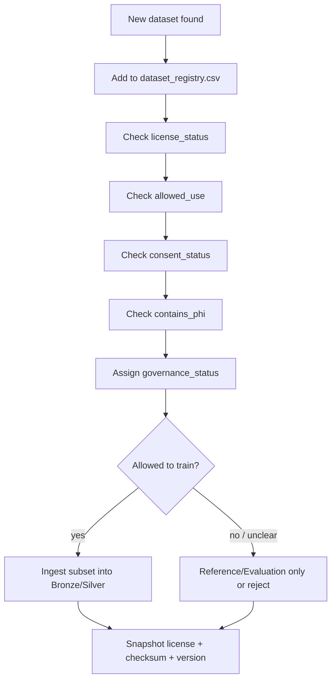

# License Matrix — Clinical Ambient Documentation MVP

**File:** `data_governance/license_matrix.md`  
**Owner:** Duy / Data Governance  
**Created:** 2026-06-01  
**Scope:** Local-first Clinical Ambient Documentation Assistant for Vietnamese outpatient care  
**Input registry:** `dataset_registry.csv`  

---

## 1. Purpose

File này là **governance gate** trước khi ingest, train, evaluate hoặc demo bất kỳ dataset nào.

Mục tiêu chính: tránh lỗi tư duy **“thấy dataset public là đem train”**.

Trong MVP y tế, một dataset chỉ được dùng khi trả lời rõ 4 câu hỏi:

1. **License có rõ không?**
2. **Có được dùng để training không?**
3. **Có được dùng để evaluation/demo không?**
4. **Có an toàn cho commercial/pilot không?**

Nếu câu trả lời không rõ, mặc định là **không dùng để train production/pilot**.

---

## 2. Core policy

### 2.1. Rule of thumb

| Case | Default decision |
|---|---|
| License clear + allowed use includes training | Can train within license terms |
| License clear + evaluation only | Evaluation/reference only |
| License needs review | No production/pilot training |
| License unknown | Do not ingest deeply; inventory only |
| Research-only | Research/evaluation only; no commercial/pilot |
| Non-commercial | Academic/reference/evaluation only; no commercial/pilot |
| Patient data | Do not use before consent + legal/governance approval |
| Internal synthetic data | Safe for MVP training/evaluation/demo if clearly marked synthetic |
| Volunteer simulated audio | Use only after consent; consent must specify training/evaluation/demo scope |
| Hold-out evaluation set | Never train on it |

### 2.2. Clinical data safety rules

- **License không rõ → không dùng để train production/pilot.**
- **Research-only → không dùng commercial/pilot.**
- **Non-commercial → chỉ dùng reference/evaluation học thuật.**
- **Real patient data → không ingest, không train, không evaluate nếu chưa có consent + legal/governance approval.**
- **Raw audio là dữ liệu nhạy cảm cao**, kể cả khi transcript đã de-identify.
- **Evaluation set phải tách khỏi training set** để tránh leakage.
- **Mọi note/fact lâm sàng phải có source attribution** về transcript/audio segment.
- **Dữ liệu public có giá trị kỹ thuật nhưng chưa chắc có quyền dùng thương mại.**

---

## 3. Decision labels

| Label | Meaning |
|---|---|
| **Use now** | Có thể dùng ngay trong MVP theo phạm vi ghi rõ |
| **Use after consent** | Chỉ dùng sau khi có consent hợp lệ |
| **Use after review** | Cần governance/legal/source review trước khi dùng sâu |
| **Evaluate later** | Chưa ưu tiên; chỉ đánh giá khi cần |
| **Reference only** | Chỉ dùng làm tham khảo/rubric/benchmark, không train sản phẩm |
| **Avoid for now** | Không dùng trong MVP hiện tại |
| **Hold-out only** | Chỉ dùng evaluation, tuyệt đối không train |

---

## 4. License matrix

| Source                                                    | Dataset ID                                    | License status    | Training allowed?                                                            | Evaluation allowed?                                | Commercial/pilot safe?                                   | Decision                                                           |
|:----------------------------------------------------------|:----------------------------------------------|:------------------|:-----------------------------------------------------------------------------|:---------------------------------------------------|:---------------------------------------------------------|:-------------------------------------------------------------------|
| Synthetic Vietnamese Outpatient Encounter Set             | A_SYNTHETIC_VI_OUTPATIENT_ENCOUNTERS          | internal          | yes — internal synthetic                                                     | yes — internal                                     | yes for MVP/demo; label as synthetic                     | Use now — main end-to-end MVP dataset                              |
| Synthetic Vietnamese Outpatient SOAP-lite Set             | A_SYNTHETIC_VI_SOAP_LITE                      | internal          | yes — internal synthetic                                                     | yes — internal                                     | yes for MVP/demo; label as synthetic                     | Use now — SOAP-lite gold/reference                                 |
| Volunteer/Actor Simulated Encounter Set                   | A_VOLUNTEER_ACTOR_ENCOUNTERS                  | internal          | yes after volunteer consent + review                                         | yes after consent + review                         | not yet — consent must explicitly cover pilot/commercial | Use after consent — do not use real symptoms/PHI                   |
| Synthetic/Volunteer Encounter Set                         | A_SYNTHETIC_VOLUNTEER_ENCOUNTER_SET           | internal          | yes after consent + annotation review                                        | yes after consent + freeze policy                  | not yet — requires consent scope and governance sign-off | Use after review — seed Gold/Evaluation v0.1                       |
| Internal Gold/Evaluation Hold-out Set                     | A_INTERNAL_GOLD_EVALUATION_SET                | internal          | no — hold-out only                                                           | yes — frozen evaluation/demo                       | yes for internal demo; do not expose as training data    | Use now for evaluation only; never train                           |
| Private Gold Outpatient Encounter Corpus — future only    | A_PRIVATE_GOLD_OUTPATIENT_CORPUS_FUTURE       | approval_required | no — approval required                                                       | no — approval required                             | no                                                       | Avoid for now — no ingest before consent/legal/governance approval |
| VietMed                                                   | B_VIETMED                                     | needs_review      | no for pilot/production until license review; maybe internal experiment only | yes internal eval/bootstrap after license snapshot | needs legal/governance review                            | Use for MVP eval/bootstrap only; no broad training/pilot yet       |
| VietSpeech                                                | B_VIETSPEECH                                  | needs_review      | no until license/source review                                               | yes internal eval after snapshot                   | needs review                                             | Evaluate later — ASR robustness only                               |
| Common Voice vi                                           | B_COMMON_VOICE_VI                             | clear             | yes                                                                          | yes                                                | yes if license terms are preserved                       | Use now — ASR robustness                                           |
| FOSD                                                      | B_FOSD                                        | clear             | yes                                                                          | yes                                                | yes with attribution/terms                               | Use now — ASR/chunk/timestamp testing                              |
| viet_bud500                                               | B_VIET_BUD500                                 | needs_review      | no until source/license review                                               | yes internal eval after snapshot                   | needs review                                             | Evaluate later — conversational ASR robustness                     |
| VietSuperSpeech                                           | B_VIETSUPERSPEECH                             | needs_review      | no                                                                           | reference/eval only after source review            | no until component licenses verified                     | Reference/evaluate only — verify component provenance              |
| VIVOS                                                     | B_VIVOS                                       | non_commercial    | no commercial training; research only                                        | yes research/evaluation only                       | no — non-commercial                                      | Reference only — do not use for commercial/pilot                   |
| viVoice                                                   | B_VIVOICE                                     | research_only     | research only; no commercial training                                        | yes research/evaluation only                       | no — research-only/gated                                 | Evaluate for research only; no pilot/commercial use                |
| FLEURS vi                                                 | B_FLEURS_VI                                   | needs_review      | no until license review                                                      | yes benchmark/evaluation                           | needs review                                             | Evaluate as auxiliary ASR benchmark                                |
| VinBigdata/VLSP2020                                       | B_VINBIGDATA_VLSP2020                         | needs_review      | no until access/usage terms confirmed                                        | reference only until confirmed                     | needs review                                             | Reference only — verify terms before ingest                        |
| ASR-Vietnamese                                            | B_ASR_VIETNAMESE                              | needs_review      | no — source mixture unclear                                                  | reference only                                     | no until component provenance verified                   | Reference only — avoid training                                    |
| AMI Meeting Corpus                                        | B_AMI_MEETING_CORPUS                          | needs_review      | no for Vietnamese clinical model                                             | yes technical benchmark/reference                  | no direct pilot use                                      | Reference only — diarization benchmark                             |
| AliMeeting                                                | B_ALIMEETING                                  | needs_review      | no for Vietnamese clinical model                                             | yes technical benchmark/reference                  | no direct pilot use                                      | Evaluate only — diarization/overlap benchmark                      |
| VietMed-NER                                               | C_VIETMED_NER                                 | needs_review      | no broad training until license review; maybe internal experiment only       | yes internal eval/demo after snapshot              | needs legal/governance review                            | Evaluate — fact extraction v0.1, review before training            |
| ViMQ                                                      | C_VIMQ                                        | needs_review      | no until source terms reviewed                                               | yes reference/eval after review                    | no until web-source terms cleared                        | Evaluate/reference only — review crawl/source terms                |
| Vietnamese Medical QA                                     | C_VIETNAMESE_MEDICAL_QA                       | clear             | yes, within license; avoid clinical decision automation                      | yes                                                | yes if license terms are satisfied                       | Use now — language patterns, QA, dictionary mining                 |
| ViHealthQA                                                | C_VIHEALTHQA                                  | needs_review      | no until license/source review                                               | yes internal eval after review                     | needs review                                             | Evaluate later — website-source risk                               |
| ViMedAQA                                                  | C_VIMEDAQA                                    | research_only     | research only; no commercial training                                        | yes research/evaluation only                       | no — research/education only                             | Reference/evaluate only                                            |
| vi_mednli                                                 | C_VI_MEDNLI                                   | clear             | yes                                                                          | yes                                                | yes if terms are satisfied                               | Use now — NLI/consistency auxiliary data                           |
| ViHealthNLI                                               | C_VIHEALTHNLI                                 | needs_review      | no until access/license verified                                             | yes internal eval after review                     | needs review                                             | Evaluate later — verify dataset license                            |
| PhoNER_COVID19                                            | C_PHONER_COVID19                              | needs_review      | no until license review; not outpatient fit                                  | yes reference/eval after review                    | needs review                                             | Reference only — NER pattern, not encounter corpus                 |
| VietBioNER                                                | C_VIETBIONER                                  | needs_review      | no until license review; not dialogue fit                                    | yes reference/eval after review                    | needs review                                             | Reference only — terminology/NER seed                              |
| ViMedNER                                                  | C_VIMEDNER                                    | unknown           | no                                                                           | no until access/license verified                   | no                                                       | Avoid for now — inventory only                                     |
| DAV / DrugBank Việt Nam                                   | D_DAV_DRUGBANK_VN                             | needs_review      | not model training; dictionary use after crawl/cache review                  | yes dictionary/evaluation after review             | needs review for automated crawl/cache/pilot             | Use for dictionary after governance review                         |
| WHO ICD-10 Browser                                        | D_WHO_ICD10_BROWSER                           | clear             | not model training; dictionary/schema use                                    | yes dictionary/evaluation                          | yes if WHO terms/attribution complied                    | Use now — diagnosis code backbone                                  |
| ICD-10 trong văn bản/BYT                                  | D_ICD10_BYT_VN                                | needs_review      | not model training; dictionary/schema use after version review               | yes dictionary/evaluation after source snapshot    | needs source/version review                              | Use after source/version snapshot                                  |
| RxNorm/RxNav                                              | D_RXNORM_RXNAV                                | clear             | not model training; dictionary/schema use                                    | yes dictionary/evaluation                          | yes if terms/attribution complied                        | Use now — medication normalization                                 |
| ATC/DDD                                                   | D_ATC_DDD                                     | clear             | not model training; dictionary/schema use                                    | yes dictionary/evaluation                          | yes if terms/attribution complied                        | Use now — drug class mapping                                       |
| LOINC                                                     | D_LOINC                                       | clear             | not model training; dictionary/schema use                                    | yes dictionary/evaluation                          | yes if LOINC terms/attribution complied                  | Use now — lab/vital mapping                                        |
| SNOMED CT                                                 | D_SNOMED_CT                                   | needs_review      | no until jurisdiction/license agreement clear                                | reference/dictionary eval only after review        | no until license agreement clear                         | Evaluate later — not a blocker for MVP v0.1                        |
| HL7 Terminology / FHIR THO                                | D_HL7_TERMINOLOGY_FHIR_THO                    | clear             | not model training; schema/value-set use                                     | yes dictionary/evaluation                          | yes if HL7 terms complied                                | Use now — FHIR-ready schema                                        |
| vi_pubmed                                                 | D_VI_PUBMED                                   | needs_review      | no until license clarified                                                   | yes alias/synonym eval after review                | no until review                                          | Evaluate later — alias/synonym seed only                           |
| acrDrAid / ViHealthBERT                                   | D_ACRDRAID_VIHEALTHBERT                       | clear             | not primary model training; dictionary/abbreviation use                      | yes dictionary/evaluation                          | yes if repo terms preserved                              | Use now — abbreviation dictionary                                  |
| Local MVP Dictionary                                      | D_LOCAL_MVP_DICTIONARY                        | internal          | yes — internal derived resource                                              | yes                                                | yes for MVP/pilot if reviewed/versioned                  | Build now — required MVP dictionary                                |
| VietMed-Sum                                               | E_VIETMED_SUM                                 | needs_review      | no broad training until license/doctor-confirmation reviewed                 | yes reference/eval/demo after snapshot             | needs legal/governance review                            | Use as reference/eval only; not SOAP gold yet                      |
| ACI-Bench                                                 | E_ACI_BENCH                                   | needs_review      | no direct training for Vietnamese product until terms/domain review          | yes structural reference/eval                      | no direct pilot use                                      | Reference only — structure/rubric                                  |
| MEDIQA-Chat                                               | E_MEDIQA_CHAT                                 | needs_review      | no direct training for Vietnamese product until terms/domain review          | yes structural reference/eval                      | no direct pilot use                                      | Reference only — section labels/rubric                             |
| MTS-Dialog                                                | E_MTS_DIALOG                                  | needs_review      | no direct training for Vietnamese product until terms/domain review          | yes structural reference/eval                      | no direct pilot use                                      | Reference only — dialogue-to-note structure                        |
| Microsoft Clinical Visit Note Summarization Corpus        | E_MICROSOFT_CLINICAL_VISIT_NOTE_SUMMARIZATION | needs_review      | no direct training for Vietnamese product until terms/domain review          | reference only                                     | no direct pilot use                                      | Reference only — synthetic English design pattern                  |
| Synthetic Vietnamese Outpatient SOAP-lite Reference Notes | E_SYNTHETIC_VI_SOAP_REFERENCE                 | internal          | yes — internal synthetic                                                     | yes — internal                                     | yes for MVP/demo; label as synthetic                     | Use now — note-generation reference                                |

---

## 5. Recommended Day 3 output

Sau Ngày 3, repo nên có file này và được dùng như checklist trước mọi thao tác ingest:

```text
data_governance/
└── license_matrix.md
```

Minimum acceptance criteria:

- Tất cả dataset trong registry đều có decision.
- Không có dataset `needs_review`, `unknown`, `research_only`, `non_commercial`, `approval_required` nào được đánh dấu an toàn cho production/pilot training.
- Internal synthetic data được phép dùng cho MVP.
- Volunteer data bị chặn bởi consent gate.
- Real patient data bị chặn hoàn toàn cho đến khi có approval.
- Evaluation hold-out được ghi rõ `never train`.

---

## 6. Immediate action list for MVP

| Priority | Action |
|---|---|
| P0 | Build synthetic outpatient encounter set and SOAP-lite reference set |
| P0 | Freeze internal Gold/Evaluation hold-out and mark **never train** |
| P0 | Do not ingest private real patient corpus yet |
| P1 | Use Common Voice vi and FOSD for ASR robustness |
| P1 | Use VietMed for MVP eval/bootstrap only, pending legal/license review |
| P1 | Use Vietnamese Medical QA, vi_mednli, acrDrAid and terminology resources for dictionary/evaluation |
| P1 | Put VietMed-NER, ViMQ, VietMed-Sum under legal/governance review before broad training |
| P2 | Evaluate other ASR/NLP corpora only when needed |
| P3 | Keep English note datasets as structural reference only |

---

## 7. Review workflow

Before using any new dataset:



---

## 8. Notes for legal/governance review

Các nguồn cần đặc biệt review nếu muốn dùng cho training rộng, pilot thương mại hoặc tích hợp lâu dài:

- VietMed
- VietMed-NER
- ViMQ
- VietMed-Sum
- ViHealthQA
- ViMedAQA
- viVoice
- VIVOS
- vi_pubmed
- ACI-Bench
- MEDIQA-Chat
- MTS-Dialog
- DAV / DrugBank Việt Nam nếu crawl/cache tự động
- SNOMED CT nếu muốn dùng sâu hơn dictionary reference

Until review is completed, use them only within the conservative decision stated in the matrix.
