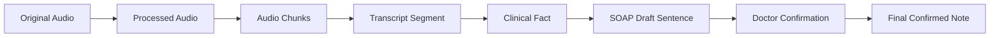
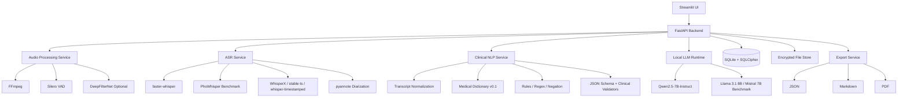
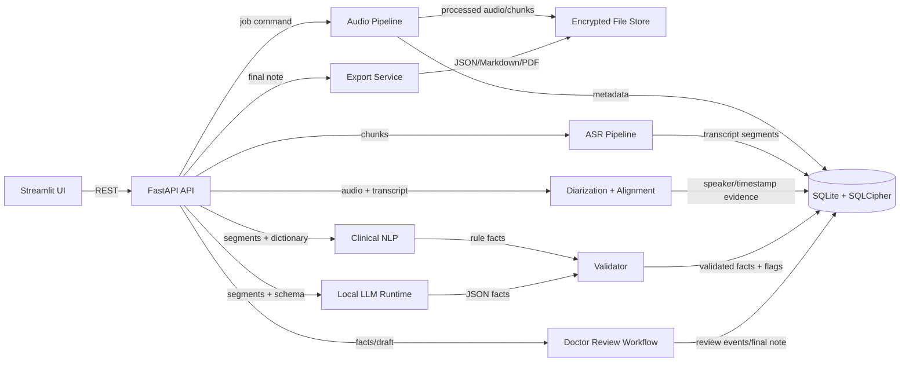
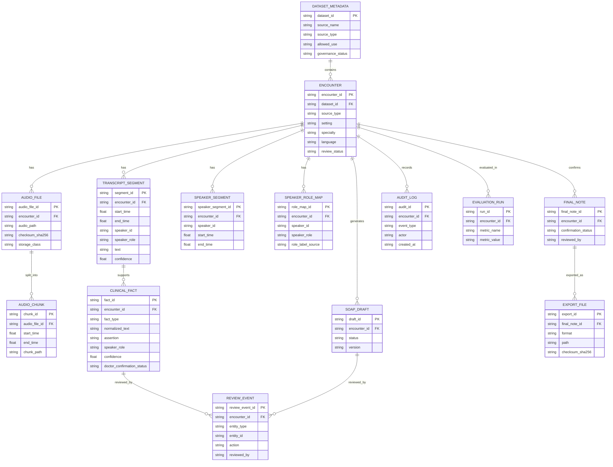

# PROJECT_PIPELINE_PLAN.md

## 1. Executive Summary

Dự án **Local-first Clinical Ambient Documentation Assistant for Vietnamese Outpatient Care** là hệ thống hỗ trợ tài liệu hóa lâm sàng cho khám ngoại trú tiếng Việt. Hệ thống nhận audio cuộc khám, xử lý cục bộ sau khi cuộc khám kết thúc, tạo transcript, gắn timestamp, phân đoạn speaker, trích xuất clinical facts có bằng chứng, tạo SOAP/outpatient note draft, sau đó bắt buộc bác sĩ review, sửa và xác nhận trước khi tạo final note.

Vấn đề chính dự án giải quyết là gánh nặng tài liệu hóa sau mỗi lượt khám ngoại trú. Bác sĩ cần ghi lại triệu chứng, tiền sử, nhận định, thuốc, xét nghiệm, lời dặn và kế hoạch theo dõi. Nếu pipeline hoạt động đúng, hệ thống có thể giảm thời gian ghi chép và giúp bác sĩ tập trung hơn vào bệnh nhân, nhưng không được thay thế bác sĩ trong bất kỳ quyết định lâm sàng nào.

Đối tượng sử dụng MVP là bác sĩ, thư ký y khoa hoặc nhân viên y tế trong bối cảnh khám ngoại trú tiếng Việt. Trong giai đoạn đầu, hệ thống ưu tiên dữ liệu synthetic/volunteer actor và dữ liệu public được governance review, không ingest dữ liệu bệnh nhân thật nếu chưa có consent, legal/governance approval, encryption, access control, retention policy và audit workflow.

MVP tập trung vào pipeline **batch-after-stop**, nghĩa là hệ thống xử lý sau khi bác sĩ bấm dừng ghi âm hoặc upload file audio. MVP không ưu tiên realtime transcription vì realtime làm tăng độ phức tạp latency, streaming, UI và resource management, đồng thời dễ tạo hiểu nhầm từ transcript chưa ổn định.

Nguyên tắc kiến trúc cốt lõi là **local-first + privacy-first + evidence-first + human-in-the-loop**. Core pipeline không dùng cloud API mặc định. Audio, transcript, clinical facts, SOAP draft và export được xử lý cục bộ. Mọi clinical fact phải truy ngược được về quote, timestamp, speaker/speaker_role và transcript segment.

Dự án không phải hệ thống chẩn đoán, không phải clinical decision support, không phải công cụ kê đơn tự động và không phải hệ thống tự động ghi vào HIS/EHR. LLM không được coi là ground truth. LLM chỉ được dùng cho structured extraction và drafting có kiểm soát, phía sau validator và doctor review.

Kết quả đầu ra cuối cùng của hệ thống là **final confirmed note** đã được bác sĩ xác nhận, cùng với bản export JSON/Markdown/PDF, audit log, transcript/fact provenance và local encrypted storage. SOAP draft chỉ là bản nháp; dữ liệu chỉ trở thành Gold/final khi bác sĩ accept hoặc edit và xác nhận.

Điểm critical path của dự án không phải chỉ là ASR WER thấp, mà là **clinical meaning safety**: không sai phủ định, không sai thuốc/liều/dị ứng/lab/vital, không gắn nhầm speaker role, không tạo unsupported facts và không đưa plan không có evidence vào final note.

Thông tin còn thiếu cần ghi nhận là exact clinical specialty đầu tiên, exact hospital note template, exact raw audio TTL policy cho pilot thật, exact HIS/EHR API, exact FHIR mapping depth và numerical quality targets. Các điểm này được đánh dấu **TBD** trong plan.

---

## 2. Product Scope

### 2.1 In Scope for MVP

| Area | Description | Priority | Notes |
|---|---|---:|---|
| Vietnamese outpatient documentation | Hỗ trợ tài liệu hóa cuộc khám ngoại trú tiếng Việt. | P0 | Bối cảnh chính của MVP. |
| Local-first processing | Core audio, ASR, NLP, LLM, storage chạy cục bộ. | P0 | Không cloud mặc định. |
| Batch-after-stop | Xử lý sau khi bác sĩ bấm stop hoặc upload audio. | P0 | Không realtime trong MVP. |
| Audio capture/upload | Upload file audio hoặc ghi âm cục bộ qua UI. | P0 | Streamlit uploader; streamlit-mic-recorder nếu phù hợp. |
| Audio preprocessing | FFmpeg decode, mono/16kHz, loudness normalization. | P0 | Denoising chỉ optional noisy clinic mode. |
| VAD/chunking | Silero VAD tạo speech regions và chunks kèm offset map. | P0 | Offset map bắt buộc để giữ provenance. |
| ASR baseline | faster-whisper + Whisper large-v3/turbo. | P0 | Production MVP baseline thực dụng. |
| Vietnamese ASR baseline | PhoWhisper-medium/large benchmark. | P0 | Bắt buộc test cho tiếng Việt. |
| Timestamp/alignment | WhisperX default; stable-ts/whisper-timestamped fallback. | P0 | Segment/word timestamp nếu chất lượng đủ. |
| Diarization | pyannote speaker diarization tạo speaker_0/speaker_1/speaker_n. | P0 | Không tự coi speaker role là truth. |
| Manual speaker role mapping | UI để map speaker thành Doctor/Patient/Caregiver/Nurse/Unknown. | P0 | Correction bắt buộc vì sai role có rủi ro cao. |
| Transcript normalization | Unicode, spacing, abbreviation, dictionary-driven cleanup. | P0 | Không tự thêm thông tin mới. |
| Rule/dictionary extraction | Medical dictionary v0.1, regex/rules, negation/assertion. | P0 | Là lớp kiểm soát trước LLM. |
| LLM structured extraction | Local LLM trích xuất JSON facts theo schema. | P0 | Qwen2.5-7B-Instruct baseline; Llama 3.1 8B/Mistral 7B đối chứng. |
| Validator and safety flags | JSON Schema + clinical validators + conflict checks. | P0 | LLM output không được đi thẳng vào final note. |
| SOAP draft | SOAP draft từ fact JSON có evidence. | P0 | Không tạo SOAP trực tiếp từ raw transcript. |
| Doctor review | Accept/edit/reject facts và confirm note. | P0 | Bắt buộc trước final/export. |
| Local encrypted storage | SQLite + SQLCipher, encrypted local file store. | P0 | Raw audio TTL và audit log. |
| Export | JSON, Markdown, PDF. | P0 | Chỉ sau doctor confirmation. |
| Evaluation | WER/CER, medical term error, negation, entity, speaker, fact F1, correction burden. | P0 | Gold/Evaluation v0.1 cần versioning. |
| Future FHIR mapping | Chuẩn bị canonical schema để mapping FHIR sau. | P2 | Không build full FHIR server trong MVP. |

### 2.2 Out of Scope for MVP

| Area | Reason | Future Phase |
|---|---|---|
| Real-time transcription | Tăng độ phức tạp latency, streaming, UI và resource management. | Future near-realtime phase |
| Full HIS/EHR write-back | Cần governance, API, integration, legal/clinical approval. | Future FHIR/HIS/EHR Integration |
| Full FHIR server | Dễ over-engineer trước khi extraction/fact schema ổn định. | Future Phase |
| Fine-tuning medical model | Cần gold data, legal review, annotation, evaluation nghiêm túc. | Post-pilot research |
| Fully automatic role labeling | Speaker attribution sai có rủi ro lâm sàng cao. | Sau khi có evaluation đủ mạnh |
| Autonomous clinical coding | Có thể bị hiểu là decision/billing automation. | Future, review-only coding candidates |
| Production-grade IAM/SSO | Chưa cần cho laptop/local MVP. | Pilot/enterprise phase |
| Hospital-wide ontology | MVP chỉ cần dictionary v0.1 theo 1–2 specialty. | Production knowledge layer |
| Cloud inference by default | Trái local-first/privacy-first. | Chỉ có thể xem xét sau governance approval |
| Raw audio long-term retention for real patients | Raw audio là dữ liệu nhạy cảm nhất. | Theo hospital governance policy |

### 2.3 Explicit Non-goals

- Không tự chẩn đoán.
- Không đưa differential diagnosis nếu bác sĩ không nói rõ.
- Không tự kê đơn.
- Không tự đặt xét nghiệm.
- Không tự đưa khuyến nghị điều trị.
- Không tự tạo clinical decision.
- Không tự ghi dữ liệu vào HIS/EHR khi chưa có xác nhận bác sĩ và governance approval.
- Không thay thế bác sĩ, điều dưỡng hoặc thư ký y khoa.
- Không trình bày sản phẩm như “AI doctor”.
- Không coi LLM output là ground truth.
- Không đưa unsupported fact vào final note.
- Không đưa plan vào SOAP nếu không có evidence hoặc doctor confirmation.
- Không dùng cloud telemetry mặc định.
- Không dùng dữ liệu bệnh nhân thật nếu chưa có consent/legal/governance approval.
- Không coi de-identification tiếng Việt là hoàn hảo.
- Không fine-tune sớm khi chưa có Gold/Evaluation set đáng tin cậy.

---

## 3. Master End-to-End Pipeline

### 3.1 High-Level Pipeline Diagram

```mermaid
flowchart LR
    A[Audio capture/upload] --> B[Audio preprocessing]
    B --> C[VAD/chunking]
    C --> D[ASR]
    D --> E[Timestamp/alignment]
    E --> F[Diarization]
    F --> G[Manual speaker role correction]
    G --> H[Transcript normalization]
    H --> I[Rule/dictionary extraction]
    I --> J[LLM structured JSON extraction]
    J --> K[Validator]
    K --> L[Safety flags]
    L --> M[SOAP draft generation]
    M --> N[Doctor review]
    N --> O[Final confirmed note]
    O --> P[Local encrypted storage]
    O --> Q[Export JSON/Markdown/PDF]
    P --> R[Future FHIR mapping]
```

### 3.2 Pipeline Stage Table

| Stage | Input | Processing | Output | Owner Module | Risks | Validation | Human Review Required |
|---|---|---|---|---|---|---|---|
| Audio capture/upload | Audio file or recording | File validation, metadata creation, local save | Encounter + raw audio record | Audio Capture / Upload | Unsupported file, missing consent metadata | File exists, format allowed, checksum | No for synthetic; yes for real data governance |
| Audio preprocessing | Raw audio | FFmpeg decode, mono/16kHz, loudness normalization, optional denoise | Processed audio | Audio Preprocessing | Denoising/resampling may distort terms | Sample rate, channels, checksum, duration | No |
| VAD/chunking | Processed audio | Silero VAD, speech region detection, chunking, offset map | Audio chunks + offset map | VAD and Chunking | Cutting important words, losing offsets | Offset continuity, chunk duration, speech coverage | No |
| ASR | Chunks | faster-whisper/PhoWhisper benchmark | Transcript segments + confidence | ASR | Medical term errors, negation errors | WER/CER, confidence, medical term review | Review in UI |
| Timestamp/alignment | Transcript segments + audio | WhisperX/stable-ts/whisper-timestamped | Segment/word timestamps, evidence map | Timestamp and Alignment | Bad timestamp usefulness | Timestamp range checks, click-back test | Review when evidence unclear |
| Diarization | Audio + transcript | pyannote diarization, merge with transcript | speaker-attributed transcript | Diarization | Speaker confusion, overlap | Speaker coverage, segment overlap checks | Yes, via role mapping |
| Speaker role mapping | speaker_0/speaker_1/speaker_n | UI role correction | locked role map | Speaker Role Mapping | Doctor/patient/caregiver swap | Role must be locked before final | Yes |
| Transcript normalization | Raw transcript | Unicode, spacing, abbreviation handling | Normalized transcript | Transcript Normalization | Over-normalization changes meaning | Keep raw quote, diff check | No, but visible |
| Rule/dictionary extraction | Normalized transcript | Dictionary matching, regex/rules, negation detection | Preliminary facts | Medical Dictionary and Rule Extraction | False positives, missed aliases | Dictionary match evidence, assertion checks | Yes for clinical acceptance |
| LLM structured extraction | Transcript + dictionary + schema | Local LLM JSON extraction | JSON clinical facts | LLM Structured Extraction | Hallucination, unsupported fact | JSON Schema, exact quote, evidence check | Yes |
| Validator | Rule facts + LLM facts | Schema validation, evidence, conflict, safety checks | Validated facts + flags | Validator and Safety Flags | Validator gaps | Missing quote/timestamp/speaker checks | Yes for flagged facts |
| Safety flags | Validated facts | Warning generation | Review warnings | Validator and Safety Flags | Alert fatigue, missed critical flags | Flag taxonomy tests | Yes |
| SOAP draft generation | Accepted/pending evidence-backed facts | SOAP section mapping, draft rendering | SOAP draft | SOAP Draft Generation | Unsupported assessment/plan | Draft sentence evidence mapping | Yes |
| Doctor review | Transcript + facts + SOAP draft | Accept/edit/reject facts, confirm note | Confirmed facts + final note | Doctor Review UI | UI not trusted, review burden high | Required confirmation gate | Yes, mandatory |
| Final confirmed note | Accepted/edited facts | Final note build | Final note | SOAP/Final Export | Pending/rejected fact leakage | Final uses accepted/edited only | Yes |
| Local encrypted storage | Metadata, transcript, facts, audio, exports | SQLCipher + encrypted file store + TTL | Stored encounter package | Local Storage and Security | PHI leakage, stale raw audio | Encryption, TTL, audit log | Governance review for real data |
| Export | Final note | JSON/Markdown/PDF export | Export files | Final Export | Export before confirmation | Confirmation status gate | Yes |
| Future FHIR mapping | Canonical facts and final note | Mapping to FHIR resources | FHIR-ready artifacts | Future Integration | Over-engineering, wrong mapping | TBD mapping review | Yes |

### 3.3 Evidence-First Data Flow

Evidence-first data flow của dự án đi theo chuỗi:

Nguyên tắc bắt buộc:

- Mỗi **ClinicalFact** phải có `original_text` hoặc quote gốc tương đương.
- Mỗi fact phải có `source_evidence.quote`.
- Mỗi fact phải có `source_evidence.start_time` và `source_evidence.end_time`, hoặc link về transcript segment có timestamp.
- Mỗi fact phải có `speaker_role`.
- Mỗi fact phải link về `source_segment_ids` hoặc `linked_transcript_segment_id`.
- Mỗi transcript segment phải có `segment_id`, `encounter_id`, `start_time`, `end_time`, `speaker_id`, `speaker_role`, `text`, `confidence`, `audio_span`.
- Final note chỉ dùng facts có `doctor_confirmation_status = accepted` hoặc tương đương trạng thái edited/confirmed.
- Facts `pending`, `rejected`, thiếu evidence, unresolved speaker role hoặc unsupported plan không được vào final note.
- Plan chỉ được ghi nếu bác sĩ nói rõ trong transcript hoặc bác sĩ đã edit/confirm trong review workflow.
- LLM không được tự thêm fact ngoài transcript.
- Audit log phải ghi nhận ai sửa gì, khi nào.

---

## 4. Phase Roadmap

### Phase 0: Research, Setup and Dataset Preparation

**Goal:** Chuẩn hóa nền tảng research, schema, dataset registry và synthetic-first data strategy trước khi build core pipeline.

| Feature / Workstream | Description | Deliverables | Dependencies | Acceptance Criteria |
|---|---|---|---|---|
| Dataset registry | Dùng registry gồm synthetic, ASR speech, medical NLP, terminology, note reference. | `dataset_registry.csv` reviewed and versioned | Existing registry | P0 datasets identified and unsafe datasets marked avoid/reference-only |
| Synthetic outpatient encounters | Tạo 20–50 encounter giả lập có PII giả, accent/noise, caregiver, negation, thuốc/liều/dị ứng. | Synthetic Vietnamese Outpatient Encounter Set | Medical dictionary v0.1 | Has audio/transcript/timestamp/speaker/role/facts/SOAP where applicable |
| SOAP-lite gold references | Tạo SOAP-lite reference note từ encounter giả lập. | Synthetic Vietnamese Outpatient SOAP-lite Set | Fact schema | Every note statement links to source segment |
| Internal Gold/Evaluation hold-out | Freeze evaluation set không dùng để train. | Internal Gold/Evaluation v0.1 | Dataset registry | Versioned, no training leakage |
| Schema foundation | Dùng Draft 2020-12 schemas cho dataset metadata, encounter, transcript segment, clinical fact. | JSON Schema files | Current schemas | Schema validation passes for seed examples |
| Governance flags | Consent, license, allowed_use, contains_phi, retention, access control. | Governance checklist | Schema + registry | No real patient data marked safe without approval |

**Key outputs**

- Dataset registry with P0/P1/P2/P3/P4 priorities.
- Synthetic-first data lake seed.
- JSON Schema Draft 2020-12 baseline.
- Governance gates for training/evaluation/demo/holdout.

**Engineering tasks**

- Implement schema validation CLI.
- Create synthetic encounter manifest.
- Create example encounter/transcript/fact JSON.
- Add checksum, version and allowed_use validation.
- Separate holdout data from training/demo data.

**Risks**

- Public datasets may have license uncertainty.
- Synthetic data may be too clean.
- Evaluation leakage if holdout is not frozen.
- Real patient data may be ingested too early.

**Definition of Done**

- P0 synthetic datasets exist or are ready to generate.
- All seed metadata validates against schema.
- `allowed_use`, `consent_status`, `license_status`, `governance_status` are populated.
- No real patient data is used unless explicitly approved.

---

### Phase 1: Local Audio and ASR Foundation

**Goal:** Build local-first audio-to-transcript pipeline that can run end-to-end on synthetic/approved demo data.

| Feature / Workstream | Description | Deliverables | Dependencies | Acceptance Criteria |
|---|---|---|---|---|
| Audio upload/record | Streamlit upload/record interface. | Audio input UI | Phase 0 schemas | Audio saved locally with metadata and checksum |
| FFmpeg preprocessing | Decode, mono, 16kHz, loudness normalization. | Processed audio file | FFmpeg | Processed file has expected sample rate/channel |
| VAD/chunking | Silero VAD speech regions and chunks. | Audio chunks + offset map | Processed audio | Chunk offsets map back to original audio |
| ASR baseline | faster-whisper + Whisper large-v3/turbo. | Transcript segments | Chunks | Transcript generated locally |
| Vietnamese ASR baseline | PhoWhisper-medium/large benchmark. | Comparative ASR output | Chunks | Benchmark artifact created |
| Basic metrics | WER/CER on synthetic/reference data. | Evaluation report | Reference transcript | Metrics reproducible |

**Key outputs**

- Local upload/record → preprocess → VAD → ASR pipeline.
- Transcript segments with confidence and basic metadata.
- Initial WER/CER baseline.
- No cloud API usage in core pipeline.

**Engineering tasks**

- Implement job creation after audio upload.
- Implement FFmpeg wrapper.
- Implement VAD + chunk offset map.
- Implement ASR service interface.
- Store transcript segments in SQLite/SQLCipher-compatible schema.

**Risks**

- ASR may fail on Vietnamese medical terms.
- Laptop resource may be insufficient for large models.
- Chunking may cut clinically important phrases.
- PhoWhisper integration may require extra alignment work.

**Definition of Done**

- End-to-end audio-to-transcript works locally.
- Transcript segments have `segment_id`, `encounter_id`, `start_time`, `end_time`, `speaker_id`, `text`, `confidence`.
- ASR output can be evaluated against at least one reference transcript.
- No PHI/PII leaves local machine.

---

### Phase 2: Transcript, Timestamp and Diarization Layer

**Goal:** Add evidence navigation: timestamped transcript, diarization, manual speaker role correction and click-back audio review.

| Feature / Workstream | Description | Deliverables | Dependencies | Acceptance Criteria |
|---|---|---|---|---|
| Timestamp alignment | WhisperX default; stable-ts/whisper-timestamped fallback. | Segment/word timestamps | ASR transcript | Fact evidence can jump to audio range |
| Diarization | pyannote speaker diarization. | speaker_0/speaker_1/speaker_n segments | Audio | Speaker segments merge with transcript |
| Role mapping UI | Manual correction of speaker roles. | Locked role map | Diarization output | Unresolved role warning shown |
| Transcript normalization | Unicode, spacing, abbreviation cleanup. | Normalized transcript | Raw transcript | Raw quote retained |
| Evidence map | Link audio span ↔ transcript segment. | Evidence map | Timestamp + transcript | Segment-level click-back works |

**Key outputs**

- Timestamped transcript.
- Speaker-attributed transcript.
- Manual role correction workflow.
- Evidence map for quote/timestamp/audio playback.

**Engineering tasks**

- Implement timestamp service.
- Implement diarization service.
- Merge diarization output with ASR transcript.
- Add speaker role table and role locking.
- Implement transcript display with audio playback.

**Risks**

- Diarization may fail with overlap or caregiver/nurse interruptions.
- WhisperX alignment may be unstable for Vietnamese.
- Role mapping UI may be cumbersome.

**Definition of Done**

- Every transcript segment has speaker ID and timestamp.
- Speaker roles can be manually corrected and locked.
- Unresolved speaker roles block or warn before final export.
- Doctor/reviewer can click fact/segment to listen to source audio.

---

### Phase 3: Clinical NLP and Fact Extraction

**Goal:** Extract evidence-backed clinical facts using dictionary/rule first and LLM structured JSON second.

| Feature / Workstream | Description | Deliverables | Dependencies | Acceptance Criteria |
|---|---|---|---|---|
| Medical dictionary v0.1 | Symptoms, problems, medications, labs/vitals, units, aliases, negation cues. | Dictionary JSON/YAML | Phase 0 | Dictionary versioned and auditable |
| Rule extraction | Regex/rules for entities, units, negation/assertion. | Preliminary facts | Normalized transcript | Rule facts include evidence segment |
| LLM structured extraction | Qwen2.5-7B-Instruct JSON extraction. | Candidate clinical facts | Schema + transcript | JSON validates or is rejected |
| Schema validation | Clinical fact schema validation. | Validation report | Candidate facts | No missing required fields |
| Evidence check | Quote exists in transcript and links to segment. | Evidence validation | Candidate facts | Missing quote fact is rejected |
| Conflict detection | Rule vs LLM negation/speaker/entity conflicts. | Safety flags | Rule + LLM facts | Conflicts visible in review UI |

**Key outputs**

- Preliminary rule facts.
- LLM candidate facts.
- Validated clinical facts with evidence.
- Warning flags for low confidence/conflict/unsupported content.

**Engineering tasks**

- Implement dictionary matcher.
- Implement Vietnamese negation/assertion rules.
- Implement LLM prompt template and local runtime call.
- Implement JSON Schema validation.
- Implement custom validators for quote/timestamp/speaker/plan evidence.

**Risks**

- LLM hallucination.
- Negation error.
- Medication/dosage extraction error.
- Dictionary too small for real clinic language.
- Facts extracted from caregiver may be attributed incorrectly.

**Definition of Done**

- Every accepted candidate fact has source segment, quote, timestamp and speaker role.
- Missing evidence facts are rejected or blocked from final note.
- Rule/LLM conflicts are flagged.
- No fact becomes Gold without doctor confirmation.

---

### Phase 4: SOAP Draft and Doctor Review Workflow

**Goal:** Generate SOAP draft from evidence-backed fact JSON and require doctor review before final note.

| Feature / Workstream | Description | Deliverables | Dependencies | Acceptance Criteria |
|---|---|---|---|---|
| SOAP section mapping | Map fact types to S/O/A/P sections. | SOAP mapping rules | Clinical facts | Subjective/Objective/Assessment/Plan generated from facts |
| Draft renderer | Template/LLM-assisted renderer from fact JSON. | SOAP draft | Validated facts | Draft sentence traceable to facts |
| Review UI | Transcript + audio playback + fact table + SOAP draft. | Streamlit review workflow | Evidence map | Doctor can accept/edit/reject facts |
| Confirmation gate | Block final/export until review complete. | Final confirmation workflow | Review events | Pending/unsupported facts blocked |
| Final note builder | Build final note from accepted/edited facts. | Final confirmed note | Confirmed facts | Rejected/pending facts excluded |

**Key outputs**

- SOAP draft.
- Fact review queue.
- Doctor confirmation workflow.
- Final confirmed note.

**Engineering tasks**

- Implement SOAP section rules.
- Implement fact table accept/edit/reject.
- Implement review event logging.
- Implement final note generation.
- Implement export lock until confirmation.

**Risks**

- SOAP draft may include unsupported assessment/plan.
- UI may not earn doctor trust.
- Correction burden may be too high.
- Pending facts may leak into final note.

**Definition of Done**

- SOAP draft never uses raw transcript directly without fact layer.
- Final note only uses accepted/edited facts and doctor edits.
- Export is blocked until final confirmation.
- Audit log records review events.

---

### Phase 5: Security, Storage and Export

**Goal:** Make local storage, retention, audit and export safe enough for internal demo and pilot preparation.

| Feature / Workstream | Description | Deliverables | Dependencies | Acceptance Criteria |
|---|---|---|---|---|
| SQLCipher database | Store encounter, transcript, facts, review events, notes. | Encrypted local DB | Data model | Sensitive metadata encrypted |
| Encrypted file store | Store raw audio, processed audio, chunks, exports. | Encrypted file directory | Storage design | Files not stored in cloud by default |
| Raw audio TTL | Delete raw audio after confirmation/export or approved TTL. | TTL job | Governance policy | Temporary chunks auto-purged |
| Audit log | Track create/update/review/export/delete events. | Audit table/report | Review workflow | Who/what/when captured |
| Export JSON/Markdown/PDF | Export confirmed note only. | Export files | Final note | Export blocked before confirmation |
| Delete raw audio | Manual/API deletion. | Deletion workflow | Storage service | Audit entry created |

**Key outputs**

- Encrypted local database.
- Encrypted local file store.
- Export service.
- TTL/purge workflow.
- Audit log.

**Engineering tasks**

- Implement SQLCipher connection.
- Implement file store abstraction.
- Implement export service.
- Implement audit logging.
- Implement raw audio deletion/purge.

**Risks**

- PHI leakage through temp files or exports.
- Raw audio kept too long.
- Audit log missing sensitive events.
- PDF export not aligned with hospital template.

**Definition of Done**

- No telemetry by default.
- Raw audio and chunks have retention behavior.
- Export only after doctor confirmation.
- Audit log covers processing, review, export and deletion events.

---

### Phase 6: Evaluation, Pilot Readiness and Hardening

**Goal:** Measure clinical documentation quality and prepare controlled pilot workflow.

| Feature / Workstream | Description | Deliverables | Dependencies | Acceptance Criteria |
|---|---|---|---|---|
| ASR metrics | WER/CER/Medical Term Error Rate. | ASR evaluation report | Gold transcript | Metrics reproducible |
| Safety metrics | Negation, critical entity, unsupported facts, unsafe SOAP inventions. | Safety report | Gold facts | Critical errors tracked |
| Speaker metrics | Speaker attribution and role mapping accuracy. | Speaker evaluation | Labeled data | Role errors measured |
| Extraction metrics | Fact precision/recall/F1. | Extraction report | Gold facts | Fact evaluation reproducible |
| Correction burden | Time review, edit count, accept/reject rate. | Review burden report | Doctor review UI | Workflow value measurable |
| Pilot checklist | Consent, governance, retention, access, audit. | Pilot readiness package | Security/storage | Real data not used before approval |

**Key outputs**

- Evaluation dashboard/report.
- Error taxonomy.
- Pilot readiness checklist.
- Safety report.

**Engineering tasks**

- Implement metrics scripts.
- Implement report generation.
- Track review burden events.
- Add test cases for unsafe facts.
- Prepare governance checklist.

**Risks**

- Gold annotation is costly.
- Reviewer disagreement.
- Metrics improve but UI remains unusable.
- Pilot data approval delayed.

**Definition of Done**

- Evaluation can run repeatedly on frozen holdout set.
- Unsupported fact count is measured.
- SOAP unsafe invention count is measured.
- Correction burden is measured.
- Pilot checklist has no unresolved P0 governance blockers.

---

### Future Phase: FHIR/HIS/EHR Integration

**Goal:** Prepare hospital integration after canonical schema, safety workflow and review process are stable.

| Feature / Workstream | Description | Deliverables | Dependencies | Acceptance Criteria |
|---|---|---|---|---|
| FHIR mapping layer | Map canonical entities to FHIR resources. | Mapping spec | Stable schema | Observation/Condition/Medication/Allergy/Procedure/Composition mapped where possible |
| HIS/EHR integration design | Define read/write boundaries. | API design | Hospital API info | No write-back without confirmation |
| Hospital template mapping | Map final note to internal template. | Template renderer | Template provided | Doctor-approved output format |
| Enterprise governance | IAM/SSO, role-based access, audit policy. | Enterprise plan | Hospital governance | Compliance gates defined |

**Recommended Addition:** Future integration should remain read-only/export-first until clinical, legal and governance approval explicitly allow write-back.

**Definition of Done**

- Canonical data can be mapped to FHIR-ready resources.
- No unsupported or unreviewed fact is sent to downstream systems.
- HIS/EHR write-back remains disabled unless approved.

---

## 5. Module Breakdown

### 5.1 Audio Capture / Upload Module

| Item | Details |
|---|---|
| Module purpose | Receive local audio input, create encounter metadata, save raw audio securely and create processing job. |
| Inputs | Audio file or local recording; user/session metadata; consent/license/governance metadata where applicable. |
| Outputs | `Encounter`, `AudioFile`, raw audio path, checksum, initial job record. |
| Internal pipeline | Audio input → file validation → metadata creation → secure local save → job creation. |
| Tech stack | Streamlit uploader; streamlit-mic-recorder if suitable; FastAPI backend; local file store. |
| Data model | Encounter fields: `encounter_id`, `source_type`, `setting`, `specialty`, `language`, `audio_path`, `transcript_path`, `contains_phi`, `consent_status`, `license_status`, `allowed_use`, `review_status`, `version`, `governance_status`. |
| API responsibilities | **Recommended Addition:** create encounter, upload audio, get upload status. |
| Risks | Unsupported format, PHI without governance approval, raw audio saved outside encrypted store. |
| Validation rules | Local path only; checksum; allowed file type; governance fields populated; no cloud URI. |
| Acceptance criteria | Raw audio is locally saved, metadata validates, job created, audit event recorded. |

### 5.2 Audio Preprocessing Module

| Item | Details |
|---|---|
| Module purpose | Convert raw audio into stable format for VAD/ASR while preserving original audio. |
| Inputs | Raw audio file. |
| Outputs | Processed audio file; processing metadata. |
| Internal pipeline | Raw audio → FFmpeg decode → mono/16kHz → loudness normalization → optional denoise → processed audio. |
| Tech stack | FFmpeg; DeepFilterNet optional noisy clinic mode. |
| Data model | AudioFile: original path, processed path, duration, format, sample rate, channels, checksum, storage class. |
| API responsibilities | **Recommended Addition:** start preprocessing, get preprocessing artifact metadata. |
| Risks | Denoising may distort medicine names, dosage, Vietnamese tone or proper nouns. |
| Validation rules | Keep master audio; denoise only on copy; processed audio must be mono/16kHz; checksum generated. |
| Acceptance criteria | Processed audio exists, original remains unchanged, temp files controlled. |

### 5.3 VAD and Chunking Module

| Item | Details |
|---|---|
| Module purpose | Detect speech regions and create ASR-friendly chunks with original audio offset map. |
| Inputs | Processed audio. |
| Outputs | Speech regions, audio chunks, offset map. |
| Internal pipeline | Processed audio → Silero VAD → speech regions → chunking → offset map. |
| Tech stack | Silero VAD; FFmpeg/Python audio utilities. |
| Data model | AudioChunk: `chunk_id`, `encounter_id`, `start_time`, `end_time`, `audio_path`, `checksum`, `vad_confidence`. |
| API responsibilities | **Recommended Addition:** run VAD/chunking as part of processing job. |
| Risks | Aggressive VAD cuts negation words such as “không/chưa”; offset map loss breaks evidence. |
| Validation rules | Chunk start/end within audio duration; offset map required; no overlapping invalid spans. |
| Acceptance criteria | Chunks map back to original audio and are usable by ASR. |

### 5.4 ASR Module

| Item | Details |
|---|---|
| Module purpose | Convert chunks into transcript segments with confidence and model metadata. |
| Inputs | Audio chunks. |
| Outputs | Transcript segments, confidence scores, ASR model metadata. |
| Internal pipeline | Chunks → faster-whisper / PhoWhisper benchmark → transcript segments → confidence scores. |
| Tech stack | faster-whisper + Whisper large-v3/turbo; PhoWhisper-medium/large baseline. |
| Data model | TranscriptSegment: `segment_id`, `encounter_id`, `start_time`, `end_time`, `speaker_id`, `speaker_role`, `text`, `confidence`, `audio_span`, `asr_engine`, `asr_model_version`, `version`. |
| API responsibilities | **Recommended Addition:** start ASR, get transcript, get ASR metrics. |
| Risks | Medical term errors, negation errors, numeric/unit errors, accent/noise mismatch. |
| Validation rules | Transcript not empty; segment timestamps valid; model version stored. |
| Acceptance criteria | Transcript segments stored locally and ready for alignment/diarization. |

### 5.5 Timestamp and Alignment Module

| Item | Details |
|---|---|
| Module purpose | Create evidence map from transcript text to audio time ranges. |
| Inputs | Transcript segments; processed/original audio. |
| Outputs | Segment/word timestamps; evidence map. |
| Internal pipeline | Transcript segments → WhisperX/stable-ts/whisper-timestamped → segment/word timestamps → evidence map. |
| Tech stack | WhisperX default; stable-ts or whisper-timestamped fallback. |
| Data model | TranscriptSegment + EvidenceMap: segment ID, char span if available, audio start/end. |
| API responsibilities | **Recommended Addition:** align transcript, retrieve evidence map. |
| Risks | Word-level timestamp may be unreliable for Vietnamese; alignment may consume too much resource. |
| Validation rules | Timestamp ranges must be non-negative and within audio duration; fallback to segment-level when needed. |
| Acceptance criteria | Reviewer can click a segment/fact and play the relevant audio span. |

### 5.6 Diarization Module

| Item | Details |
|---|---|
| Module purpose | Separate speech by speaker identity without claiming clinical role automatically. |
| Inputs | Audio; transcript timestamps. |
| Outputs | Speaker segments; speaker-attributed transcript. |
| Internal pipeline | Audio → pyannote diarization → speaker segments → merge with transcript → speaker-attributed transcript. |
| Tech stack | pyannote speaker diarization; manual correction fallback. |
| Data model | SpeakerSegment: `speaker_segment_id`, `encounter_id`, `speaker_id`, `start_time`, `end_time`, `confidence`. |
| API responsibilities | **Recommended Addition:** run diarization, get speaker segments. |
| Risks | Overlap speech, caregiver/nurse interruptions, speaker swap. |
| Validation rules | Speaker segment coverage checked; unresolved role flag generated. |
| Acceptance criteria | Transcript segments contain speaker IDs before role mapping. |

### 5.7 Speaker Role Mapping Module

| Item | Details |
|---|---|
| Module purpose | Let human reviewer map speaker IDs to clinical roles safely. |
| Inputs | speaker_0/speaker_1/speaker_n; transcript samples; audio playback. |
| Outputs | Locked SpeakerRoleMap. |
| Internal pipeline | speaker_0/speaker_1 → UI review → Doctor/Patient/Caregiver/Nurse/Unknown → locked role map. |
| Tech stack | Streamlit review UI; FastAPI persistence. |
| Data model | SpeakerRoleMap: `encounter_id`, `speaker_id`, `speaker_role`, `role_label_source`, `locked_by`, `locked_at`. |
| API responsibilities | update speaker role, lock role map, retrieve unresolved speaker warnings. |
| Risks | Wrong role may convert patient statement into doctor assessment or caregiver statement into patient history. |
| Validation rules | Unknown role allowed but flagged; final/export blocked or warned for critical facts with unresolved roles. |
| Acceptance criteria | Role map can be edited and locked; audit log records role changes. |

### 5.8 Transcript Normalization Module

| Item | Details |
|---|---|
| Module purpose | Normalize transcript for extraction without destroying original evidence. |
| Inputs | Raw transcript segments. |
| Outputs | Normalized transcript; raw-to-normalized mapping. |
| Internal pipeline | Raw transcript → Unicode normalization → spelling/spacing cleanup → abbreviation handling → normalized transcript. |
| Tech stack | Python normalization; underthesea optional utility; dictionary v0.1. |
| Data model | TranscriptSegment with raw text and normalized text as **Recommended Addition** if not already separated. |
| API responsibilities | **Recommended Addition:** normalize transcript, retrieve diff. |
| Risks | Over-normalization may change meaning or expand abbreviations incorrectly. |
| Validation rules | Raw quote must be retained; do not infer units or diagnoses. |
| Acceptance criteria | Normalized text improves matching while raw evidence remains intact. |

### 5.9 Medical Dictionary and Rule Extraction Module

| Item | Details |
|---|---|
| Module purpose | Deterministically detect high-value clinical entities and assertion/negation cues before LLM. |
| Inputs | Normalized transcript; dictionary v0.1. |
| Outputs | Preliminary clinical facts; rule matches; warning candidates. |
| Internal pipeline | Normalized transcript → dictionary matching → regex/rules → negation detection → preliminary facts. |
| Tech stack | Custom dictionary v0.1; regex/rules; underthesea; VnCoreNLP/Stanza optional. |
| Data model | ClinicalFact candidates: fact type, original text, normalized text, assertion, source segment IDs, confidence. |
| API responsibilities | **Recommended Addition:** run rule extraction, get preliminary facts. |
| Risks | Dictionary too narrow; alias ambiguity; negation scope error. |
| Validation rules | No fact without source segment; no abbreviation expansion without dictionary support; medication/dosage flagged if incomplete. |
| Acceptance criteria | Rule facts are traceable to transcript and visible before/alongside LLM facts. |

### 5.10 LLM Structured Extraction Module

| Item | Details |
|---|---|
| Module purpose | Extract structured JSON facts from transcript with schema constraints and no unsupported additions. |
| Inputs | Transcript segments; dictionary; clinical fact schema. |
| Outputs | JSON clinical fact candidates. |
| Internal pipeline | Transcript + dictionary + schema → local LLM → JSON facts → schema validation. |
| Tech stack | Qwen2.5-7B-Instruct primary baseline; Llama 3.1 8B and Mistral 7B as comparators; Ollama/LM Studio/llama.cpp. |
| Data model | ClinicalFact schema with `fact_id`, `encounter_id`, `fact_type`, `original_text`, `normalized_text`, `assertion`, `speaker_role`, `clinical_subject`, `source_segment_ids`, `source_evidence`, `doctor_confirmation_status`, `confidence`, `created_at`, `created_by`, `version`. |
| API responsibilities | **Recommended Addition:** start LLM extraction, retrieve candidate facts, regenerate invalid output. |
| Risks | Hallucination, unsupported facts, plan invention, wrong assertion. |
| Validation rules | JSON only; exact quote required; missing quote rejected; no diagnosis/treatment suggestion; plan only if doctor evidence. |
| Acceptance criteria | LLM output either validates or is rejected; unsupported facts cannot reach final note. |

### 5.11 Validator and Safety Flags Module

| Item | Details |
|---|---|
| Module purpose | Enforce schema, provenance, conflict and clinical safety checks before review/final note. |
| Inputs | LLM facts; rule facts; transcript; role map. |
| Outputs | Validated facts; rejected facts; warning flags. |
| Internal pipeline | LLM facts + rule facts → JSON schema validation → evidence check → conflict check → warning flags. |
| Tech stack | JSON Schema Draft 2020-12; custom clinical validators. |
| Data model | ClinicalFact + WarningFlag + ValidationResult. |
| API responsibilities | **Recommended Addition:** validate facts, list warnings, block unsafe export. |
| Risks | Validator too permissive; false warning overload. |
| Validation rules | Missing quote reject; quote not in transcript flag/reject; missing timestamp reject or require doctor confirmation; unresolved speaker role flag; negation conflict flag; unsupported plan flag. |
| Acceptance criteria | No unsupported fact can enter final note; warnings are reviewable. |

### 5.12 SOAP Draft Generation Module

| Item | Details |
|---|---|
| Module purpose | Create controlled SOAP draft from evidence-backed facts. |
| Inputs | Accepted/pending evidence-backed facts. |
| Outputs | SOAP draft sections: Subjective, Objective, Assessment, Plan. |
| Internal pipeline | Accepted/pending evidence-backed facts → SOAP section mapping → draft generation → doctor review queue. |
| Tech stack | Deterministic template renderer; LLM-assisted drafting only from fact JSON. |
| Data model | SOAPDraft: `draft_id`, `encounter_id`, `sections`, `source_fact_ids`, `status`, `created_at`, `version`. |
| API responsibilities | generate SOAP draft, get SOAP draft. |
| Risks | Assessment/Plan hallucination; pending low-confidence facts look final. |
| Validation rules | SOAP sentence must link to fact IDs; final note excludes pending/rejected/unsupported facts. |
| Acceptance criteria | Draft is visibly marked as draft and routed to doctor review. |

### 5.13 Doctor Review UI Module

| Item | Details |
|---|---|
| Module purpose | Provide human-in-the-loop review for transcript, role mapping, facts and SOAP draft. |
| Inputs | Transcript; audio playback; fact table; SOAP draft; safety flags. |
| Outputs | Accepted/edited/rejected facts; review events; final confirmation. |
| Internal pipeline | Transcript + audio playback + fact table + SOAP draft → accept/edit/reject → final confirmation. |
| Tech stack | Streamlit Review UI; FastAPI backend. |
| Data model | ReviewEvent: `event_id`, `encounter_id`, `entity_type`, `entity_id`, `action`, `before`, `after`, `reviewed_by`, `reviewed_at`, `comment`. |
| API responsibilities | accept/edit/reject fact; update speaker role; confirm final note; get audit log. |
| Risks | Doctor distrust, high correction burden, ambiguous evidence. |
| Validation rules | Confirmation gate; unresolved critical warnings must be resolved/acknowledged; audit every edit. |
| Acceptance criteria | Doctor can verify evidence and confirm final note; final/export blocked before confirmation. |

### 5.14 Final Export Module

| Item | Details |
|---|---|
| Module purpose | Export only confirmed clinical documentation and audit the export action. |
| Inputs | Confirmed facts; final note. |
| Outputs | JSON, Markdown, PDF exports. |
| Internal pipeline | Confirmed facts → final note → JSON/Markdown/PDF export → audit log. |
| Tech stack | Python export service; Markdown/PDF renderer; local file store. |
| Data model | ExportFile: `export_id`, `encounter_id`, `format`, `path`, `checksum`, `created_at`, `created_by`. |
| API responsibilities | export final note, download/list export, delete export if needed. |
| Risks | Export before confirmation; PHI leak through export folder. |
| Validation rules | `doctor_confirmation_status` must be final/confirmed; local path only; audit log required. |
| Acceptance criteria | Confirmed note exports successfully; unconfirmed draft cannot be exported as final. |

### 5.15 Local Storage and Security Module

| Item | Details |
|---|---|
| Module purpose | Store sensitive artifacts locally with encryption, audit and retention controls. |
| Inputs | Encounter metadata; transcript; facts; audio; exports. |
| Outputs | Encrypted DB records; encrypted local files; audit log; purge results. |
| Internal pipeline | Encounter metadata + transcript + facts + audio + exports → encrypted local storage → TTL/audit/purge. |
| Tech stack | SQLite + SQLCipher; encrypted local file store. |
| Data model | Encounter, AudioFile, TranscriptSegment, ClinicalFact, ReviewEvent, SOAPDraft, FinalNote, ExportFile, AuditLog. |
| API responsibilities | **Recommended Addition:** retrieve storage status, delete raw audio, get audit log. |
| Risks | Temp file leakage, raw audio over-retention, missing encryption. |
| Validation rules | No cloud URI; local encrypted storage; raw audio TTL; no telemetry by default. |
| Acceptance criteria | Sensitive artifacts are stored locally with retention and audit controls. |

### 5.16 Evaluation Module

| Item | Details |
|---|---|
| Module purpose | Measure ASR, extraction, safety, review burden and end-to-end performance. |
| Inputs | Gold data; reference transcript; reference facts; review logs. |
| Outputs | Evaluation metrics; safety report; correction burden report. |
| Internal pipeline | Gold data → ASR metrics → extraction metrics → safety metrics → correction burden → report. |
| Tech stack | jiwer; custom scorers; fact F1; SOAP rubric; Cohen’s kappa if two reviewers. |
| Data model | EvaluationRun, MetricResult, ErrorTaxonomy, ReviewBurdenReport. |
| API responsibilities | **Recommended Addition:** run evaluation, get report. |
| Risks | Weak gold set, leakage, inconsistent reviewer labels. |
| Validation rules | Holdout not used for training; versioned metrics; unsupported fact count measured. |
| Acceptance criteria | Evaluation can be rerun and compared across versions. |

---

## 6. Technical Architecture

### 6.1 High-Level Architecture Diagram

### 6.2 Service Breakdown Table

| Service | Tech | Responsibility | Inputs | Outputs | Critical Dependencies |
|---|---|---|---|---|---|
| Streamlit UI | Streamlit | Upload/record audio, review transcript, map speaker roles, review facts/SOAP, export. | User actions, audio, review edits | UI state, API calls | FastAPI |
| FastAPI Backend | FastAPI | Orchestrate jobs, persist data, expose module APIs. | UI requests, local artifacts | Job status, data records, exports | SQLite/SQLCipher, file store |
| Audio Processing Service | FFmpeg, Silero VAD, DeepFilterNet optional | Decode, normalize, VAD, chunking. | Raw audio | Processed audio, chunks, offset map | FFmpeg, local storage |
| ASR Service | faster-whisper, PhoWhisper | Generate transcript segments. | Audio chunks | Transcript segments | Model weights |
| Timestamp/Alignment Service | WhisperX, stable-ts, whisper-timestamped | Create evidence map with timestamps. | Audio + transcript | Segment/word timestamps | ASR output |
| Diarization Service | pyannote | Speaker segmentation. | Audio | Speaker segments | Audio processing |
| Clinical NLP Service | Python, underthesea, custom rules | Normalize transcript, dictionary extraction, negation/assertion. | Transcript segments | Preliminary facts | Dictionary v0.1 |
| Local LLM Runtime | Ollama/LM Studio/llama.cpp | Structured JSON extraction and controlled draft support. | Transcript + schema + dictionary | Candidate JSON facts | Local model |
| Validator Service | JSON Schema + custom validators | Reject/flag unsafe or unsupported facts. | Candidate facts, transcript, role map | Validated facts, warnings | Schemas |
| Review Service | FastAPI + DB | Persist accept/edit/reject, final confirmation. | Doctor edits | Review events, confirmed facts | Audit log |
| Storage Service | SQLite + SQLCipher, encrypted file store | Store metadata, transcript, facts, audio, exports. | Artifacts | Encrypted records/files | Encryption config |
| Export Service | Python renderer | Export confirmed note. | Final note | JSON/Markdown/PDF | Review confirmation |
| Evaluation Service | jiwer, custom metrics | Run quality/safety metrics. | Gold data, outputs | Evaluation report | Holdout set |

### 6.3 Service Communication

### 6.4 Recommended Tech Stack

| Layer | Technology | Default | Fallback | Reason |
|---|---|---|---|---|
| Frontend | Streamlit | Streamlit Review UI | TBD | Fast demo/review workflow. |
| Backend | FastAPI | FastAPI | TBD | Python-friendly orchestration for audio/ASR/NLP. |
| Audio preprocessing | FFmpeg | FFmpeg | Python audio libs | Stable decode/resample pipeline. |
| VAD | Silero VAD | Silero VAD | WebRTC VAD | Better neural VAD for noisy environments. |
| Denoising | DeepFilterNet | Off by default | No denoise | Avoid distortion unless noisy clinic mode is needed. |
| ASR | faster-whisper + Whisper large-v3/turbo | Default production MVP | PhoWhisper if benchmark better | Strong local ecosystem. |
| Vietnamese ASR | PhoWhisper-medium/large | Mandatory benchmark | faster-whisper | Vietnamese-specialized baseline. |
| Timestamp | WhisperX | Default | stable-ts / whisper-timestamped | Evidence-first alignment. |
| Diarization | pyannote | Default | Manual assignment fallback | Baseline speaker segmentation. |
| Vietnamese NLP | underthesea | Default utility | VnCoreNLP/Stanza optional | Lightweight Vietnamese NLP support. |
| Medical dictionary | Custom dictionary v0.1 | Default | TBD | Auditable, deterministic extraction. |
| LLM | Qwen2.5-7B-Instruct | Primary baseline | Llama 3.1 8B / Mistral 7B | Local structured extraction. |
| LLM runtime | Ollama | Quick integration | LM Studio / llama.cpp | Local runtime options. |
| Validation | JSON Schema + custom validators | Required | Manual review fallback | Reject unsafe outputs. |
| Database | SQLite + SQLCipher | Default | SQLite plain only for synthetic dev | Local encrypted storage. |
| File storage | Encrypted local file store | Default | Local plain synthetic-only | Privacy-first artifact storage. |
| Export | JSON/Markdown/PDF | Default | JSON/Markdown only early | Usable output formats. |
| Evaluation | jiwer + custom scorers | Default | Manual review sheets | Reproducible metrics. |
| Future integration | FHIR mapping layer | Future | Export-only | Avoid over-engineering early. |

---

## 7. Data Architecture

### 7.1 Core Data Entities

| Entity | Purpose | Source Basis |
|---|---|---|
| Encounter | One outpatient/simulated clinical encounter with governance metadata. | `encounter.schema.json` |
| AudioFile | Raw/processed audio metadata and storage class. | Encounter audio object + storage design |
| AudioChunk | VAD-based chunks with offset map. | Pipeline requirement |
| TranscriptSegment | Timestamped ASR/diarization segment with speaker role. | `transcript_segment.schema.json` |
| SpeakerSegment | Diarization output speaker span. | Diarization pipeline |
| SpeakerRoleMap | Human-reviewed mapping from speaker ID to clinical role. | Manual role mapping requirement |
| ClinicalFact | Source-attributed, doctor-confirmable clinical fact. | `clinical_fact.schema.json` |
| ReviewEvent | Audit of accept/edit/reject/confirm actions. | Doctor review workflow |
| SOAPDraft | Draft SOAP generated from evidence-backed facts. | SOAP workflow |
| FinalNote | Doctor-confirmed note from accepted/edited facts. | Final confirmed note workflow |
| ExportFile | JSON/Markdown/PDF output artifact. | Export requirement |
| AuditLog | Processing/review/export/delete audit trail. | Security guardrails |
| DatasetMetadata | Dataset-level governance and allowed-use metadata. | `dataset_metadata.schema.json` |
| EvaluationRun | Versioned evaluation result. | Evaluation plan |

### 7.2 ER Diagram

### 7.3 Table Overview

| Table | Purpose | Key Fields | Notes |
|---|---|---|---|
| `dataset_metadata` | Dataset governance and allowed use. | dataset_id, source_name, source_type, allowed_use, consent_status, license_status, governance_status, target_zone | Draft 2020-12 schema exists. |
| `encounter` | One clinical/simulated encounter. | encounter_id, source_type, setting, specialty, language, audio_path, transcript_path, review_status, version | Core unit of processing. |
| `audio_file` | Raw/processed audio metadata. | audio_file_id, encounter_id, path, checksum, duration, sample_rate, channels, storage_class | **Recommended Addition** derived from encounter audio object. |
| `audio_chunk` | VAD chunk artifact. | chunk_id, audio_file_id, start_time, end_time, chunk_path, checksum | Needed for offset map. |
| `transcript_segment` | Timestamped transcript segment. | segment_id, encounter_id, start_time, end_time, speaker_id, speaker_role, text, confidence, audio_span | Draft 2020-12 schema exists. |
| `speaker_segment` | Diarization output. | speaker_segment_id, encounter_id, speaker_id, start_time, end_time | **Recommended Addition** for diarization storage. |
| `speaker_role_map` | Human reviewed speaker role mapping. | role_map_id, encounter_id, speaker_id, speaker_role, role_label_source, locked_at | Required for safe role correction. |
| `clinical_fact` | Evidence-backed clinical fact. | fact_id, encounter_id, fact_type, original_text, normalized_text, assertion, speaker_role, source_segment_ids, confidence, doctor_confirmation_status | Draft 2020-12 schema exists. |
| `review_event` | Doctor review actions. | event_id, encounter_id, entity_type, entity_id, action, before, after, reviewed_by, reviewed_at | Audit-ready review history. |
| `soap_draft` | AI/template draft note. | draft_id, encounter_id, section_json, source_fact_ids, status, version | Draft only; not final record. |
| `final_note` | Doctor-confirmed note. | final_note_id, encounter_id, note_text, source_fact_ids, confirmation_status, reviewed_by, reviewed_at | Only accepted/edited facts. |
| `export_file` | Export artifact. | export_id, final_note_id, format, path, checksum, created_at | JSON/Markdown/PDF. |
| `audit_log` | Security and workflow audit. | audit_id, encounter_id, actor, event_type, entity_id, created_at | Processing/review/export/delete events. |
| `evaluation_run` | Metric results. | run_id, dataset_id, encounter_id, metric_name, metric_value, model_version | Reproducible evaluation. |

### 7.4 Clinical Fact Schema Summary

The clinical fact schema must preserve evidence attribution and doctor confirmation.

| Field | Meaning |
|---|---|
| `fact_id` | Stable unique identifier for extracted fact. |
| `encounter_id` | Encounter that produced the fact. |
| `fact_type` | symptom, diagnosis, medication, allergy, procedure, vital_sign, lab_result, history, assessment, plan, instruction, follow_up, red_flag, administrative, other. |
| `original_text` | Original text from transcript. |
| `normalized_text` | Normalized clinical text. |
| `raw_transcript_quote` | **Recommended Addition / alias:** exact quote from transcript when distinct from `original_text`. |
| `assertion` | present, absent, possible, conditional, historical, family_history, planned, ordered, recommended, unknown, not_applicable. |
| `negation_status` | **Recommended Addition / derived view:** mapped from assertion for UI: affirmed/negated/possible/unclear. |
| `uncertainty_status` | **Recommended Addition / derived view:** certain/uncertain/conflicting/missing_context. |
| `speaker` | **Recommended Addition:** diarization speaker id, e.g. speaker_0. |
| `speaker_role` | doctor, patient, caregiver, nurse, interpreter, admin_staff, unknown. |
| `clinical_subject` | patient/caregiver/family_member/fetus/other/unknown plus relationship. |
| `source_segment_ids` | Transcript segments supporting the fact. |
| `source_evidence` | Quote, segment_id, start_time, end_time, char_start, char_end. |
| `source_start_time` | **Recommended Addition / derived from source_evidence.** |
| `source_end_time` | **Recommended Addition / derived from source_evidence.** |
| `linked_transcript_segment_id` | **Recommended Addition / single-segment convenience alias.** |
| `confidence` | Extraction confidence 0–1. |
| `coding_candidates` | Future-ready candidates, not final codes unless reviewed. |
| `fhir_target_resource` | Observation, Condition, MedicationStatement, MedicationRequest, AllergyIntolerance, Procedure, Composition, DocumentReference, Encounter, None. |
| `warning_flags` | **Recommended Addition:** low confidence, unresolved speaker, negation conflict, unsupported plan, etc. |
| `doctor_confirmation_status` | pending/accepted/edited/rejected/confirmed status as defined by schema and review workflow. |
| `review_status` | candidate, pending_review, accepted, edited, rejected, gold, deprecated. |
| `created_by`, `created_at`, `model_name`, `model_version`, `prompt_version`, `version` | Provenance and versioning. |
| `is_sensitive` | Must be true for clinical facts. |

---

## 8. API and Job Pipeline

**Recommended Addition:** The source files define FastAPI as the backend and the required workflows, but do not define a formal API contract. The following API is a product-architecture proposal derived from the pipeline requirements and must be reviewed before implementation.

| API Endpoint | Method | Purpose | Input | Output |
|---|---|---|---|---|
| `/encounters` | POST | Create encounter metadata. | source_type, setting, specialty, language, governance metadata | encounter_id, status |
| `/encounters/{encounter_id}` | GET | Get encounter summary. | encounter_id | encounter metadata, status |
| `/encounters/{encounter_id}/audio` | POST | Upload audio. | audio file | audio_file_id, checksum, local path metadata |
| `/encounters/{encounter_id}/process` | POST | Start processing pipeline. | selected pipeline config | job_id, pipeline status |
| `/jobs/{job_id}` | GET | Get pipeline status. | job_id | stage, progress, errors, artifacts |
| `/encounters/{encounter_id}/transcript` | GET | Get transcript segments. | encounter_id | transcript segment list |
| `/encounters/{encounter_id}/speaker-roles` | PUT | Update speaker role map. | speaker_id, speaker_role | updated role map, audit event |
| `/encounters/{encounter_id}/speaker-roles/lock` | POST | Lock reviewed speaker roles. | reviewer, role map | locked role map |
| `/encounters/{encounter_id}/facts` | GET | Get clinical facts and flags. | encounter_id | fact list, validation status |
| `/facts/{fact_id}/accept` | POST | Accept a fact. | reviewer, optional comment | updated fact, review event |
| `/facts/{fact_id}/edit` | PATCH | Edit a fact. | edited fields, reviewer, comment | updated fact, review event |
| `/facts/{fact_id}/reject` | POST | Reject a fact. | reviewer, reason | updated fact, review event |
| `/encounters/{encounter_id}/soap-draft` | POST | Generate SOAP draft. | fact selection/config | draft_id, SOAP draft |
| `/encounters/{encounter_id}/soap-draft` | GET | Retrieve SOAP draft. | encounter_id | SOAP draft with source fact links |
| `/encounters/{encounter_id}/final-note/confirm` | POST | Confirm final note. | reviewer, confirmation payload | final_note_id, confirmation status |
| `/encounters/{encounter_id}/exports` | POST | Export final note. | format: json/md/pdf | export_file_id, path, checksum |
| `/encounters/{encounter_id}/audio/raw` | DELETE | Delete raw audio. | encounter_id, reason | deletion status, audit event |
| `/encounters/{encounter_id}/audit-log` | GET | Get audit log. | encounter_id | audit log events |
| `/evaluation/runs` | POST | Run evaluation. | dataset_id, model versions | evaluation_run_id |
| `/evaluation/runs/{run_id}` | GET | Retrieve evaluation report. | run_id | metrics report |

### Job State Model

| State | Meaning | Exit Condition |
|---|---|---|
| `created` | Encounter exists but no processing has started. | Audio uploaded. |
| `audio_uploaded` | Raw audio available locally. | Preprocessing started. |
| `preprocessed` | Processed audio generated. | VAD/chunking started. |
| `chunked` | Chunks and offset map available. | ASR started. |
| `transcribed` | Transcript generated. | Alignment/diarization started. |
| `aligned` | Timestamp/evidence map available. | Diarization/role review. |
| `speaker_review_required` | Role map not locked. | Human role mapping completed. |
| `facts_extracted` | Rule/LLM facts generated. | Validation complete. |
| `validation_required` | Facts need validation or conflict handling. | Validator passed/flagged. |
| `doctor_review_required` | Facts/SOAP draft need doctor review. | Review completed. |
| `confirmed` | Final note confirmed. | Export or storage finalization. |
| `exported` | Confirmed note exported. | Done. |
| `failed` | Pipeline failed. | Manual retry/debug. |

---

## 9. Safety, Privacy and Compliance Guardrails

### 9.1 Clinical Safety Guardrails

| Guardrail | Purpose | Enforced By | Failure Behavior |
|---|---|---|---|
| Evidence-first fact schema | Every fact must have quote, timestamp, speaker/role and segment link. | ClinicalFact schema + validator | Reject or block from final note. |
| Attribution lock | Prevent facts from losing source provenance. | Evidence map + source_segment_ids | Fact cannot be accepted without source. |
| Batch-after-stop | Avoid unstable realtime partial transcripts. | Pipeline design | No realtime output treated as clinical. |
| Rule/dictionary-first | Control high-risk facts like medication, dosage, allergy, negation. | Dictionary/rule module | Flag LLM disagreements. |
| Mandatory validator | Stop LLM output from going directly to UI/final. | JSON Schema + custom validators | Reject invalid JSON/facts. |
| Doctor confirmation required | Final note only after human review. | Review UI + export gate | Block export/final. |
| No diagnosis generation | System must not create diagnoses not spoken or confirmed. | LLM prompt + validator + UI | Reject/flag unsupported assessment. |
| No treatment suggestion | System must not create treatment plans. | LLM prompt + plan evidence check | Reject/flag unsupported plan. |
| Final note from confirmed facts only | Prevent pending/rejected facts from becoming final. | Final note builder | Exclude and block if unresolved. |
| Canonical schema before FHIR | Avoid premature integration. | Architecture governance | FHIR export disabled until future phase. |

### 9.2 Privacy Guardrails

| Guardrail | Purpose | Implementation |
|---|---|---|
| No cloud by default | Prevent PHI/PII leaving local environment. | Local ASR, local LLM, local DB/file store. |
| No telemetry by default | Avoid accidental data leakage. | Disable analytics/logging to external services. |
| Raw audio TTL | Reduce risk from most sensitive artifact. | Delete after confirmation/export or approved TTL. |
| Temporary chunk purge | Avoid leftover sensitive audio fragments. | Auto-purge temp encrypted folder. |
| SQLCipher | Encrypt local database. | SQLite + SQLCipher. |
| Encrypted file store | Protect audio/transcript/export files. | Local encrypted file store. |
| Governance metadata required | Prevent unsafe dataset use. | consent_status, license_status, allowed_use, governance_status. |
| De-identification caution | Vietnamese de-identification is not perfect. | Do not treat auto de-id as complete safety. |
| Local path only | Prevent accidental remote storage. | Schema pattern rejects http/s3/gs paths. |
| Audit log | Track processing, review, export and deletion. | AuditLog table and API. |

### 9.3 LLM Guardrails

| Guardrail | Purpose | Validation |
|---|---|---|
| JSON schema constraint | Reduce loose output. | Draft 2020-12 schema validation. |
| No unsupported fact | Prevent hallucination. | Quote exists in transcript. |
| Exact quote required | Enable evidence verification. | `original_text`/`source_evidence.quote` must be present. |
| Timestamp required | Enable audio click-back. | source evidence or segment timestamp required. |
| Speaker-aware extraction | Preserve who said what. | speaker_role and source segment check. |
| Ambiguity → unknown/unclear | Avoid guessing. | assertion/uncertainty validation. |
| Negation detection | Prevent “không/chưa” errors. | Rule vs LLM conflict check. |
| No treatment suggestion | Avoid clinical decision generation. | Plan must have doctor evidence. |
| No diagnosis generation | Avoid AI doctor behavior. | Diagnosis/assessment must have evidence or confirmation. |
| Final note outside LLM authority | LLM cannot confirm final note. | Doctor review gate. |

### 9.4 UI Guardrails

| Guardrail | Purpose | Required UX Behavior |
|---|---|---|
| Transcript + audio playback | Allow evidence verification. | Each fact/segment should click back to audio span. |
| Fact table accept/edit/reject | Force granular human review. | Actions persisted with audit log. |
| Manual role mapping | Correct speaker role safely. | Role map editable and lockable. |
| Warning panel | Surface conflicts and risk. | Show low confidence, negation conflict, unresolved role, unsupported plan. |
| Mandatory review blocks | Prevent unsafe finalization. | Export disabled while critical unresolved facts remain. |
| Draft/final distinction | Avoid treating AI draft as medical record. | SOAP draft clearly marked as draft. |
| No export before confirmation | Ensure doctor review. | Export button disabled until final confirmation. |
| Unsupported fact visibility | Build trust and safety. | Unsupported facts excluded or displayed as rejected/flagged. |

---

## 10. Evaluation Plan

| Metric | Measures | Target / Goal | Evaluation Method | Phase |
|---|---|---|---|---|
| WER | Word Error Rate of transcript. | TBD after baseline; improve across model/version runs. | Reference transcript comparison using jiwer. | Phase 1+ |
| CER | Character Error Rate. | TBD after baseline; useful for Vietnamese diacritics. | Character-level comparison. | Phase 1+ |
| Medical Term Error Rate | Errors on medical terms. | Lower than general WER focus; exact target TBD. | Dictionary-based medical term reference set. | Phase 1+ |
| Negation Error Rate | Wrong present/absent/possible/unknown assertion. | Critical errors should be minimized; exact target TBD. | Compare extracted assertion vs gold facts. | Phase 3+ |
| Critical Entity Error Rate | Medication, dosage, allergy, lab, vital, diagnosis/problem errors. | Track and reduce; no unreviewed critical entity in final note. | Gold entity comparison + safety taxonomy. | Phase 3+ |
| Speaker Attribution Accuracy | Fact attached to correct speaker. | TBD; unresolved roles must be flagged. | Compare fact speaker to labeled gold. | Phase 2+ |
| Role Mapping Accuracy | speaker_0/1 mapped correctly to Doctor/Patient/Caregiver/Nurse. | TBD; human correction required before final. | Compare locked role map to gold labels. | Phase 2+ |
| Timestamp Usefulness | Whether timestamp helps reviewer find evidence. | Fact click-back should land near evidence; exact tolerance TBD. | Reviewer/audio span evaluation. | Phase 2+ |
| Fact Precision/Recall/F1 | Clinical fact extraction quality. | TBD after Gold/Evaluation v0.1. | Gold fact comparison. | Phase 3+ |
| Unsupported Fact Count | Facts with no transcript evidence. | 0 unsupported facts in final note. | Validator + manual review. | Phase 3+ |
| SOAP Unsafe Invention Count | SOAP statements not supported by accepted/edited facts. | 0 in final confirmed note. | Sentence-to-fact audit. | Phase 4+ |
| Doctor Correction Burden | Review time, edit count, accept/reject rate. | TBD; must show workflow value. | Review event logs + timing. | Phase 4+ |
| End-to-End Processing Time | Total time from upload/stop to review-ready draft. | TBD by hardware and model choice. | Job timestamps. | Phase 1+ |
| Cohen’s kappa | Reviewer agreement when two reviewers exist. | TBD; useful for Gold/Evaluation set. | Agreement calculation on labeled facts. | Phase 6 |

### SOAP Usability Rubric

| Score | Meaning |
|---:|---|
| 0 | Not usable; many hallucinations or wrong clinical meaning. |
| 1 | Some correct points but requires heavy correction. |
| 2 | Partially usable, significant correction needed. |
| 3 | Usable after moderate correction. |
| 4 | Good draft, only light correction needed. |
| 5 | Nearly usable as-is after confirmation. |

---

## 11. Development Backlog

| Epic | User Story | Priority | Dependencies | Acceptance Criteria |
|---|---|---:|---|---|
| Frontend upload | As a clinician/reviewer, I can upload or record local audio. | P0 | Streamlit UI | Audio creates encounter/job locally. |
| Frontend transcript review | As a reviewer, I can inspect transcript segments with timestamps. | P0 | ASR + alignment | Segments display with audio playback. |
| Frontend speaker role mapping | As a reviewer, I can map speaker IDs to roles. | P0 | Diarization | Role changes persist and audit. |
| Frontend fact review | As a doctor, I can accept/edit/reject facts. | P0 | Fact extraction | Review events persisted. |
| Frontend SOAP review | As a doctor, I can review SOAP draft before final confirmation. | P0 | SOAP draft | Confirmation gate works. |
| Backend job orchestration | As a system, I can run pipeline stages in order. | P0 | FastAPI | Job status visible. |
| Backend schema validation | As a system, I validate dataset/encounter/transcript/fact JSON. | P0 | JSON schemas | Invalid artifacts rejected. |
| Audio preprocessing | As a system, I convert audio to mono/16kHz. | P0 | FFmpeg | Processed audio validated. |
| VAD/chunking | As a system, I produce chunks and offset map. | P0 | Silero VAD | Offsets trace to original audio. |
| ASR baseline | As a system, I transcribe chunks locally. | P0 | faster-whisper | Transcript generated. |
| ASR Vietnamese benchmark | As a system, I compare PhoWhisper on Vietnamese data. | P0 | PhoWhisper | Benchmark output stored. |
| Timestamp alignment | As a reviewer, I can jump from transcript/fact to audio. | P0 | WhisperX/fallback | Click-back works. |
| Diarization | As a system, I assign speaker IDs. | P0 | pyannote | Speaker segments created. |
| Transcript normalization | As a system, I normalize text without losing raw evidence. | P0 | Dictionary v0.1 | Raw quote preserved. |
| Medical dictionary | As a system, I detect core symptoms, problems, medication, labs/vitals, units, aliases, negation. | P0 | Dictionary design | Versioned dictionary exists. |
| Rule extraction | As a system, I extract preliminary evidence-backed facts. | P0 | Normalized transcript | Source segment attached. |
| LLM extraction | As a system, I extract JSON facts locally. | P0 | Local LLM + schema | Output validates or rejected. |
| Validator | As a safety layer, I reject unsupported facts and flag conflicts. | P0 | Facts + transcript | Missing evidence blocked. |
| SOAP draft renderer | As a system, I generate SOAP draft from fact JSON. | P0 | Validated facts | Draft links to fact IDs. |
| Storage encryption | As a system, I store sensitive artifacts locally and encrypted. | P0 | SQLCipher | DB/file artifacts protected. |
| Raw audio TTL | As a system, I purge raw audio according to policy. | P0 | Storage service | Deletion audited. |
| Export JSON/Markdown/PDF | As a doctor, I export confirmed final note. | P0 | Final note | Export blocked before confirmation. |
| Evaluation ASR | As an evaluator, I measure WER/CER/medical term errors. | P0 | Gold/reference transcript | Report reproducible. |
| Evaluation safety | As an evaluator, I measure negation/entity/unsupported fact errors. | P0 | Gold facts | Safety report produced. |
| Evaluation correction burden | As a product owner, I measure doctor edit workload. | P1 | Review UI | Review metrics logged. |
| Governance checklist | As a project owner, I prevent unsafe dataset use. | P0 | Registry/schema | Unsafe data flagged. |
| FHIR mapping spec | As an architect, I prepare future FHIR mapping. | P2 | Stable schema | Mapping draft exists; no write-back. |

---

## 12. Implementation Checklist

### Week 1–2

- [ ] Freeze project principles: local-first, privacy-first, evidence-first, batch-after-stop, human-in-the-loop.
- [ ] Validate all JSON schemas with example objects.
- [ ] Create sample `Encounter`, `TranscriptSegment`, `ClinicalFact`, `DatasetMetadata`.
- [ ] Review `dataset_registry.csv` and separate P0/P1/P2/P3/P4 sources.
- [ ] Create 20–50 synthetic Vietnamese outpatient encounter scripts.
- [ ] Create initial medical dictionary v0.1.
- [ ] Build Streamlit upload UI.
- [ ] Build FastAPI backend skeleton.
- [ ] Implement local file store abstraction.
- [ ] Implement FFmpeg preprocessing.
- [ ] Implement Silero VAD and chunk offset map.
- [ ] Run first faster-whisper transcription locally.
- [ ] Store transcript segments locally.

### Week 3–4

- [ ] Add PhoWhisper benchmark path.
- [ ] Add WER/CER baseline evaluation.
- [ ] Add WhisperX alignment or timestamp fallback.
- [ ] Add pyannote diarization.
- [ ] Merge diarization with transcript.
- [ ] Build manual speaker role mapping UI.
- [ ] Add transcript normalization pipeline.
- [ ] Add rule/dictionary extraction.
- [ ] Add negation/assertion detection.
- [ ] Validate preliminary facts against schema.
- [ ] Add audio click-back from transcript segment.
- [ ] Add basic audit log.

### Month 2

- [ ] Integrate local LLM runtime.
- [ ] Implement structured JSON extraction prompt.
- [ ] Add JSON Schema validation for LLM output.
- [ ] Add quote-exists-in-transcript check.
- [ ] Add timestamp and speaker evidence checks.
- [ ] Add rule-vs-LLM conflict detection.
- [ ] Add safety flags panel.
- [ ] Build fact table accept/edit/reject.
- [ ] Generate SOAP draft from fact JSON.
- [ ] Block export before doctor confirmation.
- [ ] Add JSON/Markdown export.

### Month 3

- [ ] Add PDF export.
- [ ] Add SQLCipher.
- [ ] Encrypt local file store.
- [ ] Implement raw audio TTL/purge.
- [ ] Add review event history.
- [ ] Add final note builder from accepted/edited facts only.
- [ ] Add unsupported SOAP sentence audit.
- [ ] Add medical term error metric.
- [ ] Add negation error metric.
- [ ] Add critical entity error metric.
- [ ] Add speaker attribution metric.
- [ ] Add fact precision/recall/F1 metric.

### Month 4+

- [ ] Expand synthetic/volunteer actor data.
- [ ] Freeze Internal Gold/Evaluation holdout.
- [ ] Add correction burden measurement.
- [ ] Add SOAP usability rubric workflow.
- [ ] Add error taxonomy report.
- [ ] Harden role mapping and unresolved speaker warnings.
- [ ] Review public dataset license/consent snapshots.
- [ ] Prepare pilot governance checklist.
- [ ] Draft FHIR mapping layer spec.
- [ ] Draft HIS/EHR integration boundaries.

### Pilot Readiness

- [ ] Confirm exact clinical specialty and note template.
- [ ] Confirm consent workflow for any real patient data.
- [ ] Confirm raw audio retention policy.
- [ ] Confirm access control policy.
- [ ] Confirm audit log requirements.
- [ ] Confirm hospital workstation/server deployment model.
- [ ] Confirm no cloud default behavior.
- [ ] Confirm doctor review workflow and export format.
- [ ] Confirm evaluation targets with mentor/clinical reviewer.
- [ ] Confirm real patient data remains blocked until approval.

---

## 13. Risks and Mitigation

| Risk | Impact | Likelihood | Mitigation | Owner Module |
|---|---|---:|---|---|
| ASR sai thuật ngữ y khoa | Wrong clinical meaning in transcript/facts. | High | Measure Medical Term Error Rate; dictionary validation; doctor review. | ASR + Evaluation |
| Sai phủ định | “Không đau ngực” becomes “đau ngực”. | High | Rule-based negation checks; LLM conflict flags; review gate. | Rule Extraction + Validator |
| Sai speaker attribution | Patient/caregiver/doctor statements confused. | High | Manual role mapping required; unresolved role warnings. | Diarization + Role Mapping |
| LLM hallucination | Unsupported clinical facts or plans. | High | JSON schema, exact quote required, evidence check, no unsupported facts. | LLM + Validator |
| Unsupported SOAP facts | Final note contains facts not in evidence. | High | SOAP only from fact JSON; final only accepted/edited facts. | SOAP Draft + Final Note |
| Audio quá ồn | ASR/diarization degradation. | Medium | Keep original audio; optional DeepFilterNet noisy mode; evaluate noisy samples. | Audio Preprocessing |
| Privacy leak | PHI/PII leaves local or remains in temp files. | High | No cloud default, encrypted storage, temp purge, no telemetry. | Storage/Security |
| Lưu raw audio quá lâu | Sensitive artifact exposure. | High | Raw audio TTL after confirmation/export or approved retention. | Storage/Security |
| Bác sĩ không trust UI | Low adoption; correction burden high. | Medium | Evidence click-back, transparent flags, accept/edit/reject workflow. | Doctor Review UI |
| Pipeline quá chậm | Poor usability. | Medium | Batch-after-stop expectation; model fallback; benchmark processing time. | Backend/ASR |
| Denoising làm méo audio | Medication/dosage/name distortion. | Medium | Denoise off by default; use only on copy; compare ASR outputs. | Audio Preprocessing |
| Public dataset license risk | Cannot use for training/pilot. | Medium | License snapshot, allowed_use, governance_status, reference-only marking. | Data Governance |
| Fine-tuning too early | Model overfits weak data and hides errors. | Medium | Benchmark/evaluation before fine-tuning; Gold set first. | Evaluation |
| FHIR over-engineering | Time wasted before schema stable. | Medium | Canonical schema first; FHIR future mapping only. | Architecture |
| Real data used too early | Legal/clinical/privacy risk. | High | Synthetic-first; block real data until approval. | Governance |
| De-identification false confidence | PII remains in transcript/audio. | Medium | Do not treat auto de-id as sufficient; local-first storage. | Privacy |
| Reviewer disagreement | Gold data inconsistency. | Medium | Use rubric, versioned labels, Cohen’s kappa if two reviewers. | Evaluation |
| Missing audit log | Cannot prove review/changes. | Medium | Audit processing/review/export/delete events. | Storage/Security |

---

## 14. Definition of Done

### MVP Demo Done

- [ ] Pipeline runs locally end-to-end on synthetic/approved demo data.
- [ ] Audio upload/record works.
- [ ] FFmpeg preprocessing works.
- [ ] Silero VAD and chunk offset map work.
- [ ] ASR transcript is generated locally.
- [ ] Transcript segments have timestamp, confidence and audio span.
- [ ] Diarization produces speaker IDs.
- [ ] Manual speaker role mapping works.
- [ ] Dictionary/rule extraction produces preliminary facts.
- [ ] Local LLM produces JSON facts or fails safely.
- [ ] Validator rejects invalid/unsupported facts.
- [ ] SOAP draft generated from fact JSON.
- [ ] Doctor review UI supports accept/edit/reject.
- [ ] Final note requires confirmation.
- [ ] JSON/Markdown/PDF export exists or PDF marked TBD if not implemented.
- [ ] No cloud API is used for core pipeline by default.

### Internal Test Done

- [ ] Synthetic encounter set is versioned.
- [ ] Internal Gold/Evaluation holdout is frozen.
- [ ] WER/CER measured.
- [ ] Medical Term Error Rate measured or metric script ready.
- [ ] Negation Error Rate measured or metric script ready.
- [ ] Critical Entity Error Rate measured or metric script ready.
- [ ] Speaker attribution/role mapping evaluated.
- [ ] Fact Precision/Recall/F1 measured.
- [ ] Unsupported Fact Count measured.
- [ ] SOAP Unsafe Invention Count measured.
- [ ] Correction burden logged.
- [ ] Error taxonomy report generated.

### Clinical Safety Review Done

- [ ] Clinical fact schema includes evidence, speaker role, timestamp and doctor confirmation.
- [ ] Final note only uses accepted/edited facts.
- [ ] Pending/rejected facts excluded.
- [ ] Unsupported plans blocked or flagged.
- [ ] Unresolved speaker roles flagged.
- [ ] Negation conflicts flagged.
- [ ] Medication/dosage/allergy/lab/vital issues flagged.
- [ ] Doctor confirmation required before export.
- [ ] UI clearly separates draft from final.
- [ ] Product language avoids “AI doctor”.

### Pilot Readiness Done

- [ ] Consent process confirmed.
- [ ] License/legal review completed for all pilot data/models/dictionaries.
- [ ] Governance approval completed.
- [ ] Raw audio retention policy approved.
- [ ] Access control policy approved.
- [ ] SQLCipher and encrypted file store enabled.
- [ ] Audit log covers all sensitive actions.
- [ ] No telemetry by default.
- [ ] Pilot environment defined: workstation/server/headless runtime.
- [ ] Evaluation report reviewed by mentor/clinical reviewer.
- [ ] Real patient data still blocked until explicit approval.

### Production Readiness Done

- [ ] Production deployment model approved.
- [ ] Enterprise IAM/SSO/access control designed.
- [ ] Operational monitoring designed without PHI leakage.
- [ ] Backup/restore and purge policy approved.
- [ ] HIS/EHR/FHIR integration reviewed.
- [ ] Write-back disabled unless doctor-confirmed and governance-approved.
- [ ] Clinical safety metrics tracked continuously.
- [ ] Model/version/prompt changes are audited.
- [ ] Human review remains mandatory.
- [ ] Legal/compliance review completed.

---

## 15. Final Summary

Pipeline chuẩn của dự án là:

```mermaid
flowchart LR
    A[Local Audio] --> B[Preprocess + VAD + Chunk]
    B --> C[ASR + Timestamp + Diarization]
    C --> D[Manual Speaker Role Review]
    D --> E[Normalize + Rule/Dictionary Extraction]
    E --> F[Local LLM Structured JSON Extraction]
    F --> G[Validator + Safety Flags]
    G --> H[SOAP Draft from Evidence-backed Facts]
    H --> I[Doctor Review]
    I --> J[Final Confirmed Note]
    J --> K[Encrypted Local Storage + Export]
```

Critical path của dự án gồm: local audio pipeline, ASR benchmark, timestamp/evidence map, diarization + manual role correction, clinical fact schema, validator, doctor review workflow, final note from accepted/edited facts only, and encrypted storage/export.

Phase ưu tiên là Phase 0 → Phase 1 → Phase 2 → Phase 3 → Phase 4. Không nên đi vào FHIR/HIS/EHR integration, fine-tuning hoặc production IAM trước khi evidence-first fact pipeline và doctor review workflow ổn định.

Các điểm không được compromise:

- Local-first by default.
- No cloud core pipeline by default.
- Batch-after-stop for MVP.
- Every clinical fact must have evidence.
- Every fact must link to transcript/audio segment.
- Every fact must preserve speaker/speaker_role.
- Doctor review is mandatory.
- Final note only from accepted/edited facts.
- No autonomous diagnosis.
- No autonomous prescription.
- No unsupported clinical facts.
- No unsupported SOAP assessment/plan.
- Raw audio TTL and audit are required.
- Real patient data requires consent/legal/governance approval.

Next steps đề xuất:

1. Freeze schema examples and validate them.
2. Build local audio → transcript baseline.
3. Add timestamp/diarization/role mapping.
4. Implement dictionary/rule extraction.
5. Add local LLM structured extraction behind validator.
6. Build doctor review UI and final confirmation gate.
7. Add encrypted storage, TTL, export and audit.
8. Run evaluation on frozen synthetic/holdout data.
9. Prepare pilot readiness only after safety metrics and governance gates are satisfied.
