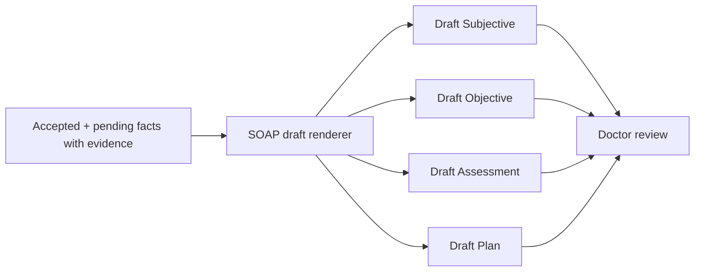
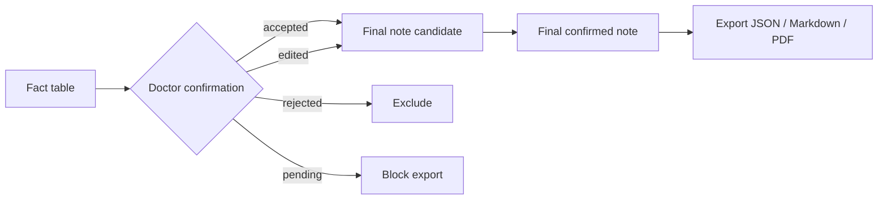
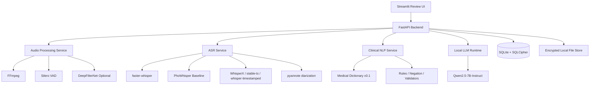

# Local-first Clinical Ambient Documentation Assistant for Vietnamese Outpatient Care

## 1. Executive Summary

Dự án **Local-first Clinical Ambient Documentation Assistant for Vietnamese Outpatient Care** nên được thiết kế như một hệ thống hỗ trợ tài liệu hóa lâm sàng, không phải hệ thống chẩn đoán hay ra quyết định điều trị. Thesis kiến trúc cốt lõi là:

**local-first + batch-after-stop + evidence-first + human-in-the-loop.**

Điều này có nghĩa là hệ thống nhận audio cuộc khám ngoại trú tiếng Việt, xử lý cục bộ sau khi kết thúc ghi âm, tạo transcript, gắn timestamp, phân đoạn speaker, trích xuất clinical facts có bằng chứng, tạo SOAP/outpatient note draft, sau đó bắt buộc bác sĩ review, sửa, xác nhận trước khi dữ liệu được coi là bản cuối.

Kiến trúc MVP nên tránh pipeline “audio → SOAP note” dạng black box. Thay vào đó, cần chia thành các lớp có thể kiểm tra:

1. Audio preprocessing.
2. VAD/chunking.
3. ASR.
4. Timestamp/alignment.
5. Diarization.
6. Manual speaker role correction.
7. Transcript normalization.
8. Rule/dictionary extraction.
9. LLM structured JSON extraction.
10. Validator và safety flags.
11. SOAP draft từ fact JSON.
12. Doctor review.
13. Final export/storage.

Khuyến nghị MVP thực dụng nhất là:

* **Frontend:** Streamlit review UI.
* **Backend:** FastAPI.
* **Audio:** FFmpeg preprocessing, mono/16kHz, loudness normalization.
* **VAD:** Silero VAD.
* **Denoising:** DeepFilterNet chỉ là tùy chọn “noisy clinic mode”, không bật mặc định.
* **ASR production baseline:** faster-whisper + Whisper large-v3/turbo.
* **ASR Vietnamese baseline bắt buộc:** PhoWhisper-medium/large.
* **Timestamp/alignment default:** WhisperX nếu tài nguyên cho phép.
* **Timestamp fallback:** stable-ts hoặc whisper-timestamped tùy resource và chất lượng alignment tiếng Việt.
* **Diarization:** pyannote speaker diarization, chỉ tạo speaker_0/speaker_1/speaker_n.
* **Role labeling:** bán tự động, bác sĩ hoặc thư ký phải sửa được.
* **Clinical NLP:** dictionary/rule trước, LLM JSON sau.
* **Local LLM:** Qwen2.5-7B-Instruct làm baseline chính; Llama 3.1 8B và Mistral 7B làm đối chứng.
* **Storage:** SQLite + SQLCipher, encrypted local file store, raw audio retention TTL.
* **Export:** JSON, Markdown, PDF; FHIR mapping để sau.

Sản phẩm không được tự động chẩn đoán, không tự kê đơn, không tự ghi vào HIS/EHR, không tự tạo clinical decision, và không được đưa thông tin không có evidence vào final note.

---

## 2. Problem Context and Vietnamese Clinical Constraints

Khám ngoại trú tạo ra gánh nặng tài liệu hóa lớn cho bác sĩ. Sau mỗi lượt khám, bác sĩ thường phải ghi lại triệu chứng, tiền sử, nhận định, chỉ định, thuốc, lời dặn, kế hoạch tái khám và các thông tin hành chính liên quan. Nếu hệ thống ambient documentation làm tốt, nó có thể giảm thời gian ghi chép và giúp bác sĩ tập trung hơn vào bệnh nhân.

Tuy nhiên, bối cảnh tiếng Việt y tế có nhiều ràng buộc riêng:

| Nhóm ràng buộc      | Mô tả                                                                                                               |
| ------------------- | ------------------------------------------------------------------------------------------------------------------- |
| Ngôn ngữ tiếng Việt | Tiếng Việt có thanh điệu, từ ghép, viết tắt, vùng miền, nói tắt, nói không đầy đủ chủ ngữ/vị ngữ.                   |
| Thuật ngữ y khoa    | Có nhiều từ Hán-Việt, tên thuốc quốc tế, tên hoạt chất, viết tắt như HA, ĐTĐ, SpO2, COPD, CRP, HbA1c.               |
| Code-switching      | Bác sĩ có thể dùng tiếng Anh, tên thuốc quốc tế, tên xét nghiệm, tên bệnh viết tắt xen trong câu tiếng Việt.        |
| Âm thanh phòng khám | Phòng khám có tiếng quạt, tiếng hành lang, tiếng gọi số, khoảng cách micro không đều, người nhà chen lời.           |
| Nhiều speaker       | Bác sĩ, bệnh nhân, điều dưỡng, người nhà có thể cùng xuất hiện. Speaker attribution sai có thể tạo rủi ro lâm sàng. |
| Privacy             | Audio và transcript có thể chứa PHI/PII; không nên đưa lên cloud mặc định.                                          |
| Clinical safety     | Hallucination, sai phủ định, sai thuốc/liều, sai speaker role có thể làm sai bản ghi lâm sàng.                      |

Điểm rủi ro nhất không chỉ là ASR sai chính tả, mà là **sai clinical meaning**. Ví dụ:

* “Không đau ngực” bị nhận thành “đau ngực”.
* “Chưa dùng insulin” bị nhận thành “đang dùng insulin”.
* Lời người nhà bị gắn thành lời bệnh nhân.
* Lời bác sĩ dự định kiểm tra thêm bị LLM biến thành chẩn đoán chắc chắn.
* SOAP note chứa plan không hề được nói trong transcript.

Vì vậy, MVP phải được thiết kế theo hướng **evidence-first**: mọi fact lâm sàng quan trọng phải truy ngược được về transcript/audio segment, speaker, timestamp và trạng thái review của bác sĩ.

---

## 3. Product Scope and Non-goals

### In scope for MVP

MVP nên tập trung vào khám ngoại trú tiếng Việt, chạy local, xử lý sau khi kết thúc cuộc khám.

| Hạng mục                 | Trong phạm vi MVP                                                                               |
| ------------------------ | ----------------------------------------------------------------------------------------------- |
| Audio input              | Upload file audio hoặc ghi âm cục bộ qua UI.                                                    |
| Batch processing         | Xử lý sau khi bác sĩ bấm stop, không yêu cầu realtime.                                          |
| Audio preprocessing      | FFmpeg, mono/16kHz, loudness normalization, VAD.                                                |
| ASR                      | faster-whisper + Whisper large-v3/turbo; test PhoWhisper.                                       |
| Timestamp                | Gắn timestamp cho segment hoặc word-level nếu pipeline ổn.                                      |
| Diarization              | Tách speaker dạng speaker_0, speaker_1.                                                         |
| Role mapping             | UI cho bác sĩ/thư ký map speaker thành Doctor/Patient/Caregiver/Nurse/Unknown.                  |
| Clinical fact extraction | Rule/dictionary trước; LLM structured JSON sau.                                                 |
| SOAP draft               | Tạo bản nháp SOAP từ fact JSON.                                                                 |
| Doctor review            | Accept/edit/reject từng fact và note.                                                           |
| Export                   | JSON, Markdown, PDF.                                                                            |
| Storage                  | SQLite + SQLCipher, file store mã hóa cục bộ.                                                   |
| Evaluation               | WER/CER, medical term error, negation error, critical entity error, fact F1, correction burden. |

### Out of scope for MVP

| Hạng mục                      | Lý do chưa nên làm sớm                                          |
| ----------------------------- | --------------------------------------------------------------- |
| Real-time transcription       | Tăng độ phức tạp latency, streaming, UI, resource management.   |
| Full HIS/EHR write-back       | Cần governance, API, integration, legal/clinical approval.      |
| Full FHIR server              | Dễ over-engineer trước khi extraction/fact schema ổn định.      |
| Fine-tuning medical model     | Cần gold data, legal review, annotation, evaluation nghiêm túc. |
| Fully automatic role labeling | Rủi ro clinical attribution cao.                                |
| Autonomous clinical coding    | Có thể bị hiểu là decision/billing automation.                  |
| Production-grade IAM/SSO      | Để giai đoạn pilot/enterprise.                                  |
| Hospital-wide ontology        | MVP chỉ cần dictionary v0.1 theo 1–2 specialty.                 |

### Explicit non-goals

Hệ thống **không** được làm các việc sau:

* Không tự chẩn đoán.
* Không đưa differential diagnosis nếu bác sĩ không nói rõ.
* Không tự kê đơn.
* Không tự đặt xét nghiệm.
* Không tự đưa khuyến nghị điều trị.
* Không tự ghi dữ liệu vào HIS/EHR khi chưa có xác nhận bác sĩ.
* Không thay thế bác sĩ, điều dưỡng, thư ký y khoa.
* Không trình bày như “AI doctor”.
* Không coi LLM output là ground truth.
* Không đưa unsupported fact vào final note.

---

## 4. Recommended MVP Architecture

Pipeline end-to-end nên được thiết kế như sau:

```mermaid
flowchart LR
    A[Audio capture/upload cục bộ] --> B[FFmpeg preprocessing]
    B --> B1[Mono / 16kHz / loudness normalization]
    B1 --> C[Silero VAD]
    C --> D[Speech chunking]
    D --> E[ASR: faster-whisper / Whisper large-v3 / turbo]
    E --> E2[PhoWhisper baseline test]
    E --> F[Timestamp alignment]
    F --> G[Diarization: pyannote]
    G --> H[Speaker IDs: speaker_0 / speaker_1 / speaker_n]
    H --> I[Manual role mapping]
    I --> J[Transcript normalization]
    J --> K[Rule / dictionary extraction]
    K --> L[LLM structured JSON extraction]
    L --> M[Schema validator]
    M --> N[Safety flags]
    N --> O[SOAP draft from fact JSON]
    O --> P[Doctor review: accept / edit / reject]
    P --> Q[Final confirmed note]
    Q --> R[Local encrypted storage]
    Q --> S[Export: JSON / Markdown / PDF]
    R --> T[Future FHIR mapping layer]
```



### Decision Rationale

| Quyết định      | Default MVP                             | Fallback                                           | Benchmark/research only            | Rationale                                                                                             |
| --------------- | --------------------------------------- | -------------------------------------------------- | ---------------------------------- | ----------------------------------------------------------------------------------------------------- |
| Processing mode | Batch-after-stop                        | Near-realtime sau này                              | Full realtime                      | Batch giúp giảm độ phức tạp, dễ kiểm soát safety, phù hợp internship MVP.                             |
| ASR             | faster-whisper + Whisper large-v3/turbo | PhoWhisper nếu tiếng Việt tốt hơn trên test nội bộ | ChunkFormer, wav2vec2, SeamlessM4T | faster-whisper có ecosystem local tốt; PhoWhisper là baseline tiếng Việt bắt buộc.                    |
| Denoising       | Không bật mặc định                      | DeepFilterNet noisy clinic mode                    | noisereduce/spectral gating        | Denoising có thể làm méo tín hiệu; chỉ bật khi audio thật sự ồn.                                      |
| Timestamp       | WhisperX                                | stable-ts hoặc whisper-timestamped                 | custom alignment                   | WhisperX thuận tiện cho Whisper-family và diarization; fallback khi resource hoặc alignment không ổn. |
| Diarization     | pyannote                                | manual segment assignment                          | custom diarization training        | pyannote đủ tốt để baseline; tự train diarization quá sớm là over-engineer.                           |
| Role labeling   | Manual correction bắt buộc              | LLM gợi ý role                                     | Full auto role labeling            | Sai role có rủi ro lâm sàng cao.                                                                      |
| NLP extraction  | Rule/dictionary trước                   | LLM hỗ trợ chuẩn hóa                               | Fine-tuning sớm                    | Rule kiểm soát tốt thuốc/liều/phủ định; LLM chỉ dùng sau khi có evidence.                             |
| Note generation | SOAP draft từ fact JSON                 | Template deterministic                             | Raw transcript → SOAP trực tiếp    | Fact JSON là lớp kiểm soát hallucination.                                                             |
| Storage         | SQLCipher + encrypted file store        | SQLite thường chỉ cho local dev không chứa PHI     | Cloud DB                           | Local-first và privacy-first.                                                                         |
| FHIR            | Future mapping layer                    | Export JSON/Markdown trước                         | Full FHIR server ngay MVP          | Tránh over-engineer khi fact schema chưa ổn.                                                          |

---

## 5. Technology Evaluation Tables

### Table 1 — ASR Model Evaluation

| Model                                   | License / legal risk                                                                                                      | Vietnamese support                                                                            | Medical Vietnamese suitability                                                                      | Local feasibility                                                                                  | Hardware expectation                                                 | Strengths                                                               | Weaknesses                                                                                            | MVP recommendation                                                       |
| --------------------------------------- | ------------------------------------------------------------------------------------------------------------------------- | --------------------------------------------------------------------------------------------- | --------------------------------------------------------------------------------------------------- | -------------------------------------------------------------------------------------------------- | -------------------------------------------------------------------- | ----------------------------------------------------------------------- | ----------------------------------------------------------------------------------------------------- | ------------------------------------------------------------------------ |
| faster-whisper + Whisper large-v3/turbo | faster-whisper và Whisper-family có hướng open-source thuận lợi trong tài liệu đầu vào. Vẫn cần legal review trước pilot. | Tốt cho multilingual ASR, có hỗ trợ tiếng Việt.                                               | Chưa có bằng chứng đủ mạnh cho outpatient medical Vietnamese; cần đo Medical Term Error Rate riêng. | Rất cao. Có quantization, CPU/GPU, ecosystem tốt.                                                  | large-v3 cần GPU tốt hơn; turbo nhẹ hơn; CPU có thể chạy nhưng chậm. | Production baseline thực dụng, nhanh, dễ tích hợp, hợp với WhisperX.    | Có thể sai thuật ngữ y khoa, phủ định, số đo; cần dictionary/validator.                               | **Default production MVP baseline.**                                     |
| PhoWhisper-medium/large                 | BSD-3-Clause trong tài liệu đầu vào. Legal risk thấp hơn nhiều lựa chọn non-commercial, nhưng vẫn cần review khi pilot.   | Rất mạnh cho tiếng Việt; được nêu là fine-tuned trên dữ liệu tiếng Việt nhiều accent.         | Baseline tiếng Việt bắt buộc; chưa đủ bằng chứng riêng cho outpatient ambient audio.                | Cao, nhưng integration timestamp/diarization có thể kém “drop-in” hơn WhisperX với checkpoint gốc. | medium hợp test đầu; large cần GPU tốt hơn.                          | Tối ưu hơn cho tiếng Việt, đáng test trên giọng Bắc/Trung/Nam.          | Cần benchmark nội bộ với audio y tế ồn; runtime và alignment cần kiểm tra.                            | **Mandatory Vietnamese ASR baseline.**                                   |
| ChunkFormer                             | Model card trong tài liệu đầu vào nêu CC-BY-NC 4.0; rủi ro nếu dùng thương mại/pilot bệnh viện tư.                        | Rất mạnh trên benchmark tiếng Việt công khai theo tài liệu đầu vào.                           | Hứa hẹn, nhưng chưa có bằng chứng đủ cho medical outpatient ambient audio.                          | Có thể local, nhưng ecosystem clinical pipeline nhỏ hơn Whisper-family.                            | Có thể nhẹ hơn một số model lớn, nhưng cần benchmark thực tế.        | WER công khai tốt, hỗ trợ long-form/timestamp theo tài liệu đầu vào.    | License non-commercial; integration diarization/alignment/provenance không thuận bằng WhisperX stack. | **Benchmark/research only nếu license phù hợp. Không làm backbone MVP.** |
| wav2vec2 Vietnamese / VietMed wav2vec2  | License/legal status cần xác minh theo từng model/dataset.                                                                | Có hỗ trợ tiếng Việt; VietMed wav2vec2 trong tài liệu đầu vào được nêu là có định hướng y tế. | Có thể tốt cho thuật ngữ y khoa hoặc acoustic domain, nhưng không nên làm backbone hội thoại dài.   | Local được, nhưng thường cần thêm language model/decoder và pipeline phức tạp hơn.                 | GPU khuyến nghị nếu muốn xử lý nhanh.                                | Có giá trị nghiên cứu, có thể dùng alignment hoặc secondary validation. | Không thuận tiện bằng Whisper-family cho long-form clinical conversation; integration tốn công.       | **Secondary benchmark/validator. Không phải MVP backbone.**              |
| SeamlessM4T                             | Tài liệu đầu vào nêu rủi ro license/research/non-commercial tùy bản; cần legal review.                                    | Multilingual tốt.                                                                             | Không chuyên cho medical Vietnamese.                                                                | Có thể local nhưng nặng và quá rộng bài toán.                                                      | Nặng hơn nhu cầu MVP laptop/local.                                   | Mạnh cho đa ngôn ngữ/đa tác vụ.                                         | Overkill cho monolingual Vietnamese outpatient documentation; không tối ưu evidence pipeline.         | **Avoid for MVP; research reference only.**                              |

### Table 2 — Audio, VAD, Denoising, Timestamping, Diarization

| Component           | Role                              | Candidate tools                          | MVP default                                               | Fallback                                                                 | Risk                                                      | Recommendation                                                                             |
| ------------------- | --------------------------------- | ---------------------------------------- | --------------------------------------------------------- | ------------------------------------------------------------------------ | --------------------------------------------------------- | ------------------------------------------------------------------------------------------ |
| Audio preprocessing | Chuẩn hóa input audio             | FFmpeg                                   | FFmpeg decode → mono → 16kHz → loudness normalization nhẹ | Python audio libs nếu cần                                                | Resampling/normalization sai có thể làm giảm ASR          | Dùng FFmpeg vì ổn định, phổ biến, dễ script hóa.                                           |
| VAD                 | Loại silence, chia speech chunk   | Silero VAD, WebRTC VAD                   | Silero VAD                                                | WebRTC VAD chỉ khi cần cực nhẹ                                           | VAD quá aggressive có thể cắt mất từ quan trọng           | Silero là default vì neural VAD tốt hơn cho môi trường ồn.                                 |
| Denoising           | Giảm nhiễu nền                    | DeepFilterNet, RNNoise, noisereduce      | Không bật mặc định                                        | DeepFilterNet noisy clinic mode                                          | Denoising có thể làm méo tên thuốc, số đo, phụ âm         | Giữ master audio gốc; denoise trên bản copy khi cần.                                       |
| Chunking            | Tạo đoạn ASR vừa đủ               | VAD-based chunking                       | 20–30s speech chunks + offset map                         | Fixed-length chunking                                                    | Mất offset map sẽ phá provenance                          | Mọi chunk phải giữ mapping về audio gốc.                                                   |
| Timestamp/alignment | Gắn time cho transcript/fact      | WhisperX, stable-ts, whisper-timestamped | WhisperX                                                  | stable-ts cho low-footprint; whisper-timestamped nếu cần word confidence | Alignment tiếng Việt có thể không ổn; word-level quá nặng | Default WhisperX cho evidence-first; fallback segment-level nếu word-level không đáng tin. |
| Diarization         | Tách ai nói khi nào               | pyannote, NeMo, manual                   | pyannote speaker diarization                              | Manual role correction, NeMo research                                    | Sai speaker attribution có rủi ro lâm sàng cao            | Chỉ dùng speaker_0/speaker_1; không coi role auto là ground truth.                         |
| Role labeling       | Map speaker sang vai trò lâm sàng | Manual UI, LLM suggestion                | Manual correction bắt buộc                                | LLM gợi ý nhưng không final                                              | Gắn sai Doctor/Patient/Caregiver có thể làm sai note      | Bắt buộc unresolved speaker role warning.                                                  |

### Table 3 — Clinical NLP and LLM Extraction

| Layer                      | Tool/model                                  | Function                                                         | Hallucination control                                     | Local feasibility                  | Recommendation                                   |
| -------------------------- | ------------------------------------------- | ---------------------------------------------------------------- | --------------------------------------------------------- | ---------------------------------- | ------------------------------------------------ |
| Text normalization         | Python normalization, Unicode normalization | Chuẩn hóa dấu, casing, spacing, đơn vị, viết tắt                 | Deterministic, không sinh thông tin mới                   | Rất cao                            | Bắt buộc trước extraction.                       |
| Vietnamese NLP utility     | underthesea                                 | Tokenization, word segmentation, hỗ trợ rule matching tiếng Việt | Không tự tạo fact; chỉ hỗ trợ phân tích                   | Cao, Python-friendly               | Default utility cho MVP.                         |
| Vietnamese NLP utility     | VnCoreNLP                                   | Word segmentation/POS/NER tiếng Việt                             | Không dùng làm clinical truth                             | Trung bình do Java/JVM             | Benchmark/optional nếu đội chấp nhận JVM.        |
| Vietnamese NLP utility     | Stanza                                      | NLP đa ngôn ngữ, có thể hỗ trợ tokenization/NER                  | Không dùng làm clinical truth                             | Trung bình                         | Secondary utility, không phải core.              |
| Dictionary/rule extraction | Custom dictionary v0.1 + regex/rules        | Bắt thuốc, liều, triệu chứng, phủ định, lab/vital, alias         | Deterministic, dễ audit                                   | Rất cao                            | **Phải làm trước LLM.**                          |
| Negation/assertion         | Vietnamese NegEx-style rules                | Gắn affirmed/negated/possible/unclear                            | Cross-check LLM output                                    | Rất cao                            | Bắt buộc cho safety.                             |
| LLM extraction             | Qwen2.5-7B-Instruct                         | Structured JSON extraction từ transcript/facts                   | JSON schema, exact quote, timestamp, speaker, uncertainty | Cao qua Ollama/LM Studio/llama.cpp | **Primary LLM baseline.**                        |
| LLM baseline               | Llama 3.1 8B                                | Đối chứng structured extraction/note drafting                    | Schema/grammar constraint                                 | Cao                                | Test đối chứng.                                  |
| LLM baseline               | Mistral 7B Instruct                         | Đối chứng nhẹ hơn                                                | Schema/grammar constraint                                 | Cao                                | Test nếu cần model nhỏ/nhẹ.                      |
| Validator                  | JSON Schema + custom clinical validators    | Reject unsupported facts, conflict flags, missing evidence       | Guardrail kiến trúc, không phụ thuộc prompt               | Rất cao                            | Bắt buộc trước UI/final note.                    |
| SOAP renderer              | Template + LLM-assisted draft               | Viết nháp SOAP từ fact JSON                                      | Final note chỉ từ accepted/edited facts                   | Cao                                | Không cho LLM viết SOAP tự do từ raw transcript. |

---

## 6. Canonical Clinical Fact Schema

Schema dưới đây là trung tâm của thiết kế **evidence-first**. Nó buộc mọi clinical fact phải có:

* Nội dung chuẩn hóa.
* Trích dẫn gốc.
* Speaker/speaker role.
* Timestamp.
* Transcript segment liên kết.
* Confidence.
* Negation/uncertainty.
* Section SOAP.
* Warning flags.
* Trạng thái xác nhận của bác sĩ.

```json
{
  "$schema": "https://json-schema.org/draft/2020-12/schema",
  "$id": "https://local-first-clinical-assistant/schemas/clinical_fact.schema.json",
  "title": "CanonicalClinicalFact",
  "type": "object",
  "additionalProperties": false,
  "required": [
    "fact_id",
    "encounter_id",
    "fact_type",
    "normalized_text",
    "raw_transcript_quote",
    "speaker",
    "speaker_role",
    "source_start_time",
    "source_end_time",
    "linked_transcript_segment_id",
    "confidence",
    "negation_status",
    "uncertainty_status",
    "clinical_section",
    "coding_candidates",
    "warning_flags",
    "requires_doctor_confirmation",
    "doctor_confirmation_status"
  ],
  "properties": {
    "fact_id": {
      "type": "string",
      "description": "Stable unique identifier for the extracted clinical fact."
    },
    "encounter_id": {
      "type": "string",
      "description": "Identifier of the clinical encounter that produced this fact."
    },
    "fact_type": {
      "type": "string",
      "enum": [
        "chief_complaint",
        "symptom",
        "history",
        "diagnosis",
        "problem",
        "medication",
        "dosage",
        "allergy",
        "vital_sign",
        "lab_result",
        "imaging_result",
        "procedure",
        "assessment",
        "plan",
        "follow_up",
        "patient_instruction",
        "warning_flag",
        "administrative",
        "unknown"
      ]
    },
    "normalized_text": {
      "type": "string",
      "description": "Normalized clinical text after dictionary/rule processing."
    },
    "original_text": {
      "type": ["string", "null"],
      "description": "Original ASR text if different from raw_transcript_quote."
    },
    "raw_transcript_quote": {
      "type": "string",
      "description": "Exact quote from transcript used as evidence."
    },
    "speaker": {
      "type": "string",
      "description": "Diarization speaker id, e.g. speaker_0, speaker_1."
    },
    "speaker_role": {
      "type": "string",
      "enum": [
        "Doctor",
        "Patient",
        "Caregiver",
        "Nurse",
        "Unknown"
      ]
    },
    "source_start_time": {
      "type": "number",
      "minimum": 0,
      "description": "Start time in seconds from original audio."
    },
    "source_end_time": {
      "type": "number",
      "minimum": 0,
      "description": "End time in seconds from original audio."
    },
    "linked_transcript_segment_id": {
      "type": "string",
      "description": "Transcript segment id that supports this fact."
    },
    "confidence": {
      "type": "object",
      "additionalProperties": false,
      "required": [
        "label",
        "asr_score",
        "extraction_score"
      ],
      "properties": {
        "label": {
          "type": "string",
          "enum": ["high", "medium", "low"]
        },
        "asr_score": {
          "type": ["number", "null"],
          "minimum": 0,
          "maximum": 1
        },
        "extraction_score": {
          "type": ["number", "null"],
          "minimum": 0,
          "maximum": 1
        },
        "speaker_score": {
          "type": ["number", "null"],
          "minimum": 0,
          "maximum": 1
        },
        "notes": {
          "type": ["string", "null"]
        }
      }
    },
    "negation_status": {
      "type": "string",
      "enum": [
        "affirmed",
        "negated",
        "possible",
        "unclear"
      ]
    },
    "uncertainty_status": {
      "type": "string",
      "enum": [
        "certain",
        "uncertain",
        "conflicting",
        "missing_context"
      ]
    },
    "clinical_section": {
      "type": "string",
      "enum": [
        "S",
        "O",
        "A",
        "P",
        "other"
      ]
    },
    "coding_candidates": {
      "type": "array",
      "description": "Future-ready coding candidates, not final codes unless reviewed.",
      "items": {
        "type": "object",
        "additionalProperties": false,
        "required": [
          "system",
          "code",
          "display",
          "match_confidence"
        ],
        "properties": {
          "system": {
            "type": "string",
            "examples": [
              "ICD-10",
              "LOINC",
              "SNOMED-CT",
              "ATC",
              "local_dictionary"
            ]
          },
          "code": {
            "type": ["string", "null"]
          },
          "display": {
            "type": "string"
          },
          "match_confidence": {
            "type": ["number", "null"],
            "minimum": 0,
            "maximum": 1
          },
          "requires_coding_review": {
            "type": "boolean",
            "default": true
          }
        }
      }
    },
    "unit": {
      "type": ["string", "null"],
      "description": "Normalized unit, e.g. mmHg, mg, mg/dL, %, bpm."
    },
    "normalized_value": {
      "type": ["string", "number", "boolean", "null"],
      "description": "Normalized numeric or categorical value."
    },
    "warning_flags": {
      "type": "array",
      "items": {
        "type": "string",
        "enum": [
          "low_asr_confidence",
          "low_extraction_confidence",
          "unresolved_speaker_role",
          "possible_negation_conflict",
          "missing_dosage",
          "missing_unit",
          "conflicting_statement",
          "unsupported_by_quote",
          "requires_audio_review",
          "possible_hallucination",
          "clinical_safety_sensitive"
        ]
      }
    },
    "requires_doctor_confirmation": {
      "type": "boolean"
    },
    "doctor_confirmation_status": {
      "type": "string",
      "enum": [
        "pending",
        "accepted",
        "edited",
        "rejected"
      ]
    },
    "doctor_edit_text": {
      "type": ["string", "null"]
    },
    "reviewed_by": {
      "type": ["string", "null"]
    },
    "reviewed_at": {
      "type": ["string", "null"],
      "format": "date-time"
    },
    "created_at": {
      "type": ["string", "null"],
      "format": "date-time"
    },
    "updated_at": {
      "type": ["string", "null"],
      "format": "date-time"
    }
  }
}
```

Schema này quan trọng vì nó tạo nền tảng cho:

* Audit trail.
* Click-back audio evidence.
* Doctor review workflow.
* Fact-level evaluation.
* Error analysis.
* Future FHIR mapping.
* Tách biệt draft AI và final confirmed note.
* Ngăn LLM đưa thông tin không có evidence vào bản cuối.

FHIR mapping nên để giai đoạn sau. Ví dụ:

| Canonical fact                        | FHIR resource tương lai            |
| ------------------------------------- | ---------------------------------- |
| Symptom/problem/diagnosis đã xác nhận | Condition                          |
| Vital sign/lab result                 | Observation                        |
| Medication đang dùng                  | MedicationStatement                |
| Thuốc được kê/plan thuốc              | MedicationRequest                  |
| Allergy                               | AllergyIntolerance                 |
| Final SOAP note                       | Composition hoặc DocumentReference |
| Encounter metadata                    | Encounter                          |
| Doctor/clinician                      | Practitioner / PractitionerRole    |

---

## 7. Medical Dictionary v0.1 and Normalization Strategy

MVP không nên xây ontology toàn bệnh viện. Cách đúng là xây **medical dictionary v0.1 nhỏ nhưng có ích**, tập trung vào 1–2 specialty đầu tiên, ví dụ nội tổng quát, tim mạch, hô hấp hoặc nội tiết.

### Dictionary layers

| Layer              | Nội dung                                                                |
| ------------------ | ----------------------------------------------------------------------- |
| Triệu chứng        | sốt, ho, đau ngực, khó thở, chóng mặt, buồn nôn, đau bụng, mệt mỏi      |
| Bệnh/vấn đề        | tăng huyết áp, đái tháo đường, viêm phổi, COPD, hen, rối loạn lipid máu |
| Thuốc/hoạt chất    | paracetamol, acetaminophen, amoxicillin, insulin, metformin             |
| Xét nghiệm/chỉ số  | HA, SpO2, HbA1c, glucose, CRP, creatinine, cholesterol                  |
| Đơn vị             | mmHg, mg, g, ml, mg/dL, mmol/L, %, lần/ngày                             |
| Abbreviation/alias | HA, ĐTĐ, THA, SpO2, COPD                                                |
| Phủ định/assertion | không, chưa, không có, phủ nhận, chưa từng, không ghi nhận              |
| Temporal cues      | hôm qua, 2 ngày nay, 1 tuần, sáng nay, gần đây                          |
| Uncertainty cues   | có vẻ, nghi ngờ, chưa rõ, khả năng, cần kiểm tra thêm                   |

### Ví dụ normalization

| Raw / alias       | Normalized form                             | Ghi chú                                            |
| ----------------- | ------------------------------------------- | -------------------------------------------------- |
| HA                | huyết áp                                    | Không tự suy đơn vị nếu transcript không có số đo. |
| HA 140/90         | huyết áp 140/90 mmHg                        | Có thể gợi ý mmHg nhưng cần giữ quote gốc.         |
| ĐTĐ               | đái tháo đường                              | Có thể map problem/diagnosis nếu bác sĩ xác nhận.  |
| tiểu đường        | đái tháo đường                              | Alias phổ thông.                                   |
| THA               | tăng huyết áp                               | Cần tránh nhầm với ngữ cảnh khác.                  |
| SpO2              | độ bão hòa oxy ngoại vi                     | Observation.                                       |
| paracetamol       | acetaminophen/paracetamol                   | Tùy dictionary chuẩn hóa.                          |
| không sốt         | symptom: sốt; negation_status: negated      | Không đưa vào “active symptom”.                    |
| chưa ho           | symptom: ho; negation_status: negated       | Phải giữ trạng thái phủ định.                      |
| phủ nhận đau ngực | symptom: đau ngực; negation_status: negated | Safety-sensitive.                                  |

### Nguyên tắc normalization

1. Không để LLM tự mở rộng viết tắt nếu dictionary không hỗ trợ.
2. Không tự thêm đơn vị nếu transcript không có evidence rõ.
3. Không tự biến symptom thành diagnosis.
4. Không tự map coding candidates thành code final nếu bác sĩ chưa xác nhận.
5. Luôn giữ `raw_transcript_quote`.
6. Luôn giữ source timestamp.
7. Với thuốc/liều/dị ứng/phủ định, ưu tiên deterministic validator hơn LLM.

---

## 8. LLM Prompting and Structured Output Guardrails

Local LLM chỉ nên làm nhiệm vụ **structured extraction** và **drafting có kiểm soát**, không được suy luận lâm sàng tự do.

### System prompt mẫu cho local LLM

```text
Bạn là Clinical Documentation Extraction Assistant chạy cục bộ.

Vai trò của bạn:
- Trích xuất clinical facts từ transcript cuộc khám tiếng Việt.
- Chuẩn hóa facts vào JSON theo schema được cung cấp.
- Hỗ trợ tạo draft SOAP note từ các facts đã có evidence.

Giới hạn bắt buộc:
1. Bạn không phải bác sĩ.
2. Bạn không được chẩn đoán.
3. Bạn không được đề xuất điều trị.
4. Bạn không được kê đơn.
5. Bạn không được tạo differential diagnosis.
6. Bạn không được thêm thông tin không xuất hiện trong transcript.
7. Bạn chỉ được extract thông tin được nói rõ trong transcript.
8. Mọi fact phải có:
   - raw_transcript_quote
   - linked_transcript_segment_id
   - source_start_time
   - source_end_time
   - speaker
   - speaker_role nếu có, nếu chưa rõ thì "Unknown"
9. Nếu thông tin mơ hồ, thiếu, xung đột hoặc không chắc:
   - đặt uncertainty_status phù hợp
   - đặt requires_doctor_confirmation = true
10. Nếu không tìm được quote hỗ trợ, không được tạo fact.
11. Nếu transcript có phủ định như "không", "chưa", "phủ nhận", phải ghi negation_status chính xác.
12. Nếu speaker role chưa được xác nhận, không được giả định chắc chắn.
13. Plan chỉ được ghi nếu bác sĩ nói rõ trong transcript.
14. Không đưa unsupported facts vào SOAP draft.
15. Final note không nằm trong quyền của bạn; bác sĩ phải review và xác nhận.

Output:
- Chỉ trả về JSON hợp lệ theo schema.
- Không giải thích ngoài JSON.
- Không markdown.
- Không thêm text ngoài JSON.
```

### User prompt mẫu cho extraction

```text
Dưới đây là transcript đã được segment hóa, có timestamp và speaker id.
Hãy trích xuất clinical facts theo schema.

Chỉ dùng thông tin có trong transcript.
Nếu thông tin không rõ, dùng null hoặc unclear.
Mọi fact phải trích dẫn đúng raw_transcript_quote.

TRANSCRIPT_SEGMENTS:
{{transcript_segments_json}}

MEDICAL_DICTIONARY:
{{dictionary_json}}

OUTPUT_SCHEMA:
{{clinical_fact_schema_json}}
```

### Backend validation bắt buộc

Sau khi LLM trả JSON, backend phải kiểm tra:

| Check                                | Hành động                                        |
| ------------------------------------ | ------------------------------------------------ |
| JSON invalid                         | Reject, yêu cầu regenerate hoặc fallback manual. |
| Missing quote                        | Reject fact.                                     |
| Quote không tồn tại trong transcript | Flag possible_hallucination.                     |
| Missing timestamp                    | Reject hoặc requires_doctor_confirmation.        |
| Missing speaker                      | Flag unresolved_speaker_role.                    |
| Medication thiếu liều                | Flag missing_dosage.                             |
| Allergy không rõ affirmed/negated    | Flag requires_audio_review.                      |
| Negation conflict giữa rule và LLM   | Flag possible_negation_conflict.                 |
| Plan không có speaker_role Doctor    | Flag unsupported_plan_text.                      |
| Fact chưa review                     | Không được vào final note.                       |

---

## 9. SOAP Note Generation Workflow

SOAP generation phải có hai lớp rõ ràng.

### Layer 1 — AI-assisted SOAP draft

LLM hoặc template renderer được phép tạo SOAP draft từ **fact JSON**, không phải từ raw transcript trực tiếp.



Draft SOAP có thể chứa fact pending nhưng phải hiển thị rõ:

* Fact nào đã accepted.
* Fact nào cần doctor confirmation.
* Fact nào low confidence.
* Fact nào có conflict.
* Fact nào speaker role chưa rõ.

### Layer 2 — Final confirmed note

Final note chỉ được dựng từ:

* Facts đã `doctor_confirmation_status = accepted`.
* Facts đã `doctor_confirmation_status = edited`.
* Doctor edit text đã được lưu.
* Không dùng rejected facts.
* Không dùng unsupported facts.
* Không dùng fact thiếu evidence.



### SOAP section rules

| SOAP section | Nguồn fact                                                                                 |
| ------------ | ------------------------------------------------------------------------------------------ |
| Subjective   | chief complaint, symptoms, history, patient-reported medication, allergy, negated symptoms |
| Objective    | vital signs, lab results, imaging, physical exam findings nếu được nói rõ                  |
| Assessment   | diagnosis/problem/assessment do bác sĩ nói rõ hoặc được bác sĩ xác nhận                    |
| Plan         | medication plan, tests, follow-up, instructions do bác sĩ nói rõ hoặc được bác sĩ xác nhận |

LLM không được tự viết assessment hoặc plan nếu transcript không có bằng chứng.

---

## 10. Clinical Safety and Guardrails

### Architecture-level guardrails

| Guardrail                            | Mục đích                                                              |
| ------------------------------------ | --------------------------------------------------------------------- |
| Evidence-first fact schema           | Mọi fact phải có quote, timestamp, speaker, segment id.               |
| Attribution lock                     | Không cho fact rời khỏi nguồn evidence.                               |
| Batch-after-stop                     | Giảm rủi ro realtime partial transcript gây hiểu nhầm.                |
| Rule/dictionary-first                | Kiểm soát tốt các entity nguy hiểm như thuốc, liều, dị ứng, phủ định. |
| Validator bắt buộc                   | LLM output không được đi thẳng vào UI/final note.                     |
| Final note from confirmed facts only | Không có doctor confirmation thì không thành Gold/final.              |
| Canonical schema before FHIR         | Tránh over-engineer và vẫn future-proof.                              |

### LLM-level guardrails

| Guardrail                | Mục đích                                 |
| ------------------------ | ---------------------------------------- |
| JSON schema constraint   | Giảm output lỏng, dễ validate.           |
| No unsupported fact      | Không có quote thì reject.               |
| No diagnosis generation  | Không biến LLM thành AI doctor.          |
| No treatment suggestion  | Không để LLM tạo plan mới.               |
| Ambiguity → unclear/null | Không đoán khi thiếu thông tin.          |
| Exact quote required     | Cho phép backend kiểm tra hallucination. |
| Speaker-aware extraction | Fact phải gắn speaker/speaker_role.      |

### UI-level guardrails

| Guardrail                            | Mục đích                                        |
| ------------------------------------ | ----------------------------------------------- |
| Transcript + audio playback          | Bác sĩ nghe lại bằng chứng.                     |
| Fact table accept/edit/reject        | Review từng fact.                               |
| Manual role mapping                  | Bác sĩ/thư ký sửa speaker role.                 |
| Mandatory review blocks              | Không export khi còn unresolved critical facts. |
| Conflict panel                       | Hiển thị phủ định/xung đột/speaker conflict.    |
| Unsupported plan warning             | Plan không có evidence bị cảnh báo.             |
| No export before doctor confirmation | Chặn final note khi chưa review.                |

### Data/security guardrails

| Guardrail               | Mục đích                             |
| ----------------------- | ------------------------------------ |
| Local inference only    | Không gửi PHI/PII ra cloud mặc định. |
| SQLCipher               | Mã hóa DB cục bộ.                    |
| Encrypted file store    | Bảo vệ audio/transcript/export.      |
| Raw audio TTL           | Giảm rủi ro lưu audio lâu.           |
| Audit log               | Theo dõi ai sửa gì, khi nào.         |
| No telemetry by default | Tránh rò rỉ dữ liệu.                 |
| Model weights local     | Không phụ thuộc network khi dùng.    |

### Evaluation-level guardrails

| Guardrail                    | Mục đích                                      |
| ---------------------------- | --------------------------------------------- |
| Medical Term Error Rate      | Không chỉ tối ưu WER chung.                   |
| Negation Error Rate          | Bắt lỗi phủ định nguy hiểm.                   |
| Critical Entity Error Rate   | Tập trung thuốc/liều/dị ứng/lab/vital.        |
| Speaker Attribution Accuracy | Đo đúng “ai nói fact này”.                    |
| Doctor Correction Burden     | Đo giá trị thực tế cho workflow.              |
| SOAP unsafe invention count  | Đếm thông tin LLM bịa hoặc không có evidence. |

---

## 11. Privacy, Security, and Local Deployment

Local-first không đồng nghĩa tự động an toàn. MVP cần tối thiểu các lớp sau:

### Privacy principles

* Không dùng cloud API cho core pipeline mặc định.
* Audio, transcript, fact JSON, note draft phải xử lý cục bộ.
* Raw audio là dữ liệu nhạy cảm nhất, cần retention TTL.
* Không lưu dữ liệu bệnh nhân thật trong giai đoạn synthetic demo.
* De-identification tiếng Việt không được coi là hoàn hảo.
* Mọi export phải có trạng thái doctor confirmation.

### Storage design

| Dữ liệu             | Lưu ở đâu                  | Bảo vệ                                    |
| ------------------- | -------------------------- | ----------------------------------------- |
| Encounter metadata  | SQLite + SQLCipher         | DB encryption                             |
| Transcript segments | SQLite + SQLCipher         | DB encryption                             |
| Clinical facts      | SQLite + SQLCipher         | DB encryption                             |
| Review events       | SQLite + SQLCipher         | Audit trail                               |
| Raw audio           | Encrypted local file store | TTL deletion                              |
| Temporary chunks    | Temp encrypted folder      | Auto purge                                |
| Export files        | Local controlled folder    | User-controlled, audit logged             |
| Model weights       | Local model directory      | Không chứa PHI, nhưng cần version pinning |

### Raw audio retention TTL

Khuyến nghị MVP:

* Synthetic/dev: giữ được để debug.
* Pilot thật: raw audio xóa sau khi bác sĩ confirm/export, hoặc theo TTL được hospital governance phê duyệt.
* Temporary chunks xóa ngay sau pipeline.
* Transcript/fact/note giữ theo policy của dự án, không tự coi là medical record chính thức nếu chưa tích hợp HIS/EHR.

### Docker Compose vs Python venv/headless runtime

| Option                 | Ưu điểm                                                 | Nhược điểm                                  | Recommendation                             |
| ---------------------- | ------------------------------------------------------- | ------------------------------------------- | ------------------------------------------ |
| Python venv            | Dễ làm nhanh, phù hợp laptop intern, debug đơn giản     | Khó reproducible giữa máy khác nhau         | Tốt cho Stage 1 demo.                      |
| Docker Compose         | Reproducible, tách service FastAPI/Streamlit/LLM runner | Nặng hơn, GPU/audio access đôi khi phức tạp | Tốt cho Stage 2–3.                         |
| Headless local runtime | Hợp on-prem server/workstation                          | Cần vận hành bài bản hơn                    | Tốt cho pilot hospital-controlled machine. |

### De-identification limitations for Vietnamese

Không nên tin rằng de-identification tự động sẽ bắt hết:

* Tên người Việt đa dạng.
* Địa chỉ nói tự nhiên.
* Số điện thoại/CCCD/bảo hiểm có nhiều format.
* Tên bệnh viện, khoa, bác sĩ có thể xuất hiện.
* Người nhà có thể nói thông tin nhận dạng trong audio.

Vì vậy, giai đoạn đầu nên dùng synthetic/actor/volunteer data có consent rõ ràng, sau đó mới dùng approved real data.

---

## 12. Recommended Demo Stack

| Thành phần               | Stack đề xuất                                                                            |
| ------------------------ | ---------------------------------------------------------------------------------------- |
| Frontend                 | Streamlit                                                                                |
| Backend                  | FastAPI                                                                                  |
| Audio recording/upload   | Streamlit uploader; streamlit-mic-recorder nếu phù hợp                                   |
| Audio preprocessing      | FFmpeg                                                                                   |
| VAD                      | Silero VAD                                                                               |
| Denoising                | DeepFilterNet optional noisy clinic mode                                                 |
| ASR default              | faster-whisper + Whisper large-v3/turbo                                                  |
| ASR Vietnamese baseline  | PhoWhisper-medium/large                                                                  |
| Timestamp default        | WhisperX                                                                                 |
| Timestamp fallback       | stable-ts hoặc whisper-timestamped                                                       |
| Diarization              | pyannote speaker diarization                                                             |
| Speaker role mapping     | Manual UI correction                                                                     |
| Vietnamese NLP utilities | underthesea default; VnCoreNLP/Stanza optional                                           |
| Dictionary               | Medical dictionary v0.1                                                                  |
| LLM                      | Qwen2.5-7B-Instruct                                                                      |
| LLM runtime              | Ollama cho tích hợp nhanh; LM Studio cho demo GUI; llama.cpp cho GGUF/grammar constraint |
| Validation               | JSON Schema + custom clinical validators                                                 |
| DB                       | SQLite + SQLCipher                                                                       |
| File storage             | Encrypted local file store                                                               |
| Export                   | JSON, Markdown, PDF                                                                      |
| Future integration       | FHIR mapping layer, HIS/EHR integration sau pilot                                        |

### MVP service layout



---

## 13. Evaluation Plan

### Metric table

| Metric                       | Đo gì                                                         | Vì sao quan trọng                                          |
| ---------------------------- | ------------------------------------------------------------- | ---------------------------------------------------------- |
| WER                          | Word Error Rate của transcript                                | Baseline ASR chung.                                        |
| CER                          | Character Error Rate                                          | Hữu ích cho tiếng Việt vì dấu và ký tự có thể sai.         |
| Medical Term Error Rate      | Lỗi trên thuật ngữ y khoa                                     | Quan trọng hơn WER chung trong clinical context.           |
| Negation Error Rate          | Sai affirmed/negated/possible/unclear                         | Sai phủ định có thể tạo rủi ro lâm sàng lớn.               |
| Critical Entity Error Rate   | Sai thuốc, liều, dị ứng, số đo, xét nghiệm, diagnosis/problem | Tập trung vào lỗi nguy hiểm nhất.                          |
| Speaker Attribution Accuracy | Fact gắn đúng speaker chưa                                    | Sai speaker làm sai narrative lâm sàng.                    |
| Role Mapping Accuracy        | speaker_0/1 map đúng Doctor/Patient/Caregiver/Nurse chưa      | Role sai có thể biến lời bệnh nhân thành nhận định bác sĩ. |
| Timestamp Usefulness         | Timestamp có giúp nghe lại đúng evidence không                | Metric thực dụng hơn word timestamp tuyệt đối.             |
| Fact Precision/Recall/F1     | Clinical fact extraction tốt đến đâu                          | Metric trung tâm của hệ thống.                             |
| SOAP Usability Rubric        | SOAP draft có dùng được sau sửa nhẹ không                     | Đo giá trị sản phẩm.                                       |
| Doctor Correction Burden     | Thời gian review, số edit, accept/reject rate                 | Đo lợi ích thực tế cho bác sĩ.                             |
| Unsupported Fact Count       | Số fact/note sentence không có evidence                       | Đo hallucination safety.                                   |
| Cohen’s kappa                | Độ đồng thuận nếu có 2 reviewer                               | Hữu ích cho gold set và pilot evaluation.                  |

### Suggested SOAP usability rubric

| Điểm | Mô tả                                                           |
| ---- | --------------------------------------------------------------- |
| 0    | Không dùng được, nhiều hallucination hoặc sai clinical meaning. |
| 1    | Có vài ý đúng nhưng cần sửa nhiều.                              |
| 2    | Dùng được một phần, cần sửa đáng kể.                            |
| 3    | Dùng được sau chỉnh sửa vừa phải.                               |
| 4    | Dùng tốt, chỉ cần sửa nhẹ.                                      |
| 5    | Gần như dùng được ngay sau review.                              |

### One-to-two-day test plan

#### Day 1 — Synthetic audio, ASR, VAD, WER, DB encryption

| Buổi  | Việc cần làm                                                                            | Output                                                   |
| ----- | --------------------------------------------------------------------------------------- | -------------------------------------------------------- |
| Sáng  | Tạo 15–20 audio giả lập tiếng Việt, có Bắc/Trung/Nam, người nhà, noise nhẹ.             | Synthetic audio set + gold transcript + gold fact sheet. |
| Sáng  | Chạy FFmpeg preprocessing + Silero VAD.                                                 | Chunked audio + offset map.                              |
| Chiều | Chạy faster-whisper large-v3/turbo và PhoWhisper-medium.                                | Transcript outputs.                                      |
| Chiều | Tính WER/CER, Medical Term Error Rate, Negation Error Rate, Critical Entity Error Rate. | ASR benchmark table.                                     |
| Chiều | Khởi tạo SQLite + SQLCipher, kiểm tra lưu encounter/transcript/fact.                    | Encrypted DB proof.                                      |

#### Day 2 — Timestamp, diarization, Qwen JSON, UI review, export, audio deletion

| Buổi  | Việc cần làm                                                                                | Output                           |
| ----- | ------------------------------------------------------------------------------------------- | -------------------------------- |
| Sáng  | Chạy WhisperX + pyannote trên subset audio.                                                 | Timestamped diarized transcript. |
| Sáng  | Test stable-ts/whisper-timestamped fallback nếu WhisperX quá nặng/không ổn.                 | Timestamp fallback comparison.   |
| Sáng  | Đo timestamp usefulness và speaker attribution.                                             | Provenance evaluation.           |
| Chiều | Chạy Qwen2.5-7B-Instruct structured JSON extraction.                                        | Clinical fact JSON.              |
| Chiều | Validate quote/timestamp/speaker/negation.                                                  | Safety flags.                    |
| Chiều | Wire vào Streamlit review UI: transcript, audio click-back, fact table, accept/edit/reject. | Reviewable MVP demo.             |
| Chiều | Export JSON/Markdown/PDF, test raw audio TTL deletion.                                      | Final demo package.              |

Model thắng trong MVP không phải model “viết hay nhất”. Model thắng là model:

* Ít bịa nhất.
* JSON valid ổn nhất.
* Giữ đúng thuốc/liều/phủ định/số đo nhất.
* Có timestamp/speaker đủ hữu ích.
* Làm bác sĩ sửa ít nhất.

---

## 14. MVP Roadmap

| Stage                                              | Objective                                                           | Technologies                                                                      | Deliverables                                                                                 | Risks                                                          | Exit criteria                                                                      |
| -------------------------------------------------- | ------------------------------------------------------------------- | --------------------------------------------------------------------------------- | -------------------------------------------------------------------------------------------- | -------------------------------------------------------------- | ---------------------------------------------------------------------------------- |
| Stage 1 — Local synthetic demo                     | Chứng minh pipeline local-first chạy end-to-end với dữ liệu giả lập | Streamlit, FastAPI, FFmpeg, Silero VAD, faster-whisper, Qwen2.5, SQLite/SQLCipher | Upload/record audio, transcript, fact JSON, SOAP draft, review UI, export JSON/Markdown/PDF  | ASR sai nhiều, JSON chưa ổn, UI review còn thô                 | Demo chạy cục bộ, không dùng cloud core pipeline, có accept/edit/reject và export. |
| Stage 2 — Provenance/timestamp/speaker             | Tăng độ kiểm chứng evidence                                         | WhisperX, pyannote, stable-ts/whisper-timestamped fallback, manual role mapping   | Timestamped transcript, speaker segments, click-back audio, role correction UI, safety flags | Alignment tiếng Việt chưa ổn, diarization sai speaker          | Bác sĩ có thể kiểm tra fact qua quote + audio trong vài click.                     |
| Stage 3 — Controlled pilot with approved real data | Kiểm chứng workflow với dữ liệu thật đã được phê duyệt              | SQLCipher, audit log, raw audio TTL, governance checklist, review workflow        | Pilot protocol, consent/approval checklist, limited real cases, correction burden logs       | PII/PHI, consent, clinical variation, noisy clinic             | Có approval, audit trail, dữ liệu được quản lý, báo cáo correction burden thực tế. |
| Stage 4 — Evaluation and safety reporting          | Đo chất lượng, lỗi và safety theo chu kỳ                            | jiwer, custom scorers, fact F1, SOAP rubric, Cohen’s kappa nếu có 2 reviewer      | Evaluation dashboard/report, error taxonomy, safety report                                   | Gold annotation tốn công, reviewer không đồng nhất             | Có metric lặp lại được, biết lỗi nào blocking pilot rộng hơn.                      |
| Stage 5 — FHIR/HIS/EHR future-proofing             | Chuẩn bị tích hợp bệnh viện                                         | Canonical schema mapping, FHIR mapping layer, HIS/EHR API design                  | Mapping Condition/Observation/Medication/Allergy/Composition, integration spec               | Over-engineer, governance/API chưa sẵn sàng, coding legal risk | Chỉ map/export after doctor confirmation; chưa auto-write nếu chưa approval.       |

---

## 15. Anti-patterns and Risks to Avoid

| Anti-pattern                                    | Vì sao nguy hiểm                                       | Cách tránh                                         |
| ----------------------------------------------- | ------------------------------------------------------ | -------------------------------------------------- |
| Dùng cloud API cho core pipeline                | Vi phạm local-first, privacy risk, phụ thuộc mạng      | Local inference by default.                        |
| End-to-end audio-to-SOAP black box              | Không debug được ASR, speaker, fact, hallucination     | Modular pipeline + evidence schema.                |
| Tối ưu WER chung nhưng bỏ medical term/negation | WER thấp vẫn có thể sai lâm sàng nguy hiểm             | Đo Medical Term Error Rate và Negation Error Rate. |
| Bỏ fact evidence/timestamp/speaker              | Không audit được, bác sĩ không kiểm chứng được         | Attribution lock.                                  |
| Role labeling full auto                         | Sai Doctor/Patient/Caregiver có thể đổi nghĩa clinical | Manual role correction bắt buộc.                   |
| LLM viết SOAP tự do từ raw transcript           | Dễ hallucinate assessment/plan                         | SOAP chỉ từ fact JSON.                             |
| Bỏ doctor confirmation                          | Biến AI draft thành medical record không an toàn       | No export before confirmation.                     |
| Over-engineer FHIR quá sớm                      | Tốn thời gian trước khi extraction ổn                  | Canonical schema trước, FHIR mapping sau.          |
| Dùng model/dictionary có license risk           | Rủi ro pilot/thương mại                                | Legal review trước khi đưa vào pilot.              |
| Dùng dữ liệu bệnh nhân thật quá sớm             | PHI/PII, consent, governance risk                      | Synthetic-first → approved real data later.        |
| Trình bày sản phẩm như AI doctor                | Sai định vị, tăng rủi ro lâm sàng/pháp lý              | Documentation aide, not AI doctor.                 |
| Tự động tạo diagnosis/coding/billing            | Có thể thành clinical decision/coding automation       | Coding candidates chỉ là gợi ý cần review.         |
| Denoising aggressive mặc định                   | Có thể làm méo thuốc/liều/tên riêng                    | DeepFilterNet chỉ optional noisy mode.             |
| Bỏ raw audio retention policy                   | Lưu dữ liệu nhạy cảm quá lâu                           | TTL + audit + purge.                               |
| Fine-tune sớm khi chưa có gold data             | Dễ tạo model sai nhưng khó phát hiện                   | Benchmark + annotation trước fine-tuning.          |

---

## 16. Open Questions and Validation Needed

| Open Question / Needs Validation                          | Lý do cần kiểm chứng                                                             |
| --------------------------------------------------------- | -------------------------------------------------------------------------------- |
| Benchmark thực tế cho Vietnamese outpatient ambient audio | Hai file đầu vào chưa đủ bằng chứng end-to-end cho bối cảnh khám ngoại trú thật. |
| Accuracy trên accent Bắc/Trung/Nam                        | ASR tiếng Việt có thể lệch theo vùng miền.                                       |
| Chất lượng trong phòng khám ồn                            | Noise thật khác synthetic noise.                                                 |
| Diarization khi nhiều speaker và overlap                  | Người nhà/điều dưỡng chen lời là rủi ro thực tế.                                 |
| WhisperX alignment tiếng Việt                             | Cần test xem word/segment timestamp có đủ hữu ích không.                         |
| stable-ts/whisper-timestamped fallback                    | Cần đo resource footprint và timestamp usefulness.                               |
| PhoWhisper vs Whisper large-v3/turbo trên medical terms   | Cần đo Medical Term Error Rate, không chỉ WER.                                   |
| ChunkFormer license                                       | Non-commercial/legal risk cần review trước khi pilot.                            |
| wav2vec2/VietMed model license và reuse rights            | Cần kiểm tra giấy phép model/data cụ thể.                                        |
| Medical dictionary reuse rights                           | Nguồn thuốc, ICD, LOINC, thuật ngữ cần legal review.                             |
| De-identification tiếng Việt                              | Không được giả định tự động an toàn.                                             |
| Clinical review burden thực tế                            | Bác sĩ có thật sự sửa ít hơn không cần đo.                                       |
| Hospital governance và consent                            | Cần mentor/bệnh viện xác nhận trước data thật.                                   |
| Raw audio retention policy                                | Cần thống nhất giữ/xóa theo governance.                                          |
| HIS/EHR/FHIR integration                                  | Chỉ làm sau khi workflow và schema ổn.                                           |

---

## 17. Final Recommendation

Kiến trúc nên xây ngay là một pipeline **local-first, batch-after-stop, evidence-first, human-in-the-loop** cho khám ngoại trú tiếng Việt.

Stack MVP cuối cùng nên chốt như sau:

| Layer                    | Final MVP recommendation                                                    |
| ------------------------ | --------------------------------------------------------------------------- |
| UI                       | Streamlit review UI                                                         |
| Backend                  | FastAPI                                                                     |
| Audio preprocessing      | FFmpeg mono/16kHz/loudness normalization                                    |
| VAD                      | Silero VAD                                                                  |
| Denoising                | DeepFilterNet optional noisy clinic mode                                    |
| ASR chính                | faster-whisper + Whisper large-v3/turbo                                     |
| ASR tiếng Việt đối chứng | PhoWhisper-medium/large                                                     |
| Timestamp/alignment      | WhisperX default                                                            |
| Timestamp fallback       | stable-ts hoặc whisper-timestamped                                          |
| Diarization              | pyannote speaker diarization                                                |
| Role mapping             | Manual correction bắt buộc                                                  |
| Clinical NLP             | Dictionary/rule-first                                                       |
| LLM extraction           | Qwen2.5-7B-Instruct structured JSON                                         |
| LLM runtime              | Ollama cho nhanh; LM Studio cho demo; llama.cpp cho GGUF/grammar constraint |
| Storage                  | SQLite + SQLCipher                                                          |
| File store               | Encrypted local file store                                                  |
| Export                   | JSON, Markdown, PDF                                                         |
| Future integration       | FHIR mapping sau doctor confirmation                                        |

Các quyết định cần test ngay trong 1–2 ngày:

1. **ASR:** faster-whisper Whisper large-v3/turbo vs PhoWhisper-medium trên synthetic Vietnamese outpatient audio.
2. **Timestamp:** WhisperX vs stable-ts/whisper-timestamped theo timestamp usefulness.
3. **Diarization:** pyannote có đủ tốt cho speaker attribution không.
4. **LLM JSON:** Qwen2.5-7B có giữ schema, quote, timestamp, speaker và không hallucinate không.
5. **Review UI:** bác sĩ có thể accept/edit/reject nhanh và nghe lại evidence không.
6. **Storage/security:** SQLCipher, raw audio TTL, export flow có hoạt động không.

Những điều không nên làm sớm:

* Không làm realtime transcription.
* Không dùng cloud API cho core pipeline.
* Không fine-tune model y tế khi chưa có gold data.
* Không full FHIR/HIS write-back.
* Không auto role labeling hoàn toàn.
* Không để LLM viết SOAP tự do.
* Không dùng dữ liệu bệnh nhân thật khi chưa có consent/governance.
* Không trình bày sản phẩm như AI doctor.

Phương án này an toàn vì nó không để LLM trở thành nguồn sự thật. Nó thực dụng vì dùng stack Python/local dễ triển khai cho internship MVP. Nó future-proof vì clinical facts được lưu theo canonical schema có provenance, review state và khả năng mapping sang FHIR sau này. Nó phù hợp bệnh viện vì mặc định không gửi dữ liệu ra cloud, có audit trail, có doctor confirmation, và giữ rõ ranh giới: **AI chỉ hỗ trợ tài liệu hóa lâm sàng; bác sĩ vẫn là người xác nhận cuối cùng.**
