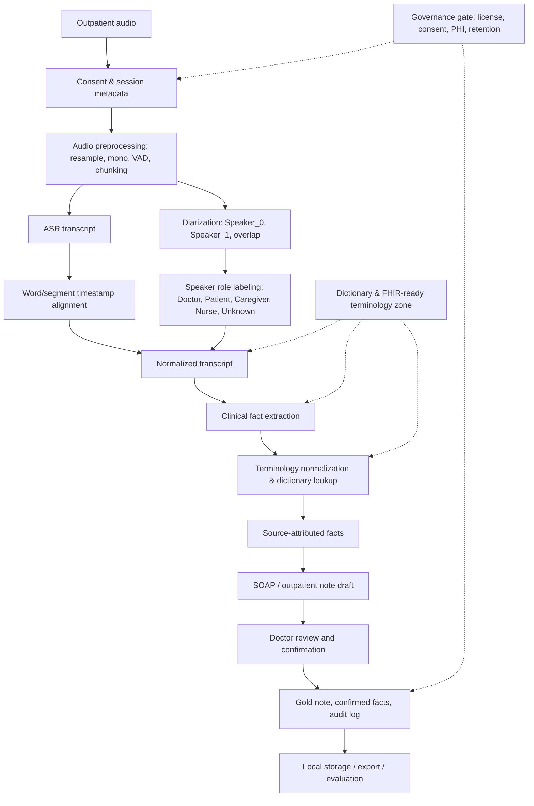
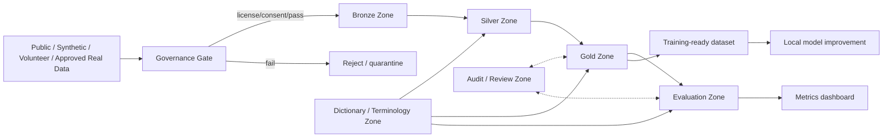

# Master Research Report  
## Data Architecture, Governance, and Dataset Strategy for a Local-first Clinical Ambient Documentation Assistant in Vietnamese Outpatient Care

**Ngôn ngữ:** Tiếng Việt  
**Phạm vi:** MVP local-first cho ghi chép lâm sàng ngoại trú tiếng Việt  
**Nguồn đầu vào:**  
1. `Research Report_ Data Architecture and Governance Strategy for a Local-First Clinical Ambient Documentation Assistant in Vietnamese Outpatient Care.md`  
2. `research-data-clinical.md`  

**Lưu ý biên tập:** Báo cáo này là bản gộp và tái cấu trúc từ hai tài liệu research được cung cấp. Nội dung được chuẩn hóa theo hướng thực dụng cho MVP 1–5 tuần. Những điểm chưa rõ về license, điều kiện sử dụng, nguồn gốc dữ liệu hoặc quyền dùng thương mại được đánh dấu là **cần legal/governance review**. Báo cáo không tự bịa thêm benchmark, license hoặc kết luận ngoài phạm vi hai tài liệu gốc.

---

## 1. Tóm tắt điều hành

MVP “Local-first Clinical Ambient Documentation Assistant for Vietnamese Outpatient Care” là một trợ lý ghi chép lâm sàng hỗ trợ bác sĩ sau cuộc hội thoại khám ngoại trú. Hệ thống nhận audio sau khi bác sĩ bấm dừng ghi âm, tạo transcript, nhận diện lượt nói, gắn vai trò người nói, trích xuất sự kiện lâm sàng có nguồn dẫn về đoạn audio/transcript, tạo bản nháp SOAP hoặc outpatient note, sau đó đưa cho bác sĩ kiểm tra và xác nhận. Đây không phải hệ thống chẩn đoán, không phải AI doctor, và không nên tự đưa ra quyết định điều trị.

Định hướng **local-first** là hợp lý vì audio khám bệnh và transcript lâm sàng là dữ liệu cực nhạy cảm. Nếu đưa dữ liệu thô lên cloud quá sớm, đội dự án sẽ đối mặt với rủi ro pháp lý, rủi ro rò rỉ thông tin sức khỏe, rủi ro thiếu consent rõ ràng và rủi ro mất kiểm soát vòng đời dữ liệu. Với MVP nội bộ, local-first giúp giảm bề mặt tấn công, kiểm soát retention tốt hơn, dễ audit hơn và phù hợp với workflow demo trên máy cá nhân hoặc workstation phòng khám.

Kết luận quan trọng nhất từ hai tài liệu là: **không có một dataset công khai tiếng Việt duy nhất đủ cho toàn bộ bài toán end-to-end**. Các nguồn public hiện có hỗ trợ từng phần: ASR tiếng Việt, một phần speech y khoa, NER y tế, QA y tế, NLI y tế, thuật ngữ thuốc/bệnh/xét nghiệm và một số corpus tiếng Anh làm tham chiếu cấu trúc note. Tuy nhiên, không thấy corpus công khai nào đồng thời có đủ raw outpatient audio, transcript vàng, diarization liên tục, role bác sĩ/bệnh nhân, fact-level attribution, SOAP/note vàng và doctor confirmation.

Khoảng trống dữ liệu lớn nhất là **private gold outpatient encounter corpus tiếng Việt**: audio khám ngoại trú thật, nhiều người nói, có overlap, có timestamp liên tục, có speaker role, có fact spans, có negation/assertion, có medication/dosage/allergy, có SOAP note bác sĩ xác nhận và có correction burden. Đây là phần public dataset gần như không thể thay thế vì phụ thuộc vào ngữ cảnh bệnh viện, biểu mẫu nội bộ, cách nói của bác sĩ Việt Nam và yêu cầu pháp lý đối với dữ liệu bệnh nhân thật.

Chiến lược dữ liệu tối ưu cho MVP là **ghép nhiều nguồn + synthetic-first**. Giai đoạn đầu không nên đợi dữ liệu bệnh nhân thật. Nên tạo 20–50 cuộc hội thoại ngoại trú giả lập tiếng Việt theo chuyên khoa, có vai bác sĩ/bệnh nhân/người nhà, có accent Bắc/Trung/Nam, có noise, có PII giả, có transcript vàng, role label, source attribution, clinical facts và SOAP-lite. Sau đó mới bootstrap thêm từ VietMed, Common Voice vi, FOSD, VietMed-NER, ViMQ, Vietnamese Medical QA, vi_mednli và các nguồn thuật ngữ.

Nguồn nên dùng ngay cho MVP kỹ thuật gồm: **VietMed** cho tiếng nói y khoa và role prior; **Common Voice vi** và **FOSD** để stress-test ASR tiếng Việt ngoài miền; **Vietnamese Medical QA**, **vi_mednli**, **DAV drug resources**, **WHO ICD-10 browser**, **RxNorm**, **ATC**, **LOINC** và **HL7 THO** cho dictionary/schema/evaluation. Một số nguồn như **VietMed-NER**, **ViMQ**, **VietMed-Sum** rất có giá trị kỹ thuật nhưng cần đánh dấu **legal/governance review** nếu dùng cho training rộng hơn, pilot thương mại hoặc tích hợp lâu dài.

Nguồn cần legal/governance review trước khi dùng sâu gồm: VIVOS do phi thương mại; viVoice do research-only/gated và nguồn YouTube; VietMed-NER nếu license card chưa xác minh rõ; ViMQ nếu dữ liệu crawl từ nguồn tư vấn sức khỏe; ViHealthQA, ViMedAQA, VietMed-Sum nếu điều kiện dữ liệu chưa rõ; ACI-Bench, MEDIQA-Chat và MTS-Dialog nếu dùng ngoài vai trò tham chiếu cấu trúc. Nguyên tắc: **license không rõ thì không dùng để train production/pilot**.

Synthetic/simulated data nên đi trước real patient data vì nó cho phép kiểm thử pipeline end-to-end mà không cần đụng vào PHI thật. Đội kỹ thuật có thể kiểm tra ingestion, ASR, diarization, role attribution, fact extraction, source attribution, note generation, doctor review UI, audit log và metric evaluation trước khi xử lý rủi ro pháp lý của dữ liệu bệnh nhân thật. Synthetic data không thay thế dữ liệu thật, nhưng là cách an toàn nhất để dựng nền móng kỹ thuật.

Trong 1–2 tuần đầu, mục tiêu thực tế là chạy được pipeline local-first từ audio giả lập hoặc volunteer audio đến transcript, speaker turns, clinical facts, SOAP draft và màn hình review. Không cần fine-tune model phức tạp ngay. Cần ưu tiên schema dữ liệu, dictionary v0.1, evaluation set nhỏ, audit trail và source attribution. Trong 5 tuần, MVP nên có pipeline ổn định, dataset giả lập có nhãn, baseline ASR/NER/note metrics, risk register, governance checklist và demo có thể giải thích được cho mentor/product/legal.

Kết luận triển khai: **đừng xây MVP dựa trên giả định rằng sẽ có sẵn một bộ dữ liệu y tế tiếng Việt hoàn chỉnh**. Hãy xây một kiến trúc dữ liệu có thể hấp thụ nhiều nguồn, có Bronze/Silver/Gold/Evaluation/Audit zones, có dictionary zone, có review workflow và có cổng governance trước khi đưa dữ liệu thật vào. Đây là cách duy nhất vừa khả thi trong 1–5 tuần, vừa không khóa chết hệ thống khi sau này tích hợp HIS/EHR/FHIR.

---

## 2. North Star Architecture

Kiến trúc mục tiêu phải được thiết kế quanh nguyên tắc: **mọi clinical fact trong note phải truy ngược được về source segment trong audio/transcript**, và mọi output lâm sàng phải đi qua **doctor review/confirmation** trước khi trở thành Gold data.

Luồng tổng thể:

**Outpatient audio → consent/session metadata → audio preprocessing → ASR → diarization/speaker role labeling → timestamp/source attribution → transcript normalization → clinical fact extraction → terminology normalization → SOAP/outpatient note draft → doctor review/confirmation → local storage/export/evaluation**



Thiết kế dữ liệu tối thiểu cho một encounter nên có:

```json
{
  "encounter_id": "UUID",
  "audio_id": "UUID_audio_file",
  "metadata": {
    "setting": "outpatient",
    "specialty": "internal_medicine",
    "language_locale": "vi-VN",
    "recording_environment": "clinic_room",
    "consent_status": "synthetic_or_approved",
    "source_type": "synthetic|public|volunteer|real_patient"
  },
  "segments": [
    {
      "segment_id": "seg_001",
      "start_time": 0.0,
      "end_time": 7.2,
      "speaker_id": "Speaker_0",
      "speaker_role": "Doctor",
      "text": "Hôm nay anh thấy khó chịu ở đâu?",
      "asr_confidence": 0.91
    }
  ],
  "clinical_facts": [
    {
      "fact_id": "fact_001",
      "type": "symptom",
      "text": "ho 3 ngày",
      "assertion": "present",
      "source_segments": ["seg_004", "seg_005"],
      "coding_candidates": [
        {
          "system": "local_dictionary",
          "code": "SYM_COUGH",
          "display": "Ho"
        }
      ],
      "requires_doctor_confirmation": true,
      "doctor_confirmation_status": "accepted|edited|rejected|pending"
    }
  ],
  "note": {
    "format": "SOAP-lite",
    "draft": "...",
    "reviewed_version": "...",
    "status": "draft|reviewed|exported"
  },
  "audit": {
    "reviewer_id": "doctor_or_simulated_reviewer",
    "correction_time_seconds": 0,
    "version": "v0.1"
  }
}
```

---

## 3. Bức tranh tổng thể về khoảng trống dữ liệu

### 3.1. Dữ liệu công khai hiện có hỗ trợ tốt điều gì?

Dữ liệu công khai và public resources hỗ trợ tương đối tốt cho các lớp sau:

- **ASR tiếng Việt tổng quát:** Common Voice vi, FOSD, VietSpeech, viet_bud500, VIVOS, viVoice, VietSuperSpeech, FLEURS vi.
- **ASR/speech y khoa tiếng Việt:** VietMed là nguồn quan trọng nhất vì có speech y khoa và metadata liên quan đến role/accent/recording condition.
- **Medical NER/fact extraction tiếng Việt:** VietMed-NER, ViMQ, PhoNER_COVID19, VietBioNER/ViMedNER nếu có thể truy cập và xác minh.
- **Medical QA và phrase mining:** Vietnamese Medical QA, ViHealthQA, ViMedAQA, vi_pubmed.
- **Negation/assertion gián tiếp:** vi_mednli và ViHealthNLI giúp học entailment/contradiction, nhưng không thay thế được span-level clinical negation corpus.
- **Note generation tham chiếu:** VietMed-Sum cho tiếng Việt; ACI-Bench, MEDIQA-Chat, MTS-Dialog cho cấu trúc tiếng Anh.
- **Thuật ngữ:** DAV/DrugBank VN, ICD-10, RxNorm, ATC, LOINC, HL7 THO, acrDrAid, vi_pubmed.

### 3.2. Dữ liệu công khai chưa hỗ trợ tốt điều gì?

Các khoảng trống nghiêm trọng:

1. **Không có outpatient encounter audio dài bằng tiếng Việt** với nhiều người nói liên tục.
2. **Không có diarization vàng ở cấp encounter** cho bác sĩ/bệnh nhân/người nhà/điều dưỡng.
3. **Không có fact attribution vàng** liên kết từng clinical fact với câu nói và timestamp cụ thể.
4. **Không có SOAP note vàng tiếng Việt** được bác sĩ xác nhận ở quy mô dùng được cho training/evaluation.
5. **Không có doctor correction burden** để đo sản phẩm có thật sự tiết kiệm thời gian hay không.
6. **Không có medication-dose-route-frequency-allergy dataset tiếng Việt** tương đương các benchmark clinical IE tiếng Anh.
7. **Không có corpus công khai đủ điều kiện cho commercial/pilot** nếu license chưa rõ hoặc chỉ nghiên cứu/phi thương mại.

### 3.3. Vì sao thiếu corpus end-to-end tiếng Việt?

Audio khám bệnh thật chứa thông tin sức khỏe, thông tin định danh, giọng nói, bối cảnh gia đình, thuốc, chẩn đoán, kết quả xét nghiệm và kế hoạch điều trị. Đây là dữ liệu nhạy cảm hơn nhiều so với text QA web. Việc công bố public đòi hỏi consent, de-identification, đánh giá pháp lý/đạo đức, quy trình retention và kiểm soát truy cập. Ngoài ra, annotation lâm sàng rất tốn kém vì cần người có chuyên môn y tế kiểm tra fact, negation, medication, dosage, allergy và note quality.

### 3.4. Hệ quả đối với MVP

MVP không nên đặt mục tiêu “train model end-to-end từ đầu”. Mục tiêu đúng là:

- dựng pipeline local-first an toàn;
- tạo synthetic/volunteer dataset nhỏ nhưng có nhãn đầy đủ;
- dùng public datasets để bootstrap từng module;
- tạo Evaluation Zone riêng;
- đo WER/CER/medical term error/role accuracy/fact F1/note usability;
- buộc mọi clinical note phải đi qua doctor review;
- không dùng real patient data cho training khi chưa có phê duyệt.

### 3.5. Cách bù khoảng trống

Cách bù hợp lý theo thứ tự:

1. **Synthetic data:** script-first, sinh hội thoại có kiểm soát, PII giả, có gold labels.
2. **Volunteer/actor data:** ghi âm giả lập có accent/noise thật hơn, không dùng bệnh nhân thật.
3. **Public dataset bootstrap:** tăng robustness của ASR/NLP/dictionary.
4. **Controlled real-data pilot:** chỉ sau consent, legal/governance approval, retention policy, audit và reviewer workflow.
5. **Gold/Evaluation set nội bộ:** tách hẳn khỏi training, versioning rõ ràng.

---

## 4. Bảng tổng hợp nguồn dữ liệu ASR / speech tiếng Việt

| Tên nguồn | Link hoặc nguồn | Nhà cung cấp | Miền dữ liệu | Loại audio | Quy mô | Có transcript không | Có timestamp không | Có speaker label/role không | Accent/noise coverage | License | Cách truy cập | Phù hợp cho MVP | Hỗ trợ zone | Rủi ro | Khuyến nghị |
|---|---|---|---|---|---:|---|---|---|---|---|---|---|---|---|---|
| VietMed | GitHub/HuggingFace MultiMed, paper VietMed | Le-Duc et al. / MultiMed | Y khoa tiếng Việt | Speech y khoa theo clip/utterance | 16h labeled + >1000h medical unlabeled theo tài liệu | Có | Có ở mức clip/utterance; chưa phải word-level encounter liên tục | Có speaker/role một phần; role như Doctor/Patient/Host theo tài liệu 2 | Có metadata accent và recording condition; phù hợp y khoa hơn nguồn tổng quát | Có nơi ghi MIT trên HF labeled subset; toàn bộ thành phần cần legal/governance review | HF/GitHub | Rất cao cho ASR y khoa, role prior, benchmark nội bộ | Bronze/Silver/Evaluation; Gold nếu được hiệu đính | Không có SOAP/note; không phải corpus outpatient encounter dài; unlabeled cần pseudo-labeling | **Use now** cho MVP kỹ thuật; review license trước pilot |
| VietSpeech | HuggingFace NhutP/VietSpeech | MMLab-UIT | Tổng quát tiếng Việt | Speech đa nguồn | >1.100h theo tài liệu 1 | Có | Không rõ/không trọng tâm | Không | Có đa phương ngữ | Mở theo tài liệu; vẫn nên snapshot license | HF | Tốt cho ASR baseline và robustness | Bronze/Silver/Evaluation | Lệch miền y khoa; thiếu thuật ngữ lâm sàng | **Evaluate** |
| Common Voice vi | Mozilla Common Voice | Mozilla | Tổng quát | Read speech crowd-sourced | Rất lớn; tài liệu 2 nêu 26.832h validated tại thời điểm rà soát | Có | Mức clip | Có client_id/metadata, không có role lâm sàng | Tốt cho speaker/accent diversity, không phải clinic noise | CC0 theo tài liệu 2 | Tải từ Common Voice | Cao cho robustness ASR tiếng Việt chung | Bronze/Silver/Evaluation | Read speech, không y khoa, không hội thoại khám bệnh | **Use now** |
| FOSD | Mendeley Data / FPT | FPT | Tổng quát tiếng Việt | Short speeches | 25.921 speeches, khoảng 30h theo tài liệu 2 | Có | Có start/end time theo tài liệu 2 | Không rõ speaker/role | Không nhấn mạnh accent; hữu ích cho alignment/chunk | CC BY 4.0 theo tài liệu 2 | Mendeley Data | Khá cao cho test ASR/chunk/timestamp | Bronze/Silver/Evaluation | Không y khoa; không role; không dialogue | **Use now** |
| viet_bud500 | HuggingFace linhtran92/viet_bud500 / Bud500 GitHub | VietAI/Bud500 contributors | Tổng quát | Podcast/tự nhiên | ~500h theo tài liệu 1 | Có | Không rõ | Không | Có Bắc/Nam/Trung theo tài liệu 1 | Mở theo tài liệu 1; cần snapshot license | HF/GitHub | Trung bình–cao cho hội thoại tự nhiên | Bronze/Silver/Evaluation | Không y khoa; nguồn audio cần kiểm tra | **Evaluate** |
| VietSuperSpeech | HuggingFace thanhnew2001/VietSuperSpeech | Community/HF | Tổng quát/hội thoại | Sub-GigaSpeech tiếng Việt | Không nêu rõ đầy đủ trong tài liệu; là tập con | Có | Một phần/chưa rõ | Một phần/chưa rõ, không role lâm sàng | Có acoustic diversity | Cần legal/governance review | HF | Trung bình cho bridge conversational ASR | Bronze/Silver/Evaluation | Lệch miền, license/nguồn cần xác minh | **Evaluate** |
| VIVOS | Zenodo/Kaggle/HF mirror | AILAB HCMUS | Tổng quát | Read speech phòng yên tĩnh | ~15h | Có | Mức clip | Có speaker_id; không role | Thấp, studio/quiet | CC BY-NC-SA 4.0/phi thương mại theo tài liệu 2 | Zenodo/Kaggle/HF | Chỉ tốt cho baseline/eval học thuật | Evaluation/Reference | Phi thương mại; read speech; không y khoa | **Reference only**; tránh cho pilot thương mại |
| viVoice | HuggingFace capleaf/viVoice | capleaf | Tổng quát | Multi-speaker speech từ YouTube đã cắt sạch | ~1.016h theo tài liệu 2 | Có | Mức clip, không forced alignment đầy đủ | Multi-speaker nhưng không role | Có đa nguồn speaker, audio cleaned | CC BY-NC-SA/research-only/gated theo tài liệu 2 | HF gated, cần email cơ quan | Khá tốt cho acoustic robustness nghiên cứu | Bronze/Silver/Evaluation nếu được phép | Research-only; nguồn YouTube; không phù hợp commercial nếu chưa review | **Evaluate** |
| FLEURS vi | Google/HuggingFace FLEURS | Google | Đa ngữ tổng quát | Sentence-level read speech | ~12h/ngôn ngữ theo tài liệu 2 | Có | Sentence-level | Không | Benchmark đa ngữ, không clinic | License cần kiểm tra lại | HF | Benchmark ASR đa ngữ | Evaluation | Không y khoa; không dialogue | **Evaluate** |
| VinBigdata/VLSP2020 | VinBigdata/VLSP | VinBigdata | Tổng quát tiếng Việt | Read/natural speech | ~100h theo tài liệu 1 | Có | Không rõ | Không | Trung bình | Công khai/cần đăng ký theo tài liệu 1; cần review | VLSP/VinBigdata | Tham khảo ASR tiếng Việt | Bronze/Silver/Evaluation nếu được phép | Tổng quát; điều kiện truy cập/usage cần xác minh | **Reference only / Evaluate** |
| ASR-Vietnamese | GitHub namphung134/ASR-Vietnamese | Community | Tổng quát | 16kHz WAV/hỗn hợp | >250h theo tài liệu 1 | Có | Không rõ | Không | Trung bình | Mở theo tài liệu 1; cần kiểm tra nguồn từng thành phần | GitHub | Thấp–trung bình, chủ yếu tham khảo model/dataset mix | Reference | Có thể trùng nguồn; nguồn gốc không chắc | **Reference only** |

### Kết luận ASR thực dụng cho MVP

Ba nguồn nên đưa vào trước là **VietMed**, **Common Voice vi** và **FOSD**. VietMed giúp mô hình nghe được cách nói và thuật ngữ y khoa tiếng Việt; Common Voice vi giúp độ bền accent/speaker ngoài miền; FOSD giúp kiểm thử chunk/timestamp ở mức speech ngắn. Nếu còn thời gian, đánh giá thêm **viet_bud500** để tăng khả năng xử lý speech tự nhiên và **VietSpeech** để mở rộng ASR baseline.

**VIVOS** nên chỉ dùng làm benchmark/reference học thuật vì phi thương mại và read speech. **viVoice** có giá trị acoustic diversity nhưng nên đánh dấu legal/governance review do research-only/gated và nguồn YouTube. **FLEURS vi** phù hợp benchmark đa ngữ, không đủ liên quan đến clinic. Khoảng trống còn lại là audio ngoại trú thật, dài, nhiều người nói, có timestamp và role liên tục.

---

## 5. Bảng tổng hợp nguồn medical NLP / clinical text tiếng Việt

| Tên nguồn | Link hoặc nguồn | Loại text | Kiểu gán nhãn | Entity/label chính | Có negation/assertion không | Quy mô | License | Truy cập | Phù hợp fact extraction | Phù hợp dictionary | Phù hợp training/evaluation | Rủi ro | Khuyến nghị |
|---|---|---|---|---|---|---:|---|---|---|---|---|---|---|
| VietMed-NER | HF/GitHub leduckhai/VietMed-NER | Spoken medical transcripts + audio | Token-level NER | 18 loại entity: AGE, GENDER, LOCATION, DISEASE/SYMPTOM, DRUG/CHEMICAL, ORGAN, DIAGNOSTICS, TREATMENT, SURGERY, UNIT/CALIBRATOR, v.v. | Không có negation riêng | ~9.000 câu / 9.267 rows theo tài liệu | Tài liệu 1 ghi mở; tài liệu 2 thận trọng: license chưa xác minh rõ | HF/GitHub | Rất cao | Rất cao | Evaluation/training sau legal review | License clarity; không phải note thật; không có assertion | **Evaluate**; dùng kỹ thuật nội bộ sau review |
| VietMed-Sum | GitHub/HF HySonLab/VietMed-Sum | Hội thoại/tóm tắt y khoa tiếng Việt | Dialogue-to-summary | Summary local/global; không phải entity labels chính | Không explicit | 106.252 rows theo tài liệu 1 | Mở/công khai theo tài liệu 1; tài liệu 2 yêu cầu xác minh license | GitHub/HF | Trung bình cho facts gián tiếp | Thấp–trung bình | Tốt cho summarization/evaluation sau review | Có thể có synthetic/LLM-assisted summaries; không phải SOAP vàng | **Use now** cho reference; **Evaluate** trước training rộng |
| ViMQ | GitHub tadeephuy/ViMQ | Câu hỏi bệnh nhân từ tư vấn trực tuyến | NER + intent classification | SYMPTOM&DISEASE, MEDICAL_PROCEDURE, MEDICINE; intents Diagnosis/Severity/Treatment/Cause | Không | ~9.000 câu hỏi | Chưa rõ/cần review; có nguồn crawl | GitHub | Cao cho phrasing bệnh nhân | Cao | Tốt cho eval/training sau review | Web-sourced, license/terms cần kiểm tra | **Evaluate** |
| Vietnamese Medical QA | HuggingFace | QA y tế từ eDoctor/Vinmec theo tài liệu | QA pairs | Hỏi đáp y tế rộng | Không | 9.335 QA pairs theo tài liệu 2 | Apache 2.0 theo tài liệu 2 | HF | Khá cao cho template facts | Cao | Có thể dùng ngay theo điều kiện license | Không phải clinical note/encounter | **Use now** |
| ViHealthQA | HuggingFace/paper | QA-passage healthcare | Retrieval/reading QA | Question + expert answer/passage | Không | 10.015 QA-passage pairs theo tài liệu 2 | Chưa rõ trên card theo tài liệu 2 | HF | Khá cao cho grounding/RAG | Trung bình | Evaluation sau review | Website-sourced, license chưa rõ | **Evaluate** |
| ViMedAQA | HF/paper | Medical paragraphs + abstractive QA | Open-book abstractive QA | Body part, disease, drug, medicine topics | Không | 44.313 triplets theo tài liệu 2 | Educational/research-only theo tài liệu 2 | HF/paper | Trung bình | Cao cho phrase mining | Research/eval only | Không encounter; không commercial-safe | **Evaluate / Reference only** |
| vi_mednli | HF | Biomedical sentence pairs tiếng Việt | NLI | entailment / contradiction / neutral | Có gián tiếp qua contradiction/entailment | 14.049 rows theo tài liệu 2 | Apache 2.0 theo tài liệu 2 | HF | Cao cho assertion/consistency classifier phụ | Thấp | Use now cho evaluation/auxiliary model | Dịch từ MedNLI, không bản địa hoàn toàn | **Use now** |
| ViHealthNLI | Paper/publication | Healthcare sentence pairs | NLI | entailment / contradiction / neutral | Có gián tiếp | 18.989 pairs theo tài liệu 2 | Paper CC BY-NC; dataset license chưa xác minh riêng | Paper/dataset nếu truy cập được | Trung bình–cao cho assertion eval | Thấp | Research/eval | License và truy cập chưa rõ | **Evaluate** |
| vi_pubmed | HuggingFace | Song ngữ biomedical corpus | Parallel/biomedical text | Biomedical terms/phrases | Không | 20.1M rows theo tài liệu 2 | “cc” chưa đủ rõ theo tài liệu 2 | HF | Thấp cho direct IE | Rất cao cho term mining | Sau legal review | Không clinical notes; license mơ hồ | **Evaluate** |
| PhoNER_COVID19 | GitHub | Tin/bản tin COVID tiếng Việt | NER | Public health/location/org/patient related entities | Không | 10K câu, 35K entities theo tài liệu 2 | Chưa rõ | GitHub | Trung bình | Trung bình | NER/de-ID reference | Miền COVID/public health, không outpatient | **Reference only / Use for NER reference** |
| ViHealthBERT / acrDrAid | GitHub | Acronym/keyword sets + phụ trợ | Acronym disambiguation | Viết tắt/y sinh | Không | 135 keyword sets theo tài liệu 2 | MIT cho repo theo tài liệu 2 | GitHub | Trung bình | Cao cho abbreviation dictionary | Use now cho dictionary | Không phải clinical IE corpus | **Use now** |
| VietBioNER | GitHub/paper | Văn bản biomedical học thuật | NER | disease, symptom, treatment/procedure, organization, v.v. | Không | Không đồng nhất giữa tài liệu | Mở theo tài liệu 1; cần review | GitHub | Trung bình | Cao cho thuật ngữ chính thức | Reference/eval | Văn bản học thuật khác hội thoại | **Reference only** |
| ViMedNER | Paper/EAI | Văn bản y tế | NER | Thực thể y tế chung | Không rõ | Không rõ | Học thuật/chưa rõ | Paper/portal | Trung bình nếu truy cập được | Trung bình | Evaluate | Code/data không rõ | **Evaluate** |

### Kết luận clinical NLP thực dụng cho MVP

- **Fact extraction v0.1:** ưu tiên VietMed-NER, ViMQ, Vietnamese Medical QA và vi_mednli. VietMed-NER cho entity trong speech y khoa; ViMQ cho cách bệnh nhân mô tả triệu chứng; Vietnamese Medical QA cho phrasing y tế phổ thông; vi_mednli cho kiểm tra mâu thuẫn/khẳng định-phủ định gián tiếp.
- **Dictionary v0.1:** dùng VietMed-NER, ViMQ, Vietnamese Medical QA, vi_pubmed, acrDrAid, DAV và ICD/LOINC/RxNorm/ATC. Không nên chỉ dựa vào một từ điển dịch máy.
- **Negation/assertion:** chưa có span-level clinical negation corpus tiếng Việt đủ mạnh. MVP nên kết hợp rule-based cue detection tiếng Việt, NLI phụ trợ, và manual annotation trên synthetic/volunteer data.
- **Legal review:** VietMed-NER, ViMQ, ViHealthQA, ViMedAQA, VietMed-Sum, vi_pubmed cần review nếu dùng cho training/pilot/commercial.
- **Thiếu so với tiếng Anh:** chưa có dữ liệu tương đương n2c2/i2b2 cho medication, dosage, route, frequency, allergy, temporality, experiencer và assertion ở clinical note thật.

---

## 6. Speaker diarization, speaker role và clinical attribution

### 6.1. Diarization khác clinical attribution thế nào?

**Speaker diarization** trả lời câu hỏi: “Ai nói lúc nào?” Nó thường xuất ra `Speaker_0`, `Speaker_1`, segment time và đôi khi overlap. Nhưng diarization không biết ai là bác sĩ, ai là bệnh nhân, ai là người nhà.

**Speaker role labeling** trả lời câu hỏi: “Speaker_0 là Doctor hay Patient?” Nó cần kết hợp audio clues, nội dung câu nói, vị trí trong hội thoại và pattern lâm sàng.

**Clinical attribution** trả lời câu hỏi sâu hơn: “Clinical fact này thuộc về ai, do ai nói, có được bác sĩ xác nhận không, và nằm ở timestamp nào?” Ví dụ: nếu người mẹ nói “cháu sốt từ tối qua”, fact “sốt từ tối qua” thuộc về **patient là trẻ em**, nhưng người nói là **caregiver**. Vì vậy, Speaker_0/Speaker_1 chưa đủ.

### 6.2. Vì sao cần role Doctor / Patient / Caregiver / Nurse / Unknown?

Ngoại trú Việt Nam thường có nhiều biến thể:
- bệnh nhân tự nói với bác sĩ;
- bố/mẹ nói thay trẻ em;
- con cái nói thay bố mẹ già;
- điều dưỡng/lễ tân hỏi thông tin ban đầu;
- bác sĩ trao đổi với người nhà;
- bệnh nhân dùng từ dân gian, bác sĩ chuẩn hóa thuật ngữ.

Nếu không có role, hệ thống có thể gán nhầm chỉ định của bác sĩ thành triệu chứng của bệnh nhân, hoặc gán lời người nhà thành statement đã được bệnh nhân xác nhận. MVP nên dùng bộ role tối thiểu: **Doctor, Patient, Caregiver, Nurse, Unknown**. Với synthetic data, nên annotate cả `speaker_role` và `clinical_subject`.

| Nguồn/tool/dataset | Ngôn ngữ | Audio type | Speaker label | Role label | Timestamp | Overlap support | License | Local feasibility | Mức phù hợp doctor-patient attribution | Rủi ro | Khuyến nghị |
|---|---|---|---|---|---|---|---|---|---|---|---|
| VietMed | Việt | Clip y khoa theo utterance | Có | Có một phần: Doctor/Patient/Host theo tài liệu | Mức clip/utterance | Không đủ cho encounter overlap liên tục | MIT trên subset theo tài liệu 2; toàn bộ cần review | Cao | Tốt cho role classifier phụ, không đủ cho full diarization | Không phải encounter dài; role set chưa đủ caregiver/nurse | **Use now** cho role prior |
| Pyannote-audio | Đa ngữ | Hội thoại chung | Có: Speaker_0/1 | Không | Có | Có/được dùng cho overlap diarization | MIT theo tài liệu 1; cần xác minh version/model terms | Cao nếu chạy local | Tốt cho diarization kỹ thuật, không role lâm sàng | Có thể split/merge sai, nhạy với noise/overlap | **Use now** cho pipeline |
| WhisperX | Đa ngữ | Speech/hội thoại | Có nếu kết hợp diarization | Không | Word-level alignment | VAD/diarization phụ thuộc backend | BSD-4-Clause theo tài liệu 1; cần xác minh dependencies | Cao nhưng cần GPU/CPU đủ | Rất hữu ích cho timestamp/source attribution | Phụ thuộc Whisper/Pyannote; lỗi alignment y khoa | **Use now** cho alignment |
| AMI Meeting Corpus | Anh | Meeting | Có | Có role meeting, không clinical | Có | Có annotations meeting | Cần review điều kiện corpus | Có thể local | Chỉ tham khảo kỹ thuật | Khác miền/ngôn ngữ | **Reference only** |
| AliMeeting | Quan thoại | Meeting far-field/near-field | Có | Không clinical | Có | Có overlap | Public/OpenSLR theo tài liệu 2; cần review | Có | Benchmark kỹ thuật diarization/overlap | Khác ngôn ngữ/miền | **Use now** cho benchmark kỹ thuật nếu cần |
| VIVOS | Việt | Read speech | Speaker ID | Không | Mức clip | Không | Phi thương mại | Có | Thấp | Không hội thoại | **Reference only** |
| Synthetic/volunteer encounter set | Việt | Outpatient simulated encounters | Có | Có đầy đủ Doctor/Patient/Caregiver/Nurse/Unknown | Có thể tự annotate | Có thể thiết kế overlap | Nội bộ | Cao | Cao nhất cho MVP | Synthetic bias nếu kịch bản kém | **Use now** bằng cách tự tạo |

### 6.3. Khuyến nghị MVP

MVP nên làm hai tầng:
1. **Tầng kỹ thuật:** WhisperX/Pyannote để tạo speaker turns và timestamps.
2. **Tầng lâm sàng:** role classifier/rule/LLM local để gán Doctor/Patient/Caregiver/Nurse/Unknown dựa trên nội dung và template.

Evaluation phải đo riêng **DER**, **speaker role accuracy** và **clinical attribution accuracy**. Không được đánh đồng diarization đúng với clinical attribution đúng.

---

## 7. Clinical dialogue, SOAP và note generation

### 7.1. VietMed-Sum có giá trị gì?

VietMed-Sum là nguồn tiếng Việt quan trọng nhất cho hướng **medical conversation summarization**. Nó có giá trị ở ba điểm:
- cung cấp cách chuyển transcript hội thoại y khoa thành summary;
- gợi ý chiến lược local summary/global summary phù hợp với pipeline local-first theo chunk;
- là reference tốt để đánh giá output note tiếng Việt.

Tuy nhiên, VietMed-Sum không nên được xem là “SOAP note vàng ngoại trú” hoàn chỉnh nếu chưa xác minh cấu trúc, license, quy trình tạo gold và mức độ doctor confirmation.

### 7.2. ACI-Bench, MEDIQA-Chat, MTS-Dialog có giá trị gì?

Các nguồn tiếng Anh này rất hữu ích để học:
- cấu trúc note theo section;
- tiêu chí chất lượng note;
- cách tách subjective/objective/assessment/plan;
- benchmark dialogue-to-note;
- lỗi hallucination và unsupported statement.

Nhưng chúng không nên được dùng trực tiếp để train sản phẩm tiếng Việt local-first nếu chưa qua Việt hóa, governance, đánh giá domain shift và legal review.

| Nguồn | Ngôn ngữ | Miền | Có dialogue không | Có note/summary không | Có SOAP/section structure không | Có entity/speaker/timestamp không | License | Dùng trực tiếp hay tham chiếu | Rủi ro | Khuyến nghị |
|---|---|---|---|---|---|---|---|---|---|---|
| VietMed-Sum | Việt | Medical conversations | Có | Có local/global summary | Một phần, không chắc SOAP đầy đủ | Speaker/timestamp/entity chưa đủ rõ theo tài liệu | Công khai nhưng cần review license dữ liệu | Dùng trực tiếp cho reference summarization; không thay thế Gold SOAP | Có thể có LLM-assisted summary; thiếu doctor confirmation | **Use now** cho reference, **Evaluate** cho training |
| ACI-Bench | Anh | Ambient clinical intelligence / outpatient | Có | Có visit note | Có sectioned clinical note gần SOAP | Speaker text có; audio/timestamp không phải trọng tâm | Cần review dataset terms | Structural reference | English/domain shift; legal terms | **Evaluate / Reference only** |
| MEDIQA-Chat | Anh | Clinical dialogue summarization | Có | Có section summary | Có normalized section labels | Không phải full audio entity benchmark | Challenge terms cần review | Structural/rubric reference | Không tiếng Việt, không audio | **Evaluate / Reference only** |
| MTS-Dialog | Anh | Doctor-patient conversations | Có | Có clinical notes/summaries | Sectioned summary | Speaker text có; entity/timestamp hạn chế | Cần review release license | Structural reference | Short dialogs, English | **Evaluate / Reference only** |
| Microsoft clinical visit note summarization corpus | Anh | Synthetic clinical encounters | Có | Có clinical notes | Có structured notes | Không phải audio/timestamp đầy đủ | Cần review | Reference cho synthetic design | Synthetic English, không thay thế tiếng Việt | **Reference only** |
| Synthetic Vietnamese outpatient SOAP-lite set | Việt | MVP specialties | Có, tự tạo | Có, tự annotate | Có SOAP-lite do team định nghĩa | Có thể annotate đầy đủ entity/speaker/timestamp/source | Nội bộ | Dùng trực tiếp cho MVP Evaluation/Gold | Synthetic bias | **Use now** |

### 7.3. Thiếu gì để có SOAP note vàng tiếng Việt?

Cần tự tạo hoặc thu thập có kiểm soát:
- transcript vàng;
- role label;
- fact spans;
- assertion/negation;
- medication/dose/frequency/allergy;
- vital/lab/procedure;
- source segment link;
- SOAP/outpatient note theo template Việt Nam hoặc template nội bộ;
- doctor confirmation và correction log.

---

## 8. Terminology, medical dictionary và FHIR readiness

### 8.1. Nguyên tắc

Không nên bắt đầu bằng việc dịch toàn bộ SNOMED CT/LOINC sang tiếng Việt. Việc này lớn, tốn license/governance, khó đảm bảo chất lượng và không cần cho MVP 1–5 tuần. Thay vào đó, hãy xây **dictionary v0.1 hẹp theo chuyên khoa MVP**.

Dictionary v0.1 nên gồm:
- symptom/problem;
- diagnosis;
- drug/active ingredient/brand;
- dosage/unit/route/frequency;
- allergy;
- lab/vital;
- procedure;
- abbreviation/acronym;
- alias tiếng Việt/dân gian;
- mapping candidates sang code systems.

### 8.2. Bảng tài nguyên thuật ngữ

| Tài nguyên | Loại thuật ngữ | Hỗ trợ tiếng Việt | Phạm vi | Code system | License/điều kiện | Tính thực dụng cho MVP | Cách map sang FHIR CodeableConcept | Khuyến nghị |
|---|---|---|---|---|---|---|---|---|
| DAV / DrugBank Việt Nam | Thuốc, hoạt chất, đăng ký thuốc | Có, nguồn Việt Nam | Thuốc đang lưu hành, dạng bào chế, hoạt chất, nhà sản xuất | Local VN drug registry | Cổng công khai; vẫn cần review quyền crawl/cache | Rất cao | `coding.system` local, `display` tên thuốc VN, crosswalk sang RxNorm/ATC khi có | **Use now** |
| WHO ICD-10 Browser | Chẩn đoán/bệnh | Tiếng Anh chính thức; alias Việt cần tự tạo | Problem/diagnosis backbone | ICD-10 | Công khai; điều kiện sử dụng WHO cần tuân thủ | Cao | `coding.system = http://hl7.org/fhir/sid/icd-10`; alias Việt trong local dictionary | **Use now** |
| ICD-10 trong văn bản/BYT | Chẩn đoán/báo cáo KCB | Có ở mức vận hành Việt Nam | Mã bệnh trong cơ sở KCB | ICD-10/local usage | Văn bản pháp quy/cổng chính phủ | Rất cao cho Việt Nam | Local CodeSystem/ValueSet mapping về ICD-10 | **Use now** |
| RxNorm/RxNav | Thuốc chuẩn hóa | Không Việt hóa sẵn | Ingredient/clinical drug | RxNorm | NIH/NLM terms | Cao cho hoạt chất quốc tế | `coding.system = http://www.nlm.nih.gov/research/umls/rxnorm` | **Use now** |
| ATC/DDD | Phân nhóm thuốc | Không Việt hóa sẵn | Drug classes | ATC | WHOCC terms | Cao cho nhóm thuốc | Thêm coding ATC song song local drug | **Use now** |
| LOINC | Lab/vital/observation | Không Việt hóa sẵn | Labs, vitals, observations, documents | LOINC | Tải miễn phí nhưng có điều kiện attribution/không tạo chuẩn thay thế | Rất cao cho lab/vital | `coding.system = http://loinc.org` | **Use now** |
| SNOMED CT | Clinical terminology tổng quát | Không có bản Việt chuẩn dễ dùng trong MVP | Findings, procedures, body structures | SNOMED CT | License phụ thuộc jurisdiction/agreement | Tốt về lâu dài, nặng cho MVP | `coding.system = http://snomed.info/sct` khi có quyền dùng | **Evaluate**, không làm blocker |
| HL7 Terminology / FHIR THO | Value sets/code systems | Không phải dictionary tiếng Việt | Interoperability bindings | HL7/FHIR code systems | HL7 official terms | Cao cho schema | Dùng URI chuẩn trong FHIR resources | **Use now** |
| vi_pubmed | Biomedical bilingual corpus | Có Anh–Việt | Phrase/term mining | Không phải code system | License mơ hồ, cần review | Cao cho synonym mining | Lớp alias/synonym, không làm code gốc | **Evaluate** |
| acrDrAid / ViHealthBERT | Acronym/keyword | Có | Viết tắt y sinh | Local resource | MIT repo theo tài liệu 2 | Cao cho abbreviation v0.1 | `alias`, `display`, `synonym`, `review_state` | **Use now** |
| Local MVP dictionary | Từ điển hẹp nội bộ | Có | Chuyên khoa MVP | Local CodeSystem | Nội bộ | Bắt buộc | `CodeableConcept` với local coding + candidates chuẩn | **Use now** |

### 8.3. FHIR readiness

MVP chưa cần export FHIR đầy đủ ngay, nhưng schema phải **FHIR-ready**. Mỗi fact nên có:
- `type`: symptom, diagnosis, medication, lab, vital, procedure, allergy;
- `text_original`;
- `normalized_display`;
- `coding_candidates`;
- `source_segments`;
- `assertion`;
- `clinical_subject`;
- `review_status`;
- `confidence`;
- `version`.

Map dần:
- symptom/problem → `Condition` hoặc `Observation`;
- medication → `MedicationStatement` hoặc `MedicationRequest` sau doctor confirmation;
- allergy → `AllergyIntolerance`;
- vital/lab → `Observation`;
- procedure → `Procedure`;
- note → `DocumentReference` hoặc `Composition`;
- encounter → `Encounter`;
- speaker/audio metadata → không phải FHIR core hoàn chỉnh, lưu local/audit và liên kết với `DocumentReference`.

---

## 9. Dataset Coverage Matrix

**Ký hiệu:** ✓ = có trực tiếp; △ = có thể suy/ghép một phần; ✗ = không có; ? = license/điều kiện chưa rõ.

| Dataset/resource | Raw audio | Transcript | Timestamp | Speaker turn | Speaker role | Clinical entity | Negation | Medication | Dosage | Allergy | Vital sign | Lab result | SOAP/note | Doctor confirmation | License clarity | Local use allowed | Training allowed | Evaluation allowed |
|---|---:|---:|---:|---:|---:|---:|---:|---:|---:|---:|---:|---:|---:|---:|---:|---:|---:|---:|
| VietMed | ✓ | ✓ | △ | △ | ✓ | △ | ✗ | △ | ✗ | ✗ | ✗ | ✗ | ✗ | ✗ | △ | ✓ | △ | ✓ |
| VietSpeech | ✓ | ✓ | △ | ✗ | ✗ | ✗ | ✗ | ✗ | ✗ | ✗ | ✗ | ✗ | ✗ | ✗ | △ | ✓ | △ | ✓ |
| Common Voice vi | ✓ | ✓ | △ | ✗ | ✗ | ✗ | ✗ | ✗ | ✗ | ✗ | ✗ | ✗ | ✗ | ✗ | ✓ | ✓ | ✓ | ✓ |
| FOSD | ✓ | ✓ | ✓ | ✗ | ✗ | ✗ | ✗ | ✗ | ✗ | ✗ | ✗ | ✗ | ✗ | ✗ | ✓ | ✓ | ✓ | ✓ |
| viet_bud500 | ✓ | ✓ | △ | ✗ | ✗ | ✗ | ✗ | ✗ | ✗ | ✗ | ✗ | ✗ | ✗ | ✗ | △ | △ | △ | ✓ |
| VIVOS | ✓ | ✓ | △ | ✗ | ✗ | ✗ | ✗ | ✗ | ✗ | ✗ | ✗ | ✗ | ✗ | ✗ | ✓ phi thương mại | ✓ | ✗ commercial | ✓ |
| viVoice | ✓ | ✓ | △ | ✗ | ✗ | ✗ | ✗ | ✗ | ✗ | ✗ | ✗ | ✗ | ✗ | ✗ | ✓ research-only | ✓ nội bộ nghiên cứu | ✗ commercial | ✓ |
| VietMed-NER | ✓/△ | ✓ | △ | △ | △ | ✓ | ✗ | ✓ | △ | ✗ | △ | △ | ✗ | ✗ | ? | ? | ? | ✓ |
| ViMQ | ✗ | ✓ | ✗ | ✗ | △ patient implied | ✓ | ✗ | ✓ | ✗ | ✗ | ✗ | ✗ | ✗ | ✗ | ? | ? | ? | ✓ |
| Vietnamese Medical QA | ✗ | ✓ | ✗ | ✗ | ✗ | △ | ✗ | △ | △ | △ | △ | △ | ✗ | ✗ | ✓ | ✓ | ✓ | ✓ |
| ViHealthQA | ✗ | ✓ | ✗ | ✗ | ✗ | △ | ✗ | △ | △ | △ | △ | △ | ✗ | ✗ | ? | ? | ? | ✓ |
| ViMedAQA | ✗ | ✓ | ✗ | ✗ | ✗ | △ | ✗ | ✓ | △ | ✗ | △ | △ | ✗ | ✗ | ✓ research-only | ✓ | ✗ commercial | ✓ |
| vi_mednli | ✗ | ✓ | ✗ | ✗ | ✗ | △ | ✓ gián tiếp | △ | △ | ✗ | △ | △ | ✗ | ✗ | ✓ | ✓ | ✓ | ✓ |
| ViHealthNLI | ✗ | ✓ | ✗ | ✗ | ✗ | △ | ✓ gián tiếp | △ | ✗ | ✗ | ✗ | ✗ | ✗ | ✗ | ? | ? | ? | ✓ |
| PhoNER_COVID19 | ✗ | ✓ | ✗ | ✗ | ✗ | ✓ | ✗ | ✗ | ✗ | ✗ | ✗ | ✗ | ✗ | ✗ | ? | △ | ? | ✓ |
| VietMed-Sum | △ | ✓ | △ | ? | ? | △ | ✗ | △ | △ | ✗ | △ | △ | summary | ✗ | ? | ? | ? | ✓ |
| ACI-Bench | ✗/△ | ✓ | ✗ | ✓ | ✓ | △ | △ | △ | △ | △ | △ | △ | ✓ | ✗ | ? | ? | ? | ✓ |
| MEDIQA-Chat | ✗ | ✓ | ✗ | ✓ | ✓ | △ | △ | △ | △ | △ | △ | △ | section summary | ✗ | ? | ? | ? | ✓ |
| MTS-Dialog | ✗ | ✓ | ✗ | ✓ | ✓ | △ | △ | △ | △ | △ | △ | △ | ✓ | ✗ | ? | ? | ? | ✓ |
| DAV/ICD/LOINC/RxNorm/ATC/THO | ✗ | terminology | ✗ | ✗ | ✗ | ✓ | ✗ | ✓ | ✓ | △ | ✓ | ✓ | ✗ | ✗ | ✓/△ | ✓ | not training audio | ✓ |
| Synthetic/volunteer MVP set | ✓ | ✓ | ✓ | ✓ | ✓ | ✓ | ✓ | ✓ | ✓ | ✓ | ✓ | ✓ | ✓ | simulated review | ✓ nội bộ | ✓ | ✓ | ✓ |

### Phân tích coverage

**Điểm mạnh:** Có đủ nguồn để dựng baseline ASR tiếng Việt, bootstrap terminology, tạo fact extractor v0.1 và tham chiếu cấu trúc note.

**Điểm yếu:** Không có nguồn public end-to-end cho outpatient documentation assistant. Dữ liệu có audio thì thiếu SOAP/fact labels; dữ liệu có NLP labels thì thiếu raw audio; dữ liệu có note thì thường là tiếng Anh hoặc không có doctor confirmation.

**Khoảng trống nghiêm trọng:** negation/assertion span-level, medication/dosage/allergy tiếng Việt, continuous diarization, role + clinical subject, source attribution và correction burden.

**Dữ liệu phải tự tạo:** synthetic/volunteer outpatient encounters có đầy đủ labels. Đây là Gold/Evaluation seed cho MVP.

**Dữ liệu chỉ dùng evaluation/reference:** VIVOS, ACI-Bench/MEDIQA/MTS/Microsoft English synthetic corpora nếu license chưa rõ hoặc lệch miền/ngôn ngữ.

**Dữ liệu không nên dùng cho commercial/pilot:** mọi nguồn có license mơ hồ, phi thương mại, research-only hoặc dữ liệu patient thật chưa được approve.

---

## 10. Data Lake Architecture

### 10.1. Mermaid data lake diagram



### 10.2. Zone design

| Zone | Mục đích | Dữ liệu lưu | Ai được truy cập | Retention/governance note | Rủi ro | Output sang zone tiếp theo |
|---|---|---|---|---|---|---|
| Bronze | Lưu raw/immutable, bảo toàn nguồn gốc | Raw audio, raw transcript, raw ASR output, raw diarization, raw LLM output, metadata, license snapshot, checksum | Data engineer được phân quyền; không mở rộng | Raw audio bệnh nhân thật phải retention ngắn, encrypted, access logged; synthetic có thể giữ lâu hơn | Raw PHI leak, license misuse | Preprocessed audio/text sang Silver |
| Silver | Chuẩn hóa/căn chỉnh | Cleaned audio, chunks, normalized transcript, word/segment timestamps, speaker turns, role predictions, de-ID candidate, terminology hints | AI engineer/data engineer | Không coi là de-identified nếu còn nội dung sức khỏe/giọng nói | Sai alignment, mất context, de-ID giả an toàn | Candidate facts và normalized transcript sang Gold |
| Gold | Dữ liệu đã review/xác nhận | Doctor-reviewed transcript, role, clinical facts, SOAP/outpatient note, source attribution, final status | Bác sĩ reviewer, lead engineer, data steward | Chỉ Gold mới được dùng làm training/evaluation high-trust; versioning bắt buộc | Reviewer inconsistency, note bias | Training-ready và Evaluation subsets |
| Evaluation | Hold-out benchmark | Set cố định không train: audio/text/facts/note labels, metrics configs | AI lead, evaluator, governance | Tách khỏi training; freeze version; audit changes | Leakage vào training, metric ảo | Dashboard, release gate |
| Dictionary/Terminology | Chuẩn hóa thuật ngữ | local dictionary, aliases, ICD/RxNorm/ATC/LOINC candidates, DAV terms, abbreviations, mappings | Data/AI/clinical reviewer | Mỗi mapping có review_state; không auto-code clinical diagnosis nếu chưa confirm | Sai map thuốc/liều/chẩn đoán | Hỗ trợ Silver/Gold/Eval |
| Audit/Review | Theo dõi vòng đời quyết định | Review actions, accept/edit/reject, correction_time_seconds, delta, reviewer id, model version | Governance/product/AI lead | Không lưu PHI dư thừa; log bất biến; cần access control | Audit log chứa PHI gián tiếp | Correction burden, model drift, safety review |

### 10.3. Metadata bắt buộc khi ingest

Mỗi dataset/file phải có:
- `source_name`;
- `source_url_or_repository`;
- `source_type`: public/synthetic/volunteer/real_patient;
- `license_text_or_snapshot`;
- `license_review_status`;
- `allowed_use`: research/internal/commercial/training/evaluation;
- `contains_phi`;
- `consent_status`;
- `de_identification_status`;
- `retention_policy`;
- `checksum`;
- `version`;
- `ingested_at`;
- `owner`.

---

## 11. Governance và data lifecycle

Governance của MVP phải đơn giản nhưng đủ chặt:

1. **Synthetic-first:** giai đoạn đầu dùng synthetic/volunteer data, không dùng dữ liệu bệnh nhân thật.
2. **Real patient data chỉ dùng khi có phê duyệt:** phải có consent, governance/legal approval, retention policy và access control.
3. **Raw audio là dữ liệu cực nhạy cảm:** giọng nói + nội dung sức khỏe có thể định danh, không nên lưu lâu nếu không cần.
4. **Consent:** cần ghi rõ mục đích: documentation support, evaluation, training hay product improvement. Không gộp chung.
5. **De-identification:** transcript cần loại bỏ tên, số điện thoại, địa chỉ, mã bệnh án, BHYT, ngày sinh cụ thể; nhưng cần nhớ de-ID text không làm audio hết nhạy cảm.
6. **Retention:** synthetic giữ lâu; volunteer giữ theo consent; real audio giữ ngắn nhất có thể; Gold facts/note có thể giữ theo chính sách đã duyệt.
7. **Access control:** phân quyền theo zone; raw audio ít người xem nhất; mọi truy cập có log.
8. **Audit log:** lưu model version, prompt version, reviewer, action, correction time, source segment.
9. **Local-first/private-first:** inference local mặc định; nếu dùng cloud phải có approval riêng.
10. **License review:** dataset public phải có snapshot license và allowed-use matrix trước khi train/eval/pilot.
11. **Không dùng real patient data cho training nếu chưa được phê duyệt:** kể cả “chỉ fine-tune thử” cũng là rủi ro cao.

---

## 12. MVP Dataset Strategy

### Phase 1 — Synthetic / simulated data

**Mục tiêu:** Dựng pipeline end-to-end an toàn mà không cần PHI thật.

**Dữ liệu cần tạo:**
- 20–50 outpatient encounters tiếng Việt, mỗi encounter 3–8 phút;
- chuyên khoa: nội tổng quát, hô hấp, tiêu hóa, tim mạch đơn giản, da liễu, nhi;
- roles: Doctor, Patient, Caregiver, Nurse/Receptionist, Unknown;
- accent: Bắc/Trung/Nam;
- noise: yên tĩnh, quạt/máy lạnh, hành lang, mic laptop xa, call remote.

**Annotation cần có:**
- transcript vàng;
- speaker turn;
- speaker role;
- timestamps;
- clinical facts;
- source segments;
- negation/assertion;
- medication/dosage/allergy;
- vital/lab/procedure nếu có;
- SOAP-lite;
- safety flags;
- review/correction log giả lập.

**Cách dùng:** test pipeline audio → ASR → diarization → role → facts → note → review UI → metrics.

**Output:** seed Gold/Evaluation v0.1.

### Phase 2 — Public dataset bootstrap

**Nguồn dùng ngay:**
- ASR: VietMed, Common Voice vi, FOSD.
- NLP: Vietnamese Medical QA, vi_mednli, acrDrAid.
- Terminology: DAV, ICD-10, RxNorm, ATC, LOINC, HL7 THO.

**Nguồn cần đánh giá:**
- VietMed-NER, VietMed-Sum, ViMQ, ViHealthQA, ViMedAQA, vi_pubmed, viet_bud500, viVoice, FLEURS vi, VietSpeech.

**Nguồn chỉ tham khảo:**
- VIVOS, ACI-Bench, MEDIQA-Chat, MTS-Dialog, English synthetic visit-note corpora.

**Cách đưa vào zones:**
- Bronze: raw download + license snapshot.
- Silver: normalized split/chunk/metadata.
- Evaluation: sample subset cố định.
- Dictionary: extracted terms + aliases + mappings.

### Phase 3 — Volunteer/actor data

**Mục tiêu:** Tăng realism của audio mà không dùng bệnh nhân thật.

**Cách tạo:**
- dùng script synthetic đã duyệt;
- mời volunteer đóng vai;
- ghi bằng laptop/mic phòng thường;
- thêm noise thật;
- yêu cầu đọc tự nhiên, có ngắt lời nhẹ, nói lặp, sửa câu.

**Annotation cần có:** giống Phase 1 nhưng tập trung mạnh vào diarization, role và ASR error.

**Output:** realistic simulated Evaluation set.

### Phase 4 — Controlled real-data pilot

**Điều kiện trước khi dùng:**
- consent template rõ;
- legal/governance approval;
- DPIA/data risk assessment nếu cần;
- retention policy cho raw audio;
- local encrypted storage;
- access control;
- doctor review workflow;
- incident response plan.

**Nguyên tắc:**
- real audio không tự động dùng training;
- mọi note là draft, bác sĩ xác nhận;
- audit log bắt buộc;
- dữ liệu bệnh nhân thật phải tách khỏi synthetic/public.

### Phase 5 — Gold/Evaluation set

**Cách tạo hold-out set:**
- chọn 20–30 synthetic/volunteer encounters đầu tiên;
- khi có approval, thêm 30–100 real encounters;
- freeze version;
- không train trên hold-out;
- mỗi label có reviewer/version.

**Metric:** WER, CER, medical term error, DER, role accuracy, fact F1, negation error, medication/dose/allergy error, note usability, correction burden, hallucination, unsupported statement, source attribution accuracy.

---

## 13. Evaluation Framework

| Metric | Đo cái gì | Cần dữ liệu/annotation gì | Dùng ở phase nào | Mức ưu tiên MVP | Ghi chú triển khai |
|---|---|---|---|---|---|
| WER | Tỷ lệ lỗi từ của ASR | Transcript vàng | Phase 1–5 | Rất cao | Tính chung và theo accent/noise |
| CER | Lỗi ký tự, hữu ích với tiếng Việt | Transcript vàng | Phase 1–5 | Cao | Hữu ích khi tokenization tiếng Việt gây nhiễu |
| Medical Term Error Rate | Sai thuật ngữ y khoa | Term spans + dictionary | Phase 2–5 | Rất cao | Tách symptom/drug/lab/procedure |
| Negation Error Rate | Sai phủ định/khẳng định | Assertion labels | Phase 1–5 | Rất cao | Safety-critical: “không đau ngực” ≠ “đau ngực” |
| Critical Entity Error Rate | Sai entity nguy hiểm | Critical fact labels | Phase 1–5 | Rất cao | Thuốc, liều, dị ứng, triệu chứng đỏ |
| Diarization Error Rate | Sai ai nói lúc nào | Speaker turn gold | Phase 1,3,4,5 | Cao | Đo riêng overlap |
| Speaker Role Accuracy | Gán sai Doctor/Patient/Caregiver | Role labels | Phase 1,3,4,5 | Rất cao | Không thay thế bằng DER |
| Clinical Attribution Accuracy | Fact thuộc đúng người/chủ thể không | Fact + source + subject labels | Phase 1–5 | Rất cao | Đặc biệt khi caregiver nói thay patient |
| Fact Extraction Precision | Fact được trích có đúng không | Gold clinical facts | Phase 1–5 | Cao | Giảm hallucination |
| Fact Extraction Recall | Có bỏ sót fact không | Gold clinical facts | Phase 1–5 | Rất cao | Bỏ sót dị ứng/thuốc là nguy hiểm |
| Fact Extraction F1 | Cân bằng precision/recall | Gold clinical facts | Phase 1–5 | Cao | Theo từng entity type |
| SOAP Note Usability | Note có dùng được sau chỉnh nhẹ không | Doctor rubric | Phase 1,4,5 | Cao | Rating 1–5 hoặc pass/fail |
| Doctor Correction Burden | Bác sĩ mất bao lâu/sửa bao nhiêu | Audit log, edit distance, time | Phase 1,4,5 | Rất cao | Metric product quan trọng |
| Hallucination Rate | Note có thông tin không có trong transcript không | Source attribution + reviewer | Phase 1–5 | Rất cao | Không source = reject |
| Unsupported Clinical Statement Rate | Clinical statement không có evidence | Source segment labels | Phase 1–5 | Rất cao | Gate trước export |
| Source Attribution Accuracy | Link fact → đoạn audio/transcript đúng không | Segment-level labels | Phase 1–5 | Rất cao | Bắt buộc cho trust UI |
| Safety Flag Recall | Có bắt được red flags không | Safety labels | Phase 1–5 | Cao | MVP chỉ flag để bác sĩ review |
| Latency | Thời gian từ Stop đến draft | Runtime logs | Phase 1–5 | Trung bình–cao | Local-first cần đo trên máy thật |

---

## 14. Recommended MVP Stack and Dataset Use

| Hạng mục | Lựa chọn đề xuất | Lý do | Rủi ro | Hành động tiếp theo |
|---|---|---|---|---|
| ASR data | VietMed + Common Voice vi + FOSD; đánh giá thêm VietSpeech/viet_bud500 | Cân bằng y khoa, robustness, timestamp/chunk test | Domain mismatch; license chưa đồng nhất | Ingest vào Bronze, tạo subset Eval |
| ASR baseline | Whisper/WhisperX hoặc baseline ASR local tương đương | Dễ chạy local, có alignment ecosystem | Lỗi thuật ngữ y khoa, cần GPU | Test WER/CER/medical term error |
| Diarization/timestamp | WhisperX + Pyannote pipeline | Có word/segment alignment và speaker turns | Role không có sẵn; overlap khó | Thêm role classifier và manual eval |
| Clinical NLP | Rule + dictionary + LLM local/prompt + VietMed-NER/ViMQ eval | MVP nhanh hơn fine-tune | Hallucination, negation error | JSON facts có source segments |
| Dictionary | Local dictionary v0.1 từ DAV, ICD, RxNorm, ATC, LOINC, acrDrAid, VietMed-NER terms | Thực dụng, FHIR-ready | Mapping sai nếu auto-code | Mỗi mapping có review_state |
| Note generation reference | VietMed-Sum + ACI/MEDIQA/MTS làm cấu trúc | Có reference dialogue-to-note | English/domain shift | Chỉ dùng làm template/rubric |
| Synthetic data | 20–50 encounters script-first + TTS/volunteer | An toàn, đủ test pipeline | Synthetic bias | Annotate đầy đủ Gold/Eval |
| Evaluation data | Hold-out synthetic/volunteer + public subsets | Đo được end-to-end | Leakage nếu không tách | Freeze version |
| Data lake | Bronze/Silver/Gold/Eval/Dictionary/Audit | Kiểm soát lifecycle | Over-engineer nếu quá phức tạp | Bắt đầu bằng local folder + metadata JSON/SQLite |
| Governance | License matrix, consent status, access control, retention | Tránh rủi ro PHI/license | Bỏ qua vì MVP demo | Làm checklist bắt buộc trước ingest |
| FHIR readiness | Canonical fact schema + CodeableConcept candidates | Không khóa chết về sau | Dịch thuật terminology phức tạp | FHIR-ready, chưa cần export đầy đủ |

---

## 15. 5-Week Execution Roadmap

| Tuần | Goal | Task | Deliverable | Exit criteria | Risk |
|---|---|---|---|---|---|
| Week 1 — Dataset inventory, governance check, synthetic case design | Có inventory và synthetic plan rõ | Tạo dataset registry; phân loại Use now/Evaluate/Reference/Avoid; soạn 20–50 scripts; thiết kế schema JSON; tạo dictionary v0.1 skeleton | `dataset_registry.csv`, `license_matrix.md`, `synthetic_encounter_specs.md`, schema v0.1 | Mỗi nguồn có owner, license status, allowed-use; 10 scripts đầu đã review | License mơ hồ; script không giống lâm sàng |
| Week 2 — ASR baseline and audio pipeline | Chạy được audio → transcript/timestamp/speaker | Ingest VietMed/Common Voice/FOSD subset; chuẩn hóa audio; chạy ASR; chạy alignment/diarization; log WER/CER trên synthetic | ASR pipeline local, transcript JSON, metrics baseline | 5–10 audio chạy end-to-end; có WER/CER; có segment timestamps | Thiếu GPU, diarization sai, audio format lỗi |
| Week 3 — Medical dictionary and fact extraction | Có fact extraction có source | Xây dictionary v0.1 300–800 terms; rule/LLM extractor; negation cues; map facts vào source segments; test với synthetic + VietMed-NER/ViMQ samples | `dictionary_v0.1.json`, `facts_schema.json`, extractor demo | Extract được symptom/drug/dose/allergy/procedure cơ bản; mọi fact có source | Hallucination, sai phủ định, dictionary thiếu |
| Week 4 — SOAP draft and doctor review workflow | Có note draft + review loop | Tạo SOAP-lite template; build review UI hoặc CLI; accept/edit/reject facts; log correction_time; click-to-source nếu có | SOAP draft generator, review workflow, audit log | Một encounter tạo được draft và reviewer sửa được; audit đầy đủ | Note lan man, không có source, review khó dùng |
| Week 5 — Evaluation, documentation and demo readiness | Có benchmark và demo đáng tin | Freeze Eval set; chạy metrics; viết risk register; viết governance checklist; chuẩn bị demo story; test 3 cases: bình thường, negation, medication/allergy | Evaluation report, demo package, final MVP docs | Có số liệu baseline, known limitations, demo chạy ổn trên máy local | Metric yếu, demo lỗi, thiếu giải thích governance |

---

## 16. Risk Register

| Rủi ro | Loại rủi ro | Mức độ | Tác động | Cách giảm thiểu | Owner đề xuất |
|---|---|---:|---|---|---|
| Không có dataset end-to-end tiếng Việt | Data | Rất cao | Không train/eval full pipeline bằng public data | Synthetic-first, volunteer data, private gold sau approval | AI Lead + Data Lead |
| License không rõ | Legal/license | Rất cao | Không thể dùng cho training/pilot/commercial | License matrix, snapshot, legal/governance review trước ingest sâu | Governance/Legal |
| Dùng dữ liệu bệnh nhân thật quá sớm | Legal/clinical | Rất cao | Vi phạm privacy, mất niềm tin, phải hủy dữ liệu | Cấm real data trước consent/approval/retention | Product Owner + Legal |
| Raw audio leak | Security/data | Rất cao | Lộ giọng nói và PHI | Local encryption, access control, retention ngắn, audit | Security/Data Lead |
| ASR sai thuật ngữ y khoa | Model/clinical | Cao | Note sai triệu chứng/chẩn đoán/thuốc | Medical term error metric, dictionary hints, doctor review | AI Lead |
| Sai phủ định | Clinical/model | Rất cao | “không đau ngực” thành “đau ngực” | Negation rules, NLI check, explicit assertion labels, review gate | Clinical NLP Lead |
| Sai thuốc/liều/dị ứng | Clinical/model | Rất cao | Nguy hiểm trực tiếp | Critical entity metric, medication dictionary, no auto-finalization | Clinical Reviewer |
| Diarization sai speaker | Model/evaluation | Cao | Gán triệu chứng/chỉ định nhầm người | DER + role accuracy + source review UI | Speech Lead |
| Sai clinical subject khi caregiver nói thay | Clinical attribution | Cao | Gán fact cho người nói thay vì bệnh nhân | `speaker_role` + `clinical_subject` schema | Clinical NLP Lead |
| LLM hallucination | Model/clinical | Rất cao | Note có thông tin không có trong encounter | Source attribution bắt buộc, unsupported statement metric | AI Lead |
| Note không có source attribution | Product/clinical | Rất cao | Bác sĩ không kiểm chứng được | Mọi fact/note sentence link về source segment | Product + AI |
| Evaluation thiếu gold labels | Evaluation | Cao | Metrics không đáng tin | Tạo hold-out synthetic/volunteer có annotation thủ công | Data Lead |
| Leakage giữa training và evaluation | Evaluation/data | Cao | Ảo tưởng hiệu năng | Freeze Eval set, versioning, no train policy | Data Lead |
| FHIR/schema bị thiết kế cụt | Architecture | Cao | Khó tích hợp HIS/EHR sau này | Canonical fact schema, CodeableConcept candidates | Data Architect |
| Dictionary mapping sai | Data/clinical | Trung bình–cao | Chuẩn hóa nhầm chẩn đoán/thuốc | Review_state, không auto-code final | Terminology Owner |
| Local-first latency quá chậm | Deployment | Trung bình | Bác sĩ không dùng | Chunking, model size trade-off, async pipeline | Engineering Lead |
| Governance quá nặng cho intern MVP | Delivery | Trung bình | Không kịp demo | Minimum viable governance: matrix/checklist/audit JSON | Product Owner |
| Synthetic bias | Data/model | Trung bình | Demo tốt nhưng fail real world | Volunteer audio, noise/accent variation, real pilot sau approval | Data Lead |

---

## 17. Final Recommendation

### Dùng ngay

- **ASR/speech:** VietMed, Common Voice vi, FOSD.
- **NLP/dictionary:** Vietnamese Medical QA, vi_mednli, acrDrAid/ViHealthBERT phụ trợ.
- **Terminology:** DAV/DrugBank VN, WHO ICD-10 browser, RxNorm, ATC, LOINC, HL7 THO.
- **Pipeline/tools:** WhisperX/Pyannote hoặc stack local tương đương cho timestamp/diarization; local JSON/SQLite data lake cho MVP.

### Đánh giá thêm

- VietMed-NER, VietMed-Sum, ViMQ, ViHealthQA, ViMedAQA, vi_pubmed.
- VietSpeech, viet_bud500, VietSuperSpeech, viVoice, FLEURS vi.
- ACI-Bench, MEDIQA-Chat, MTS-Dialog cho structural reference và rubric.

### Chỉ tham khảo

- VIVOS nếu hướng đến pilot/commercial do phi thương mại.
- English clinical dialogue/note corpora nếu chưa Việt hóa và chưa review license.
- Biomedical academic NER corpora nếu quá khác hội thoại ngoại trú.

### Tránh hoặc chưa nên dùng

- Dữ liệu bệnh nhân thật khi chưa có consent/governance/legal approval.
- Dataset license mơ hồ cho training production.
- Dữ liệu research-only/NC cho commercial pilot.
- SNOMED CT full translation như blocker của MVP v0.1.

### Synthetic dataset nên xây thế nào?

Xây 20–50 encounter giả lập tiếng Việt theo chuyên khoa, có PII giả, accent/noise, caregiver cases, negation, medication/dose/allergy, vital/lab/procedure, SOAP-lite và source attribution. Dùng script-first rồi audio hóa bằng TTS/volunteer, không sinh audio ngẫu nhiên rồi phó mặc cho model tự gán nhãn.

### Data lake nên thiết kế ra sao?

Dùng medallion architecture đơn giản:
- Bronze: raw immutable + metadata/license;
- Silver: normalized/aligned;
- Gold: reviewed/confirmed;
- Evaluation: hold-out;
- Dictionary: terminology/mapping;
- Audit: review/correction/model version.

Với intern MVP, có thể triển khai bằng folder structure + JSONL/SQLite thay vì hệ thống lakehouse nặng.

### MVP 1–2 tuần nên làm gì trước?

1. Tạo dataset registry + license matrix.
2. Tạo 10–20 synthetic encounters đầu tiên.
3. Chạy ASR/timestamp/diarization local.
4. Xây schema facts + source attribution.
5. Xây dictionary v0.1 nhỏ.
6. Tạo SOAP-lite draft + review loop tối thiểu.

### MVP 5 tuần nên đạt gì?

- 20–50 encounters synthetic/volunteer có nhãn;
- pipeline audio → transcript → role → facts → SOAP draft → review;
- Evaluation report với WER/CER/medical term error/role accuracy/fact F1/source attribution;
- governance checklist;
- risk register;
- demo chạy local-first và giải thích được limitation.

### Điều kiện trước khi dùng real patient data

- consent rõ ràng;
- legal/governance approval;
- retention policy;
- access control;
- encryption;
- audit log;
- doctor review;
- data use purpose tách biệt: documentation/evaluation/training;
- de-identification plan;
- incident response.

### Future-proof cho FHIR/HIS/EHR

Không cần export FHIR đầy đủ trong MVP, nhưng phải giữ schema canonical:
- encounter_id/session metadata;
- speaker segments;
- source segments;
- clinical facts có assertion/subject/source;
- coding candidates;
- review status;
- note version;
- audit log.

Sau này map dần sang FHIR `Encounter`, `Observation`, `Condition`, `MedicationStatement`, `AllergyIntolerance`, `Procedure`, `Composition`/`DocumentReference`.

---

## Decision Summary for Leadership

1. Không có public dataset tiếng Việt nào đủ end-to-end cho ambient clinical documentation assistant.
2. MVP nên đi theo chiến lược **synthetic-first + public bootstrap + controlled pilot**, không đợi dữ liệu bệnh nhân thật.
3. Local-first là hướng đúng vì raw audio và transcript lâm sàng là dữ liệu cực nhạy cảm.
4. VietMed là nguồn ASR/speech y khoa quan trọng nhất, nhưng không thay thế được outpatient encounter corpus thật.
5. Common Voice vi và FOSD nên dùng ngay để tăng robustness ASR và kiểm thử chunk/timestamp.
6. VietMed-NER, ViMQ, Vietnamese Medical QA và vi_mednli là nền tảng tốt cho fact extraction/dictionary, nhưng một số nguồn cần legal review.
7. Note generation tiếng Việt nên tham chiếu VietMed-Sum; ACI-Bench/MEDIQA/MTS chỉ nên dùng làm structural reference, không train trực tiếp khi chưa review.
8. Mọi clinical fact trong note phải có source attribution và doctor review trước khi thành Gold.
9. Dictionary v0.1 nên hẹp, thực dụng, theo chuyên khoa MVP; không nên bắt đầu bằng việc dịch toàn bộ SNOMED/LOINC.
10. Trong 5 tuần, thành công không phải là “model hoàn hảo”, mà là pipeline local-first an toàn, có evaluation, có governance, có demo và biết rõ rủi ro trước khi dùng real patient data.

---

## Phụ lục A — Minimum folder structure đề xuất cho intern MVP

```text
data_lake/
  bronze/
    public/
    synthetic/
    volunteer/
    real_patient_quarantine/
  silver/
    audio_chunks/
    transcripts_normalized/
    speaker_turns/
    role_predictions/
  gold/
    reviewed_transcripts/
    reviewed_facts/
    reviewed_notes/
  evaluation/
    holdout_v0_1/
    metrics_reports/
  dictionary/
    dictionary_v0_1.json
    mappings_icd10.json
    mappings_drug.json
    mappings_loinc.json
  audit/
    review_events.jsonl
    model_versions.json
    prompt_versions.json
  governance/
    dataset_registry.csv
    license_matrix.md
    consent_templates/
    retention_policy.md
```

## Phụ lục B — Minimum annotation schema cho synthetic/volunteer data

```json
{
  "encounter_id": "enc_syn_001",
  "source_type": "synthetic",
  "specialty": "internal_medicine",
  "audio": {
    "path": "bronze/synthetic/enc_syn_001.wav",
    "duration_seconds": 420,
    "noise_condition": "clinic_quiet",
    "accent_mix": ["north", "central"]
  },
  "participants": [
    {"speaker_id": "S0", "role": "Doctor"},
    {"speaker_id": "S1", "role": "Patient"},
    {"speaker_id": "S2", "role": "Caregiver"}
  ],
  "segments": [
    {
      "segment_id": "seg_001",
      "speaker_id": "S0",
      "role": "Doctor",
      "start": 0.0,
      "end": 3.2,
      "text_gold": "Hôm nay bác bị khó chịu ở đâu?"
    }
  ],
  "facts": [
    {
      "fact_id": "f001",
      "type": "symptom",
      "text": "ho khan",
      "assertion": "present",
      "clinical_subject": "Patient",
      "spoken_by": "Patient",
      "source_segments": ["seg_005"],
      "criticality": "routine",
      "coding_candidates": []
    }
  ],
  "note_gold": {
    "format": "SOAP-lite",
    "subjective": "...",
    "objective": "...",
    "assessment": "...",
    "plan": "..."
  }
}
```

## Phụ lục C — Quy ước khuyến nghị sử dụng nguồn

| Nhãn | Ý nghĩa |
|---|---|
| Use now | Có thể dùng ngay cho MVP nội bộ với kiểm tra tối thiểu và lưu license snapshot |
| Evaluate | Có giá trị nhưng cần thử nghiệm kỹ thuật và legal/governance review trước khi dùng sâu |
| Reference only | Dùng làm benchmark/tham khảo cấu trúc, không dùng train/pilot trực tiếp |
| Avoid | Không dùng cho MVP hiện tại do license/độ lệch miền/rủi ro cao |
